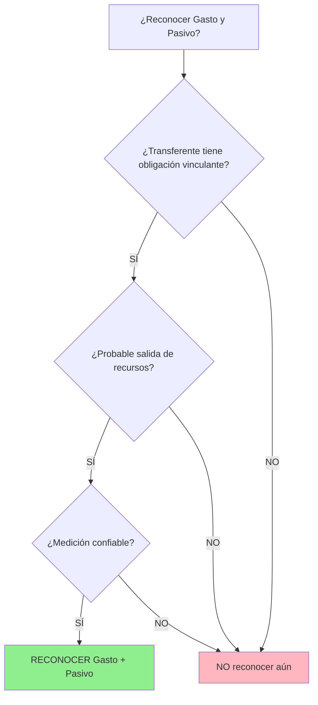

# IPSAS 48 - Gastos por Transferencias

## Marco Normativo

**Norma:** IPSAS 48 - _Transfer Expenses_  
**Emitida por:** IPSASB  
**Fecha emisión:** Enero 2023  
**Vigencia:** Períodos anuales iniciando 1 enero 2026 o después (adopción anticipada permitida)  
**Relación:** **Norma espejo** de IPSAS 23 (receptora de transferencias) → IPSAS 48 (transferente)  
**Base:** Complementa marco de transacciones sin contraprestación

**Contexto histórico:**  
Antes de IPSAS 48, NO existía guía específica para el transferente. Muchas entidades reconocían gastos:

- Al aprobar presupuesto (demasiado temprano), o
- Al pagar efectivo (demasiado tarde, base caja)

**Innovación IPSAS 48:**  
Introduce concepto de **obligación vinculante** como trigger de reconocimiento, alineando el momento del gasto (transferente) con el momento del ingreso (receptor IPSAS 23).

**Referencia:** IPSASB (2023). _IPSAS 48 - Transfer Expenses_. IPSASB Handbook.

---

## Objetivo y Alcance

### Objetivo

> "Establecer principios para el **reconocimiento y medición de gastos** y **pasivos** relacionados con **transferencias**, donde la entidad proporciona bienes, servicios o efectivo a otra entidad/individuo **sin recibir contraprestación equivalente** directamente a cambio."
>
> **Fuente:** IPSAS 48, Objetivo

---

### Definición de Transferencia (IPSAS 48.9)

> **Transferencia:** "Transacción donde una entidad proporciona bienes/servicios/otros activos (incluyendo efectivo) a otra sin recibir **contraprestación aproximadamente equivalente** directamente a cambio."

**Característica clave:** **Sin contraprestación** (o mínima).

---

### Alcance (IPSAS 48.2-6)

**Aplica a:**

| Tipo Transferencia                      | Descripción                    | Ejemplo Perú                       |
| --------------------------------------- | ------------------------------ | ---------------------------------- |
| **Transferencias intergubernamentales** | Entre niveles de gobierno      | MEF → Gobiernos Regionales (Canon) |
| **Donaciones otorgadas**                | A otras entidades o individuos | Perú → Ecuador (ayuda humanitaria) |
| **Subvenciones**                        | Apoyo financiero sin retorno   | MINAGRI → Pequeños agricultores    |
| **Condonación de deudas**               | Perdón de préstamos            | Gobierno perdona deuda a municipio |
| **Transferencias internacionales**      | A organismos multilaterales    | Perú → ONU (cuotas de membresía)   |

---

**Excluye:**

- **Beneficios sociales a individuos** → IPSAS 42 (Pensión 65, Juntos)
- **Beneficios a empleados** → IPSAS 39
- **Transacciones con contraprestación** → IPSAS 47 (Revenue)
- **Impuestos pagados** (no son transferencias, son obligaciones legales)

---

### Diagrama de Decisión: ¿Qué norma aplicar?

```mermaid
graph TD
    A[Transacción Saliente] --> B{¿Hay contraprestación equivalente?}
    B -->|SÍ| C[IPSAS 47 - Revenue o compra]
    B -->|NO| D{¿Beneficia a empleados?}
    D -->|SÍ| E[IPSAS 39 - Beneficios Empleados]
    D -->|NO| F{¿Beneficia a individuos (riesgo social)?}
    F -->|SÍ| G[IPSAS 42 - Beneficios Sociales]
    F -->|NO| H[IPSAS 48 - Gastos por Transferencias]

    style C fill:#87CEEB
    style E fill:#FFB6C1
    style G fill:#98FB98
    style H fill:#FFD700
```

---

## Reconocimiento de Gastos y Pasivos (IPSAS 48.16-34)

### Principio Fundamental (IPSAS 48.16)

**La entidad transferente reconoce gasto y pasivo cuando:**



**Referencia:** IPSAS 48.16-18

---

### Obligación Vinculante (IPSAS 48.19-24)

**Surge cuando:**

a) **Acuerdo vinculante** con términos suficientemente específicos (contrato, ley, política pública), **Y**  
b) Transferente **no tiene alternativa realista** de evitar la transferencia.

**Concepto clave pedagógico:**  
Una obligación es "vinculante" cuando la entidad está **legalmente atada** o **políticamente comprometida** sin poder retractarse sin consecuencias graves.

**Analogía:**  
Piensa en la diferencia entre:

- **Obligación vinculante:** Firmar hipoteca de casa (no puedes decir "cambié de idea" sin perder la casa)
- **Intención no vinculante:** Decir "planeo donar a caridad" (puedes cambiar de opinión sin consecuencias legales)

---

#### Indicadores de Obligación Vinculante (IPSAS 48.AG7-AG14):

| Indicador                  | Descripción                             | Ejemplo                            | ¿Por qué es vinculante?                                   |
| -------------------------- | --------------------------------------- | ---------------------------------- | --------------------------------------------------------- |
| **Términos específicos**   | Monto, destinatario, plazos definidos   | Ley define S/ 500M para regiones   | Ley publicada en El Peruano = **exigible**                |
| **Evento pasado**          | Basado en criterios ya cumplidos        | Canon minero por producción 2023   | Producción ya ocurrió = **derecho adquirido**             |
| **Sin discrecionalidad**   | No puede cancelar unilateralmente       | Transferencia mandatada por ley    | Cancelar requeriría **nueva ley** (políticamente costoso) |
| **Consecuencias adversas** | Evitar pago tiene costos significativos | Sanción legal o pérdida reputación | Violar ley = **multa o juicio político**                  |

---

### Ejemplo 1: Transferencia Intergubernamental - Canon Minero

**Contexto (Ley 27506):**

- MEF debe transferir **50% del Impuesto a la Renta** de empresas mineras a gobiernos locales/regionales
- Producción minera 2024: Impuesto a la Renta = S/ 3,000,000,000
- Canon minero: 50% = S/ 1,500,000,000
- Pago: Marzo 2025

**Análisis (IPSAS 48):**

| Criterio                 | Evaluación                                           |
| ------------------------ | ---------------------------------------------------- |
| ¿Hay acuerdo vinculante? | **SÍ** (Ley 27506)                                   |
| ¿Términos específicos?   | **SÍ** (50% del IR, destinatarios definidos por ley) |
| ¿Evento pasado?          | **SÍ** (producción minera 2024 ya ocurrió)           |
| ¿Puede evitar MEF?       | **NO** (obligación legal)                            |
| **Conclusión**           | **Reconocer gasto y pasivo 31-dic-2024**             |

---

**Asiento 31-dic-2024:**

```
DEBE: Gasto - Transferencias Canon Minero    1,500,000,000
HABER: Pasivo - Canon por Pagar               1,500,000,000
```

**Pago marzo 2025:**

```
DEBE: Pasivo - Canon por Pagar               1,500,000,000
HABER: Bancos                                 1,500,000,000
```

**Nota:** Gasto se reconoce en **2024** (cuando surge obligación), no en **2025** (cuando se paga).

---

### Ejemplo 2: Donación Condicionada - Ministerio de Salud

**Contexto:**

- MINSA firma acuerdo con ONG para donar S/ 2,000,000 para construir centro de salud rural
- **Condición:** ONG debe completar construcción en 18 meses (verificación técnica MINSA)
- Si no cumple condición: ONG **devuelve fondos**
- Fecha acuerdo: 15-dic-2024
- Desembolso: 50% al firmar, 50% al completar obra

**Análisis IPSAS 48:**

**¿Hay obligación vinculante al 15-dic-2024?**

- Acuerdo vinculante: ✅ Contrato firmado
- Términos específicos: ✅ Monto, condición, plazo claros
- **Condición pendiente:** ❌ ONG **NO ha construido** aún (puede devolver fondos si no cumple)
- **Conclusión:** **NO hay obligación vinculante completa** al 15-dic-2024

---

**Reconocimiento:**

**15-dic-2024 (primer desembolso 50%):**

```
DEBE: Anticipo a ONG (Activo)                1,000,000
HABER: Bancos                                 1,000,000
```

**Revelación:** "MINSA tiene compromiso condicional de S/ 1,000,000 adicionales, sujeto a completar construcción."

**Durante construcción (avance 60% verificado - jul-2025):**

```
DEBE: Gasto - Donación Centro Salud          1,200,000
HABER: Anticipo a ONG                         1,000,000
HABER: Pasivo - Donación por Pagar              200,000
```

**Al completar construcción (dic-2025):**

```
DEBE: Gasto - Donación Centro Salud            800,000
HABER: Pasivo - Donación por Pagar              800,000

DEBE: Pasivo - Donación por Pagar            1,000,000
HABER: Bancos                                 1,000,000
```

**Interpretación:** Gasto se reconoce **conforme ONG cumple condición** (avance de obra), no al firmar acuerdo ni al desembolsar.

---

## Medición (IPSAS 48.35-45)

### Pasivo por Transferencia

**Principio (IPSAS 48.35):**  
Medir pasivo al **monto esperado de transferir**, que puede ser:

| Tipo          | Base de Medición                            | Ejemplo                            |
| ------------- | ------------------------------------------- | ---------------------------------- |
| **Efectivo**  | Monto a pagar                               | Canon: S/ 1,500M                   |
| **Bienes**    | **Valor en libros** del activo a transferir | Donación vehículos: valor contable |
| **Servicios** | Costo de provisión                          | Personal prestado a otra entidad   |

**Descuento:** Aplicar valor presente si **pago > 12 meses** y componente financiero es significativo (IPSAS 48.39).

---

### Ejemplo 3: Donación de Activos - Municipalidad de Lima

**Contexto:**

- Lima dona 10 ambulancias usadas a municipalidades provinciales (ayuda emergencia)
- Valor en libros ambulancias: S/ 500,000 (costo original S/ 1,200,000, depreciación acumulada S/ 700,000)
- Valor razonable mercado: S/ 600,000
- Fecha compromiso irrevocable: 31-dic-2024
- Entrega física: 15-ene-2025

**Medición del Gasto:**

IPSAS 48.37: **Valor en libros del activo** (NO valor razonable).

$$
\text{Gasto} = S/ 500,000
$$

---

**Asiento 31-dic-2024 (reconocimiento obligación):**

```
DEBE: Gasto - Donación Ambulancias              500,000
HABER: Pasivo - Activos por Transferir           500,000
```

**15-ene-2025 (entrega física):**

```
DEBE: Depreciación Acumulada - Ambulancias      700,000
DEBE: Pasivo - Activos por Transferir           500,000
HABER: Ambulancias (Activo)                     1,200,000
```

**Nota:** Gasto reconocido al **comprometerse** (31-dic), no al **entregar** (15-ene).

---

## Tipos Especiales de Transferencias

### 1. Transferencias con Condiciones (IPSAS 48.25-28)

**Condición:** Estipulación que especifica uso de recursos transferidos y **requiere devolución** si no se cumple.

**Tratamiento:**

- Si condición **NO cumplida**: **NO reconocer** gasto ni pasivo (es activo contingente o anticipo)
- Si condición **cumplida** (o en proceso verificable): Reconocer gasto

**Ejemplo:** Donación MINSA (Ejemplo 2 anterior) → Reconocer conforme avanza construcción.

---

### 2. Transferencias con Restricciones (IPSAS 48.29-30)

**Restricción:** Estipulación de uso de recursos, pero **NO requiere devolución** si no se cumple (solo reportar uso).

**Tratamiento:**

- **SÍ reconocer** gasto y pasivo cuando surge obligación vinculante
- **Revelar** restricción en notas

---

#### Ejemplo: Transferencia MEF a Gobiernos Regionales - Salud

**Contexto:**

- MEF transfiere S/ 800,000,000 a regiones para salud (Ley de Presupuesto 2024)
- **Restricción:** Debe usarse en salud (reportar a MEF trimestralmente)
- **No hay devolución** si no cumplen (solo reporte)

**Análisis:**

- Obligación vinculante: ✅ Ley de Presupuesto
- Restricción (no condición): Regiones deben informar uso, pero **no devuelven** si usan en otro fin
- **Conclusión:** Reconocer gasto completo al aprobarse presupuesto

**Asiento (aprobación presupuesto 31-dic-2023, para 2024):**

```
DEBE: Gasto - Transferencia Salud Regiones     800,000,000
HABER: Pasivo - Transferencias por Pagar        800,000,000
```

**Revelación Nota:** "La transferencia está restringida a gastos de salud. Las regiones deben reportar uso trimestralmente al MEF."

---

### 3. Condonación de Deuda (IPSAS 48.46-50)

**Definición:** Perdón de derecho de cobro sin recibir contraprestación.

**Tratamiento:**

- **Reconocer gasto** cuando se decide irrevocablemente condonar
- **Medición:** Valor en libros de la cuenta por cobrar

**Pregunta pedagógica clave:**  
¿Por qué condonar deuda es un "gasto por transferencia"?

**Respuesta:** Porque el deudor recibe un **beneficio económico** (eliminación de pasivo) sin dar contraprestación a cambio. Es equivalente a transferirle efectivo por el monto de la deuda.

**Distinción importante:**

- **Condonación** (IPSAS 48) → Decisión voluntaria del acreedor
- **Incobrabilidad** (IPSAS 41) → Deterioro del activo financiero (improbable cobro)

**Timing crítico:**  
El gasto se reconoce al **publicar decreto/resolución** que hace la condonación irrevocable, **no** cuando:

- Se propone la idea (aún no vinculante)
- Se elimina del sistema contable (consecuencia, no causa)

---

#### Ejemplo: MEF Condona Deuda - Municipalidad Provincial

**Contexto:**

- Municipalidad de Huancavelica debe al MEF S/ 5,000,000 (préstamo 2015)
- Desastre natural 2024: terremoto destruye infraestructura
- MEF decide condonar deuda (D.S. publicado 20-dic-2024)

**Análisis del timing:**

| Fecha           | Evento                                 | ¿Reconocer gasto? | Razón                                   |
| --------------- | -------------------------------------- | ----------------- | --------------------------------------- |
| **15-dic-2024** | MEF evalúa condonación (borrador D.S.) | ❌ NO             | Aún no es irrevocable (puede cambiarse) |
| **20-dic-2024** | D.S. publicado en El Peruano           | ✅ SÍ             | Obligación vinculante (IPSAS 48.46)     |
| **31-dic-2024** | Municipalidad notificada               | Revelación        | Ya reconocido el 20-dic                 |

**Asiento MEF (20-dic-2024):**

```
DEBE: Gasto - Condonación Deuda               5,000,000
HABER: Cuentas por Cobrar - Municipalidad      5,000,000
```

**Asiento Municipalidad Huancavelica (20-dic-2024):**

```
DEBE: Pasivo - Préstamo MEF                   5,000,000
HABER: Ingreso - Condonación Deuda (IPSAS 23)  5,000,000
```

**Espejo:** MEF usa IPSAS 48 (gasto) ↔ Municipalidad usa IPSAS 23 (ingreso).

**Impacto en Estados Financieros 2024:**

- **MEF:** Incremento en gastos S/ 5M → Déficit mayor
- **Municipalidad:** Incremento en ingresos S/ 5M + Reducción pasivos → Patrimonio neto aumenta S/ 5M

---

## Revelaciones (IPSAS 48.51-59)

### Información Obligatoria

| Revelación              | Detalle                                                                   |
| ----------------------- | ------------------------------------------------------------------------- |
| **Política contable**   | Cómo determina obligaciones vinculantes                                   |
| **Gasto del período**   | Desglose por tipo (efectivo, bienes, servicios)                           |
| **Pasivos**             | Corriente y no corriente                                                  |
| **Compromisos futuros** | Transferencias comprometidas pero no reconocidas (condiciones pendientes) |
| **Restricciones**       | Estipulaciones de uso de transferencias                                   |
| **Eventos posteriores** | Nuevas transferencias aprobadas después de cierre                         |

**Referencia:** IPSAS 48.51-59

---

### Ejemplo Revelación: Nota Estados Financieros MEF

**Nota 22: Gastos por Transferencias**

_Política Contable:_  
El Ministerio de Economía y Finanzas reconoce gastos y pasivos por transferencias cuando surge una **obligación vinculante** de transferir recursos, típicamente al momento de aprobación presupuestal o firma de convenios irrevocables (IPSAS 48.16).

_Gastos por Transferencias 2024 (S/ millones):_

| Tipo Transferencia    | Destinatario                    | Monto     |
| --------------------- | ------------------------------- | --------- |
| Canon minero          | Gobiernos regionales/locales    | 1,500     |
| Transferencias salud  | Gobiernos regionales            | 800       |
| Donación humanitaria  | Ecuador (terremoto)             | 50        |
| Subsidios agricultura | Pequeños agricultores (MINAGRI) | 200       |
| **Total**             |                                 | **2,550** |

_Pasivos por Transferencias 31-dic-2024 (S/ millones):_

- Corriente (pagadero 2025): S/ 1,200
- No corriente: S/ 0

_Compromisos Futuros:_  
MEF tiene compromiso condicional de S/ 300 millones con BID para infraestructura rural, sujeto a cumplimiento de hitos técnicos (no reconocido como pasivo).

---

## Diferencias con Normas Relacionadas

### IPSAS 48 vs IPSAS 23 (Espejo)

| Aspecto            | IPSAS 23 (Receptor)                           | IPSAS 48 (Transferente)                         |
| ------------------ | --------------------------------------------- | ----------------------------------------------- |
| **Transacción**    | **Recibe** transferencia                      | **Otorga** transferencia                        |
| **Reconocimiento** | **Ingreso** (o pasivo si hay condición)       | **Gasto** (o activo si hay condición pendiente) |
| **Condiciones**    | Genera **pasivo** (obligación devolver)       | Genera **activo** (derecho a devolución)        |
| **Restricciones**  | Genera **ingreso inmediato**                  | Genera **gasto inmediato**                      |
| **Ejemplo Perú**   | Gobierno Regional **recibe** canon (IPSAS 23) | MEF **transfiere** canon (IPSAS 48)             |

**Simetría:** Gasto de uno = Ingreso del otro (en teoría, puede haber diferencias de timing).

---

### IPSAS 48 vs IPSAS 42 (Beneficios Sociales)

| Aspecto            | IPSAS 42                                       | IPSAS 48                                        |
| ------------------ | ---------------------------------------------- | ----------------------------------------------- |
| **Beneficiario**   | **Individuos/Hogares** (población general)     | **Entidades** (gobiernos, ONGs)                 |
| **Propósito**      | Proteger **riesgos sociales** (vejez, pobreza) | Transferir recursos para **servicios públicos** |
| **Ejemplo Perú**   | Pensión 65 (a adultos mayores)                 | Canon minero (a gobiernos regionales)           |
| **Reconocimiento** | 2 enfoques (obligaciones o asignaciones)       | Solo enfoque obligaciones vinculantes           |

---

## Caso Integrado: Ministerio de Economía y Finanzas - 2024

**Transacciones:**

### 1. Canon Minero (IPSAS 48 - obligación ley)

- **Base:** 50% IR minero 2024 = S/ 1,500M
- **Pago:** Marzo 2025
- **Reconocimiento:** 31-dic-2024

```
DEBE: Gasto - Canon Minero                   1,500,000,000
HABER: Pasivo - Canon por Pagar               1,500,000,000
```

---

### 2. Transferencia Condicionada - Infraestructura (BID)

- **Compromiso:** S/ 300M a gobiernos locales
- **Condición:** Presentar proyectos técnicos aprobados (pendiente 31-dic-2024)
- **Reconocimiento:** NO reconocer aún (condición no cumplida)

**Revelación:** "MEF tiene compromiso de S/ 300M sujeto a aprobación proyectos."

---

### 3. Donación Vehículos Policía (sin condición)

- **Activo:** 20 patrulleros, valor libros S/ 600,000
- **Destinatario:** Policía Nacional (entrega enero 2025)
- **Compromiso irrevocable:** 31-dic-2024

```
DEBE: Gasto - Donación Vehículos                600,000
HABER: Pasivo - Activos por Transferir            600,000
```

---

### 4. Condonación Deuda - Municipalidad

- **Deuda:** S/ 5,000,000 (Huancavelica)
- **Razón:** Desastre natural
- **D.S. aprobado:** 20-dic-2024

```
DEBE: Gasto - Condonación Deuda               5,000,000
HABER: Cuentas por Cobrar - Municipalidad      5,000,000
```

---

### 5. Subsidio Agricultura (con restricción)

- **Monto:** S/ 200M a pequeños agricultores (vía MINAGRI)
- **Restricción:** Usar en semillas certificadas (no devuelven si usan diferente)
- **Ley Presupuesto:** Aprobada 31-dic-2023

```
DEBE: Gasto - Subsidio Agricultura             200,000,000
HABER: Pasivo - Subsidio por Pagar              200,000,000
```

---

**Resumen Gastos por Transferencias MEF 2024:**

$$
\text{Total} = 1,500M + 0.6M + 5M + 200M = S/ 1,705,600,000
$$

**Pasivo Total:**

$$
\text{Pasivo} = 1,500M + 0.6M + 200M = S/ 1,700,600,000
$$

_(Condonación no genera pasivo, elimina activo)_

---

## Transición desde Práctica Actual (IPSAS 48.AG38-AG42)

### Antes de IPSAS 48 (práctica común):

**Muchas entidades reconocían gasto cuando:**

- Se aprobaba presupuesto, **O**
- Se **pagaba** (base caja)

### Con IPSAS 48 (desde 2026):

**Reconocer cuando surge obligación vinculante:**

- **Puede ser antes** de pago (ej: canon al cierre año fiscal)
- **Puede ser después** de aprobación presupuestal (si hay condiciones pendientes)

**Impacto:** Mayor **uniformidad** entre transferente (IPSAS 48) y receptor (IPSAS 23).

---

## Conexiones con Otras Normas

- [[ipsas-23-ingresos-sin-contraprestacion]] → Norma espejo (receptor de transferencias)
- [[ipsas-42-beneficios-sociales]] → Diferencia: IPSAS 48 = entidades, IPSAS 42 = individuos
- [[ipsas-39-beneficios-empleados]] → Excluye beneficios laborales
- [[introduccion-gastos]] → Marco conceptual de gastos
- [[ipsas-19-provisiones]] → Provisiones si transferencia es contingente

---

## Resumen Ejecutivo

**Tesis Central:**  
IPSAS 48 regula gastos por **transferencias** (otorgar recursos sin contraprestación equivalente a entidades), reconociendo **gasto y pasivo** cuando surge **obligación vinculante** (acuerdo con términos específicos + sin alternativa de evitar), diferenciando **condiciones** (no reconocer hasta cumplir) de **restricciones** (reconocer inmediatamente).

**Alcance:**  
Transferencias intergubernamentales, donaciones, subvenciones, condonación deudas → A **entidades** (no individuos).

**Reconocimiento:**  
Obligación vinculante requiere: acuerdo específico + evento pasado + no discrecionalidad

**Condiciones vs Restricciones:**

- **Condición:** Requiere devolución si no cumple → NO reconocer gasto hasta cumplir
- **Restricción:** Solo reportar uso → Reconocer gasto inmediatamente

**Medición:**  
Efectivo (monto a pagar), Bienes (valor en libros), Servicios (costo provisión)

**Espejo IPSAS 23:**  
Gasto IPSAS 48 (transferente) = Ingreso IPSAS 23 (receptor)

**Vigencia:** 1 enero 2026 (adopción anticipada permitida)

**Siguiente Paso:** Ver [[indice-unidad-III]] para integración completa de la unidad.

---

**Referencias Normativas:**

- IPSASB (2023). _IPSAS 48 - Transfer Expenses_. IPSASB Handbook.
- IPSASB (2023). _Basis for Conclusions - IPSAS 48_. IPSASB.
- IPSASB (2023). _IPSAS 23 - Revenue from Non-Exchange Transactions_ (norma espejo). IPSASB.
- MEF (2023). _Ley de Presupuesto del Sector Público_. Ministerio de Economía y Finanzas, Perú.
