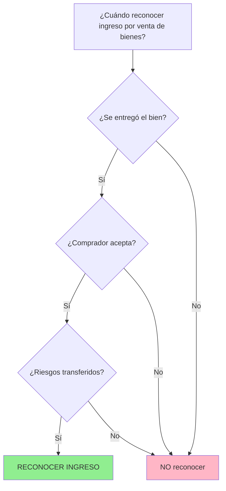

# IPSAS 9 - Ingresos por Transacciones de Cambio

## Marco Normativo

**Norma:** IPSAS 9 - _Revenue from Exchange Transactions_  
**Emitida por:** IPSASB (International Public Sector Accounting Standards Board)  
**Fecha emisión original:** Enero 2002 (revisada 2023)  
**Vigencia:** Actualmente vigente (será reemplazada por IPSAS 47 a partir de 2026)  
**Base en IFRS:** Basada en IAS 18 (ahora IFRS 15 en sector privado)

**Referencia:** IPSASB Handbook 2023, IPSAS 9, disponible en www.ipsasb.org

---

## Objetivo de la Norma

> "Prescribir el tratamiento contable de los ingresos provenientes de **transacciones de cambio** (exchange transactions)."
>
> **Fuente:** IPSAS 9, Objetivo

**Alcance:** Aplica a ingresos por:

1. Venta de bienes
2. Prestación de servicios
3. Uso de activos de la entidad por terceros (intereses, regalías, dividendos)

**Exclusiones:** NO aplica a:

- Transacciones sin contraprestación (IPSAS 23)
- Arrendamientos (IPSAS 43)
- Instrumentos financieros (IPSAS 41)

---

## Definición Clave: Transacción de Cambio


> **Transacción de Cambio:** "Transacción en la cual una entidad recibe activos o servicios, o cancela pasivos, y entrega directamente a cambio un **valor aproximadamente igual** (principalmente en forma de efectivo, bienes, servicios u otros activos)."
>
> **Fuente:** IPSAS 9, párrafo 8

**Característica esencial:** Hay **contraprestación directa y proporcional**.

---

## Tipos de Ingresos por Cambio en el Sector Público

### 1. Venta de Bienes

**Ejemplos en Perú:**

- SEDAPAL vende agua potable a hogares
- Imprenta Nacional vende publicaciones oficiales
- Hospital público vende servicios de laboratorio a empresas (análisis ocupacionales)
- Universidades públicas venden servicios de consultoría técnica

### 2. Prestación de Servicios

**Ejemplos:**

- Municipalidades: emisión de certificados, licencias de funcionamiento
- RENIEC: expedición de DNI duplicados
- Ministerio de Relaciones Exteriores: legalización de documentos
- Policía Nacional: certificados de antecedentes

### 3. Uso de Activos por Terceros

**Ejemplos:**

- Municipalidad arrienda local a comerciante → **Ingreso por arrendamiento** (IPSAS 43, no IPSAS 9)
- Gobierno deposita fondos en banco → **Intereses devengados** (IPSAS 9)

---

## Reconocimiento de Ingresos: Criterios Generales

### Principio Fundamental (IPSAS 9, párrafo 18)

El ingreso se reconoce cuando se cumplen **TODOS** estos criterios:

| Criterio                     | Descripción                                                                       | Evaluación                   |
| ---------------------------- | --------------------------------------------------------------------------------- | ---------------------------- |
| **Probabilidad**             | Es **probable** que beneficios económicos fluyan a la entidad                     | ¿Es cobrable?                |
| **Medición fiable**          | El importe puede **medirse con fiabilidad**                                       | ¿Hay precio/tarifa definida? |
| **Transferencia de riesgos** | Se han transferido riesgos y beneficios significativos de propiedad (solo bienes) | ¿Quién controla el bien?     |
| **No control continuo**      | La entidad NO retiene control gerencial sobre los bienes (solo bienes)            | ¿Se entregó efectivamente?   |
| **Costos medibles**          | Los costos incurridos o por incurrir pueden medirse fiablemente (solo servicios)  | ¿Hay costeo del servicio?    |

---

## Reconocimiento por Tipo de Transacción

### A. Venta de Bienes (IPSAS 9.19)

**Momento de reconocimiento:** Cuando se han transferido al comprador los **riesgos y beneficios** significativos de la propiedad.

**Indicadores de transferencia:**



**Ejemplo: Imprenta Nacional**

| Fecha      | Evento                                          | Reconocimiento                                         |
| ---------- | ----------------------------------------------- | ------------------------------------------------------ |
| 15/10/2024 | Cliente solicita 1,000 certificados a S/ 5 c/u  | **NO** (no hay transferencia aún)                      |
| 20/10/2024 | Imprenta imprime certificados                   | **NO** (aún no entregados)                             |
| 22/10/2024 | Cliente retira certificados y firma conformidad | **SÍ - Reconocer ingreso S/ 5,000**                    |
| 30/10/2024 | Cliente paga                                    | Baja de cuenta por cobrar (el ingreso ya se reconoció) |

**Asiento contable (22/10/2024):**

```
DEBE: Cuentas por Cobrar Comerciales       5,000
HABER: Ingresos por Venta de Bienes         5,000
```

---

### B. Prestación de Servicios (IPSAS 9.20-25)

**Métodos de reconocimiento:**

#### 1. Método del Porcentaje de Terminación (% Completion)

**Aplicable cuando:**

- Resultado de la transacción puede estimarse fiablemente
- Servicio se presta durante **varios períodos**

**Fórmula:**

$$
\text{Ingreso Reconocido} = \text{Ingreso Total Estimado} \times \text{\% Avance}
$$

**Formas de medir el % de Avance (IPSAS 9.23):**

| Método                              | Descripción                                  | Ejemplo                                         |
| ----------------------------------- | -------------------------------------------- | ----------------------------------------------- |
| **Hitos alcanzados**                | % según etapas completadas                   | Consultoria con 4 entregables: 25% por cada uno |
| **Servicios ejecutados a la fecha** | Proporción de servicios realizados del total | 60 de 100 inspecciones realizadas = 60%         |
| **Costos incurridos**               | Costos a la fecha / Costos totales estimados | S/ 80,000 / S/ 200,000 = 40%                    |

**Ejemplo: Ministerio de Vivienda - Consultoría de Tasación**

- **Contrato:** Tasar 100 inmuebles por S/ 200,000 (plazo: 5 meses)
- **Mes 1:** Tasados 25 inmuebles → Avance 25%

**Reconocimiento Mes 1:**

```
Ingreso = S/ 200,000 × 25% = S/ 50,000

DEBE: Deudores por Devengado           50,000
HABER: Ingresos por Prestación Servicios  50,000
```

#### 2. Método Lineal (Straight-Line)

**Aplicable cuando:**

- Servicios se prestan de manera **uniforme** en el tiempo
- No hay hitos específicos

**Ejemplo:** Contrato de mantenimiento anual de S/ 12,000 → S/ 1,000 mensuales

---

### C. Intereses, Regalías y Dividendos (IPSAS 9.27-32)

| Tipo           | Base de Reconocimiento                | Método                          |
| -------------- | ------------------------------------- | ------------------------------- |
| **Intereses**  | Base tiempo (tiempo transcurrido)     | Tasa efectiva de rendimiento    |
| **Regalías**   | Base devengado según contrato         | Según términos contractuales    |
| **Dividendos** | Cuando se establece derecho a recibir | Fecha declaración de dividendos |

**Ejemplo: Intereses Bancarios**

Gobierno tiene depósito de S/ 10,000,000 al 5% anual (360 días).

**Interés devengado por 30 días:**

$$
\text{Interés} = 10,000,000 \times 0.05 \times \frac{30}{360} = S/ 41,667
$$

**Asiento mensual:**

```
DEBE: Intereses por Cobrar               41,667
HABER: Ingresos Financieros - Intereses    41,667
```

---

## Medición de Ingresos

### Valor de Medición (IPSAS 9.13)

> "Los ingresos se medirán al **valor razonable** de la contraprestación recibida o por recibir."

**Valor razonable:** Importe por el cual puede intercambiarse un activo entre partes conocedoras y dispuestas, en una transacción libre.

### Deducciones del Ingreso Bruto:

- Descuentos comerciales
- Rebajas
- Devoluciones
- Impuestos recaudados por cuenta de terceros (ej. si una entidad recauda IVA)

**Ejemplo:**

| Concepto                | Importe      |
| ----------------------- | ------------ |
| Precio de lista         | S/ 10,000    |
| (-) Descuento 10%       | (1,000)      |
| **Ingreso a reconocer** | **S/ 9,000** |

---

## Revelaciones (IPSAS 9.34)

Las entidades deben revelar en notas a estados financieros:

### Obligatorias:

1. **Políticas contables** adoptadas para reconocimiento de ingresos por:
   - Venta de bienes
   - Prestación de servicios
   - Intereses, regalías, dividendos

2. **Importe de cada categoría** significativa de ingresos:
   - Venta de bienes
   - Prestación de servicios
   - Intereses
   - Regalías
   - Dividendos

**Ejemplo de Nota (extracto):**

> **Nota 15: Ingresos de Transacciones de Cambio**
>
> La entidad reconoce ingresos por venta de bienes cuando se transfiere el control al comprador. Los ingresos por servicios se reconocen según el método de porcentaje de terminación.
>
> | Categoría               | 2024              | 2023              |
> | ----------------------- | ----------------- | ----------------- |
> | Venta de bienes         | S/ 5,200,000      | S/ 4,800,000      |
> | Prestación de servicios | S/ 12,300,000     | S/ 11,500,000     |
> | Intereses               | S/ 450,000        | S/ 380,000        |
> | **Total**               | **S/ 17,950,000** | **S/ 16,680,000** |

---

## Casos Especiales en el Sector Público

### 1. Tarifas Subsidiadas

**Situación:** Entidad cobra tarifas por debajo del costo de mercado (ej. agua potable subsidiada).

**Tratamiento:**

- **Si hay contraprestación directa:** IPSAS 9 (aunque el valor sea menor al costo)
- **Si NO hay contraprestación proporcional:** Puede ser IPSAS 23 (parte) + IPSAS 9 (parte)

**Ejemplo:** Hospital cobra S/ 20 por consulta (costo real S/ 150):

- Componente de cambio: S/ 20 (IPSAS 9)
- Componente de subsidio: S/ 130 (gasto cubierto por transferencias - IPSAS 23 en el receptor)

### 2. Licencias y Permisos

**Análisis:** ¿Es transacción de cambio?

| Tipo                               | Clasificación                                                   | Norma    |
| ---------------------------------- | --------------------------------------------------------------- | -------- |
| Licencia de conducir (S/ 30)       | **Cambio** (se recibe servicio de autorización)                 | IPSAS 9  |
| Multa de tránsito (S/ 500)         | **Sin contraprestación** (sanción, no hay servicio equivalente) | IPSAS 23 |
| Permiso de construcción (S/ 2,000) | **Cambio** (servicio de verificación y autorización)            | IPSAS 9  |

---

## Diferencias con IPSAS 23 (Sin Contraprestación)

| Aspecto         | IPSAS 9 (Cambio)                          | IPSAS 23 (Sin Contraprestación)           |
| --------------- | ----------------------------------------- | ----------------------------------------- |
| **Naturaleza**  | Valor aproximadamente igual intercambiado | Sin intercambio directo equivalente       |
| **Disparador**  | Transferencia de riesgos/beneficios       | Control del activo                        |
| **Ejemplos**    | Venta de bienes, servicios                | Impuestos, donaciones, transferencias     |
| **Condiciones** | Raramente generan pasivo                  | Condiciones → Pasivo (ingresos diferidos) |
| **Medición**    | Valor razonable de contraprestación       | Valor razonable del activo recibido       |

---

## Transición a IPSAS 47 (2026)

### Cambios Esperados:

| Elemento                                 | IPSAS 9 (Actual)              | IPSAS 47 (Nueva)                                                |
| ---------------------------------------- | ----------------------------- | --------------------------------------------------------------- |
| **Modelo**                               | Basado en tipo de transacción | **Modelo de 5 pasos** (similar IFRS 15)                         |
| **Enfoque**                              | Transferencia de riesgos      | **Obligaciones de desempeño**                                   |
| **Reconocimiento a lo largo del tiempo** | % de terminación (servicios)  | Criterios de transferencia de control a lo largo del tiempo     |
| **Unificación**                          | Separado de IPSAS 23          | **Unifica** cambio y algunas transacciones sin contraprestación |

**Recomendación:** Familiarizarse con IPSAS 47 desde ahora (adopción anticipada permitida).

---

## Ejemplo Integrado: SEDAPAL (Empresa Pública de Agua)

### Transacciones del mes:

1. **Facturación de agua y alcantarillado** a usuarios: S/ 45,000,000
2. **Servicios de laboratorio** a empresas mineras: S/ 150,000
3. **Intereses bancarios** devengados: S/ 80,000
4. **Transferencia del Estado** para inversión en redes: S/ 10,000,000 (sin contraprestación)

### Reconocimiento:

| Transacción           | Norma                     | Reconocimiento                                | Monto         |
| --------------------- | ------------------------- | --------------------------------------------- | ------------- |
| Facturación agua      | IPSAS 9                   | Ingreso al emitir factura (servicio prestado) | S/ 45,000,000 |
| Servicios laboratorio | IPSAS 9                   | Ingreso al entregar resultados                | S/ 150,000    |
| Intereses bancarios   | IPSAS 9.27                | Ingreso por base tiempo                       | S/ 80,000     |
| Transferencia Estado  | **IPSAS 23** (NO IPSAS 9) | Depende de condiciones                        | Variable      |

**Asientos (transacciones 1-3):**

```
1) DEBE: Cuentas por Cobrar - Usuarios     45,000,000
   HABER: Ingresos - Servicio de Agua         45,000,000

2) DEBE: Cuentas por Cobrar - Empresas        150,000
   HABER: Ingresos - Servicios Laboratorio     150,000

3) DEBE: Intereses por Cobrar                  80,000
   HABER: Ingresos Financieros                  80,000
```

---

## Conexiones con Otras Normas

- [[introduccion-ingresos]] → Marco general de reconocimiento
- [[ipsas-23-ingresos-sin-contraprestacion]] → Complemento para transacciones sin cambio
- [[ipsas-47-ingresos]] → Nueva norma que reemplazará IPSAS 9
- [[marco-conceptual-nicsp]] → Definición de ingresos y reconocimiento
- [[ipsas-43-arrendamientos]] → Ingresos por arrendamientos (no IPSAS 9)

---

## Resumen Ejecutivo

**Tesis Central:**  
IPSAS 9 regula ingresos por **transacciones de cambio** donde hay contraprestación directa equivalente, reconociéndolos cuando se transfieren riesgos y beneficios (bienes) o según porcentaje de terminación (servicios), medidos a **valor razonable** de la contraprestación.

**Criterios de Reconocimiento:**  
Probabilidad de cobro + Medición fiable + Transferencia de riesgos (bienes) + Sin control continuo (bienes) + Costos medibles (servicios)

**Momento Clave:**  
Venta de bienes → Al transferir control  
Prestación de servicios → Según % de avance  
Intereses → Base tiempo

**Diferencia Crítica con IPSAS 23:** La presencia de **contraprestación directa proporcional** es el factor determinante.

---

**Referencias Normativas:**

- IPSASB (2023). _IPSAS 9 - Revenue from Exchange Transactions_. IPSASB Handbook 2023.
- IPSASB (2023). _IPSAS 47 - Revenue_ (efectiva 2026). IPSASB.
- IAS 18 (2023). _Revenue_ (base de IPSAS 9). IASB.
- IFRS 15 (2023). _Revenue from Contracts with Customers_ (base de IPSAS 47). IASB.
