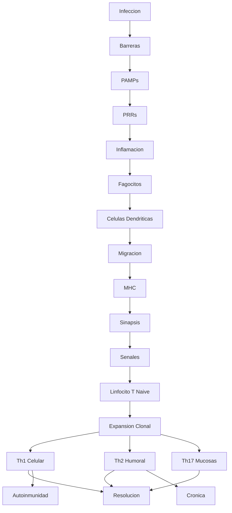
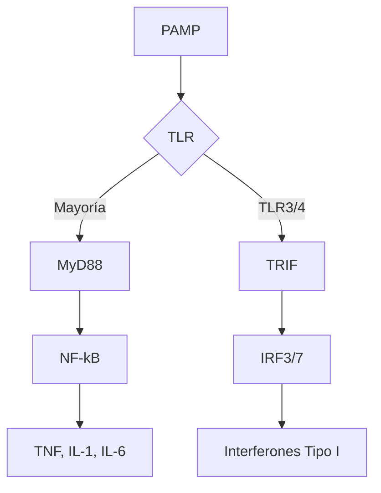
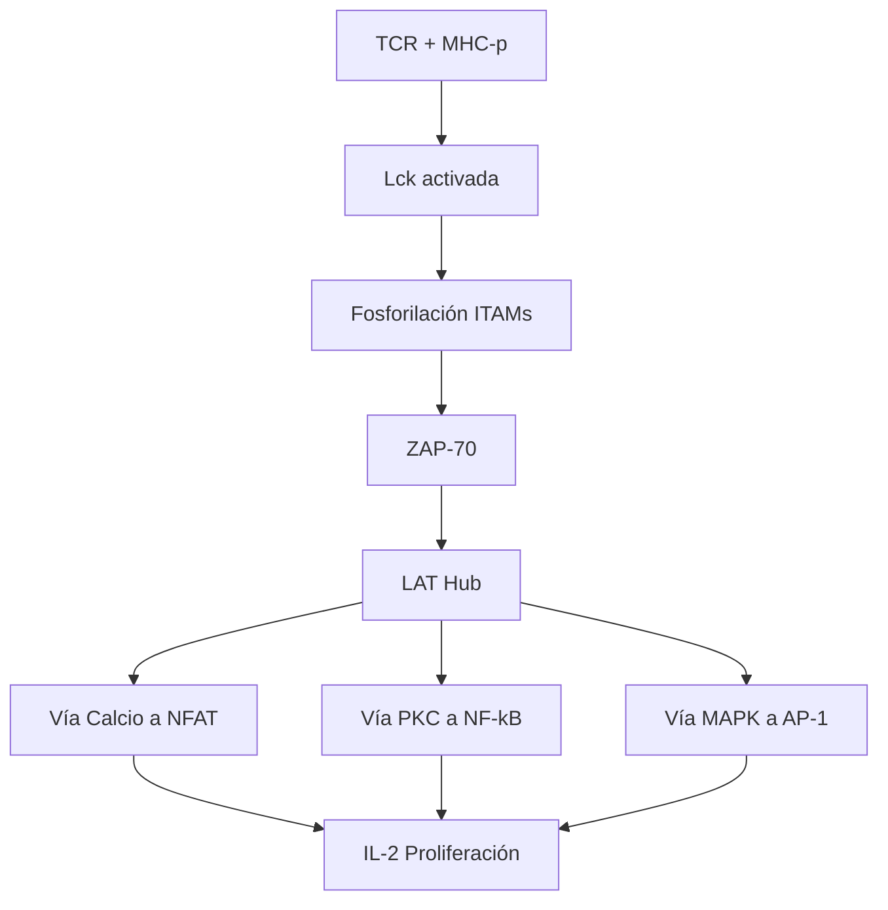
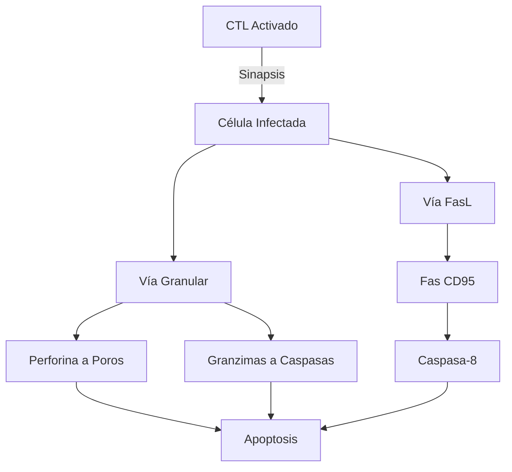

# 🧬 Mapa Global: La Lógica de la Defensa Inmunológica

> [!ABSTRACT] Abstract
> Este curso de **Inmunología Básica y Clínica** presenta una deconstrucción sistemática de la respuesta biológica frente a la no-mismidad (*non-self*). Analizamos la inmunología no como una lista de células, sino como un **sistema de procesamiento de información** que debe distinguir entre ruido (lo propio/inocuo) y señal (patógenos/daño).
>
> **Tesis Central**: La inmunidad es un continuo temporal y evolutivo. La **Inmunidad Innata** (codificada en línea germinal, rápida, estereotipada) provee el contexto y las instrucciones iniciales para la **Inmunidad Adaptativa** (somática, lenta, altamente específica). La interfase crítica entre estos dos mundos es la **Presentación de Antígenos**, y la desregulación de este diálogo conduce a la patología (autoinmunidad, alergia, inmunodeficiencia).

---

## 🗺️ La Línea de Tiempo Inmunológica: De la Brecha a la Memoria

Este diagrama, diseñado con una estética de revisión científica, ilustra el flujo lógico de la respuesta inmune.

---

## 🔬 Desglose Curricular y Mecanismos Clave

### [[00_Unidad_I_MOC|Unidad I: La Lógica Molecular de la Inmunidad Innata]]
> **"El sistema inmune no ve patógenos, ve patrones."**

Esta unidad establece los fundamentos moleculares. Antes de que exista una respuesta específica, el organismo debe responder a la pregunta fundamental: **¿Hay peligro?**

*   **Reconocimiento de Patrones**: El sistema utiliza receptores codificados en la línea germinal (**[[03_Inmunidad_Innata|PRRs]]**) para detectar motivos moleculares conservados evolutivamente (**[[03_Inmunidad_Innata|PAMPs]]**) o señales de daño celular endógeno (**DAMPs**). Ver también: [[06_Inmunogenos_Antigenos|Inmunógenos y Antígenos]].
*   **La Respuesta Inflamatoria**: No es solo una reacción, es un programa complejo orquestado por **[[15_Citocinas|Citocinas]]** (IL-1, IL-6, TNF-α) que altera la vasculatura y recluta células efectoras. Los [[07_Laboratorio_Fagocitosis|mecanismos de fagocitosis]] son esenciales aquí.
*   **El Sistema del Complemento**: Una cascada proteolítica ancestral que actúa como un sistema de vigilancia autónomo en el plasma ([[11_Sistema_Complemento|Ver Nota]]).

#### 🔍 Zoom-In: Señalización Innata (TLRs)
*Referencia: [[03_Inmunidad_Innata]]*
El siguiente diagrama detalla cómo la ligación de un TLR se traduce en expresión génica.

---

### [[00_Unidad_II_MOC|Unidad II: El Puente de la Presentación Antigénica]]
> **"Sin presentación no hay respuesta. Sin coestimulación hay tolerancia."**

Aquí diseccionamos el evento más sofisticado de la inmunología: la **Presentación de Antígenos**. Es el punto donde la información innata se "traduce" al lenguaje de los linfocitos T.

*   **El Complejo Mayor de Histocompatibilidad ([[16_MHC_Complejo_Mayor_Histocompatibilidad|MHC]])**: La molécula más polimórfica del genoma. Define la "individualidad biológica" y actúa como una bandeja de presentación de péptidos.
    *   **MHC-I**: Presenta péptidos endógenos (virus, cáncer) a [[04_Celulas_Sistema_Adaptativo|CD8+]] ([[18_Procesamiento_Antigenico|Procesamiento]]).
    *   **MHC-II**: Presenta péptidos exógenos (bacterias extracelulares) a [[04_Celulas_Sistema_Adaptativo|CD4+]].
*   **La Sinapsis Inmunológica**: No es un simple contacto, es una estructura supramolecular organizada (SMAC) que integra tres señales críticas:
    1.  **Reconocimiento** ([[19_Reconocimiento_TCR|TCR + MHC-p]]).
    2.  **Coestimulación** (CD28 + B7). Ver [[13_Interacciones_Ag_Ac|Interacciones Ag-Ac]].
    3.  **Direccionamiento** ([[15_Citocinas|Citocinas polarizantes]]).

#### 🔍 Zoom-In: La Cascada del TCR
*Referencia: [[19_Reconocimiento_TCR]]*
Detalle de la transducción de señal desde la membrana hasta el núcleo.

---

### [[00_Unidad_III_MOC|Unidad III: La Respuesta Efectora y sus Patologías]]
> **"El poder de destruir conlleva el riesgo de autodestruirse."**

Integramos los mecanismos anteriores para entender la eliminación de patógenos y qué sucede cuando los mecanismos de control (**Tolerancia**) fallan.

*   **Polarización Th**: Cómo el linfocito [[04_Celulas_Sistema_Adaptativo|CD4+]] "decide" qué tipo de respuesta orquestar (Th1 vs Th2 vs Th17). Ver [[15_Citocinas|Citocinas]] para señales de diferenciación.
*   **Mecanismos Citotóxicos**: La "licencia para matar" de los CTLs y NKs ([[20_Respuesta_Celular|Respuesta Celular]]). Ver también [[22_Respuesta_Humoral|Respuesta Humoral]] para anticuerpos.
*   **Hipersensibilidad**: Cuando la respuesta es desproporcionada o mal dirigida ([[29_Hipersensibilidad|Alergias]], [[25_Tolerancia_Autoinmunidad|Autoinmunidad]]). Estudiar [[09_Inmunoglobulinas|IgE]] para Tipo I.
*   **Inmunodeficiencias**: Cuando la respuesta es insuficiente ([[30_Inmunodeficiencias|Primarias vs Secundarias]]). Incluye [[24_Inmunidad_Microorganismos|Inmunidad a Microorganismos]] y [[27_Inmunidad_Tumoral|Tumoral]].

#### 🔍 Zoom-In: Mecanismos Citotóxicos
*Referencia: [[20_Respuesta_Celular]]*
Comparación de las dos vías principales de inducción de apoptosis.

---

## 🧠 Expert Insights: Conceptos Transversales

Para dominar la inmunología, es necesario comprender estos "Hubs Conceptuales" que atraviesan todas las unidades:

### 1. La Teoría del Peligro (Danger Model)
Tradicionalmente se pensaba que el sistema inmune distinguía "lo propio" de "lo extraño". La visión moderna (Polly Matzinger) sugiere que distingue **"lo peligroso"** de **"lo inocuo"**. Esto explica por qué toleramos bacterias comensales (extrañas pero inocuas) y atacamos células tumorales (propias pero peligrosas/estresadas).

### 2. Pleiotropía y Redundancia
Las citocinas rara vez actúan solas.
*   **Pleiotropía**: Una citocina (ej. IL-6) tiene múltiples efectos en diferentes células (fiebre en hipotálamo, reactantes de fase aguda en hígado, proliferación en células B).
*   **Redundancia**: Múltiples citocinas pueden cumplir la misma función (ej. IL-2, IL-4, IL-7 todas promueven proliferación).

### 3. Tolerancia Central vs. Periférica
*   **Central (Timo/Médula)**: Eliminación de clones autorreactivos antes de que salgan a circulación (Selección Negativa). Es imperfecta.
*   **Periférica (Tejidos)**: Mecanismos de seguridad (Anergia, Tregs, Ignorancia) para controlar a los clones autorreactivos que escaparon de la selección central. La autoinmunidad ocurre cuando *ambos* sistemas fallan.

---
> [!NOTE] Nota Técnica sobre Diagramas
> Los diagramas de este MOC utilizan sintaxis Mermaid.js optimizada para Quartz. Se han diseñado para ser visualmente informativos sin comprometer la compatibilidad de renderizado.
