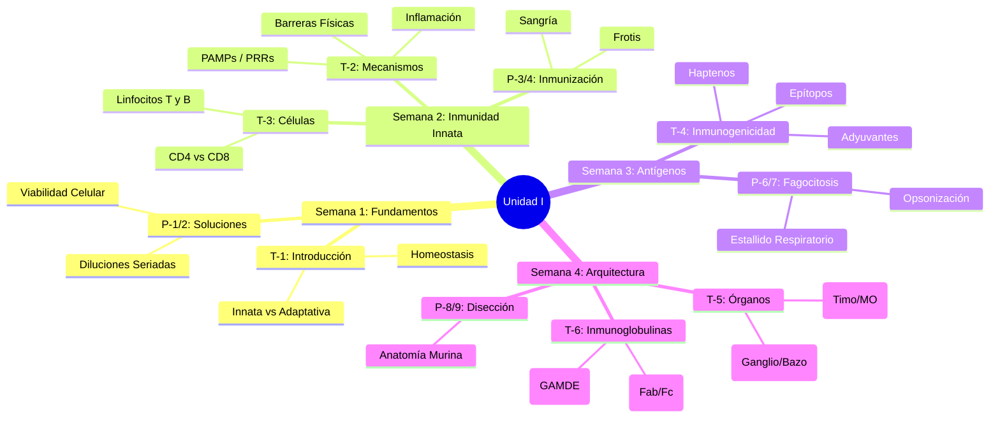

# Unidad I: Bases de la inmunidad innata y adquirida

> **Objetivo de la Unidad**: Al finalizar la unidad, el estudiante describe y relaciona la conformación del sistema inmunológico, características de los antígenos y la antigenicidad de agentes infecciosos e interpreta pruebas inmunológicas cumpliendo procedimientos establecidos.

---

## 🗺️ Mapa de Navegación

### Semana 1: Introducción y Fundamentos
- [[01_Introduccion_Sistema_Inmune|T-1: Introducción al Sistema Inmune]]
    - *Conceptos Clave*: Inmunidad Innata vs. Adaptativa, Homeostasis.
- [[02_Laboratorio_Soluciones_Diluciones|P-1/P-2: Laboratorio - Soluciones y Diluciones]]
    - *Práctica*: Preparación de reactivos, cálculos de diluciones seriadas.

### Semana 2: Inmunidad Innata y Células
- [[03_Inmunidad_Innata|T-2: Inmunidad Innata]]
    - *Conceptos Clave*: Barreras, PAMPs, PRRs, Fagocitosis.
- [[04_Celulas_Sistema_Adaptativo|T-3: Células del Sistema Adaptativo]]
    - *Conceptos Clave*: Linfocitos T y B, CD4 vs CD8.
- [[05_Laboratorio_Inmunizacion_Celulas|P-3/P-4: Laboratorio - Inmunización y Células]]
    - *Práctica*: Inoculación, sangría, identificación celular.

### Semana 3: Antígenos e Inmunogenicidad
- [[06_Inmunogenos_Antigenos|T-4: Inmunógenos y Antígenos]]
    - *Conceptos Clave*: Epítopos, Haptenos, Adyuvantes.
- [[07_Laboratorio_Fagocitosis|P-6/P-7: Laboratorio - Fagocitosis]]
    - *Práctica*: Obtención de células mononucleares.

### Semana 4: Arquitectura y Anticuerpos
- [[08_Organos_Sistema_Inmune|T-5: Órganos del Sistema Inmune]]
    - *Conceptos Clave*: Primarios vs. Secundarios, Recirculación.
- [[09_Inmunoglobulinas|T-6: Inmunoglobulinas]]
    - *Conceptos Clave*: Estructura, Isotipos (IgG, IgM, etc.), Anticuerpos Monoclonales.
- [[10_Laboratorio_Organos_Linfoides|P-8/P-9: Laboratorio - Órganos Linfoides]]
    - *Práctica*: Disección y aislamiento en modelo murino.

---

## 🧠 Conceptos Transversales (Hubs)
- [[Inmunidad_Innata_vs_Adaptativa]]
- [[Reconocimiento_Antigenico]]
- [[Respuesta_Efectora]]

---

## 📚 Recursos Adicionales
- **Lectura 1**: Bioseguridad y riesgo ocupacional.
- **Lectura 2**: Obtención de antígenos microbianos.
