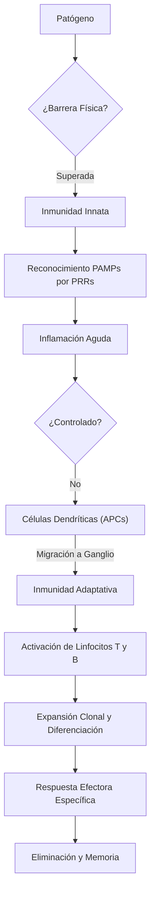

# T-1: Introducción al Sistema Inmune

> *"El sistema inmune no es solo un ejército de defensa; es un sistema de identidad biológica que distingue el 'yo' del 'no-yo' mediante un repertorio molecular casi infinito."*

---

## 1. Perspectiva Histórica y Evolución Conceptual

La inmunología nació de la observación empírica antes de conocerse los microorganismos.

-   **Tucídides (430 a.C.)**: Observó que los sobrevivientes de la plaga de Atenas podían cuidar a los enfermos sin volver a contraer la enfermedad. Primer concepto de *inmunidad* (exención).
-   **Edward Jenner (1796)**: El padre de la vacunación. Observó que las ordeñadoras que contraían *cowpox* (viruela vacuna) eran inmunes a la *smallpox* (viruela humana). Inoculó a un niño con pus de cowpox y luego lo desafió con viruela. **Principio**: Inmunidad cruzada.
-   **Louis Pasteur (1880s)**: Desarrolló el principio de **atenuación**. Trabajando con cólera aviar, descubrió que cultivos viejos no mataban a las gallinas, sino que las protegían. Acuñó el término "vacuna" en honor a Jenner.
-   **El Gran Debate (Siglo XIX)**:
    -   **Inmunidad Celular (Metchnikoff)**: Observó fagocitos en larvas de estrella de mar. Sostuvo que las células eran la base de la defensa.
    -   **Inmunidad Humoral (Ehrlich/Von Behring)**: Descubrieron las "antitoxinas" (anticuerpos) en el suero contra la difteria. Ehrlich propuso la **Teoría de la Cadena Lateral**, precursora de la selección clonal.
    -   **Síntesis**: Hoy sabemos que ambos sistemas (celular y humoral) son interdependientes.

---

## 2. Análisis de Primeros Principios: Homeostasis e Identidad

### Tesis Central
El sistema inmune es una red homeostática de células y moléculas cuya función es mantener la integridad del organismo. No solo defiende contra patógenos, sino que elimina células propias disfuncionales (cáncer, células senescentes) y repara tejidos. Su fallo produce tres patologías fundamentales:
1.  **Inmunodeficiencia**: Respuesta insuficiente (Infecciones, Cáncer).
2.  **Autoinmunidad**: Respuesta errónea contra lo propio (Lupus, Artritis).
3.  **Hipersensibilidad**: Respuesta excesiva contra lo inocuo (Alergias).

### Definiciones Fundamentales
-   **Inmunidad Innata**: Sistema germinal, codificado en el genoma, reconoce patrones conservados (PAMPs). Es la respuesta "por defecto".
-   **Inmunidad Adaptativa**: Sistema somático, genera receptores *de novo* mediante recombinación genética (V(D)J). Reconoce epítopos específicos únicos.
-   **Expansión Clonal**: Principio central de la inmunidad adaptativa. Un solo linfocito específico se multiplica exponencialmente tras reconocer su antígeno.

---

## 3. Componentes y Mecanismos Moleculares

### La Barrera Epitelial y Química
Antes de cualquier célula, existen barreras fisicoquímicas:
-   **Piel**: Estrato córneo impermeable, pH ácido (5.5), ácidos grasos.
-   **Mucosas**: Moco (atrapa microbios), cilios (barrido mecánico).
-   **Moléculas Antimicrobianas**:
    -   *Lisozima*: Rompe el peptidoglicano bacteriano (lágrimas, saliva).
    -   *Defensinas*: Péptidos catiónicos que forman poros en membranas bacterianas.

### Comunicación Intercelular: Citocinas y Quimiocinas
Las células inmunes no tienen "ojos"; se comunican por mediadores solubles.
-   **Citocinas**: Proteínas de señalización (Interleucinas, Interferones, TNF). Actúan de forma:
    -   *Autocrina* (sobre la misma célula: IL-2 en células T).
    -   *Paracrina* (sobre células vecinas: IL-12 de macrófago a NK).
    -   *Endocrina* (a distancia: IL-6 causando fiebre en hipotálamo).
-   **Quimiocinas**: Subfamilia de citocinas que induce **quimiotaxis** (movimiento dirigido por gradiente químico). Ej: CXCL8 atrae neutrófilos.

---

## 4. Comparación Técnica Profunda: Innata vs. Adaptativa

| Característica | Inmunidad Innata | Inmunidad Adaptativa |
| :--- | :--- | :--- |
| **Receptores** | Codificados en línea germinal (PRRs). Limitados (~100 tipos). Invariables. | Codificados por recombinación somática (BCR/TCR). Ilimitados ($10^{11}$ tipos). Únicos por clon. |
| **Distribución** | No clonal (todas las células de una línea tienen los mismos receptores). | Clonal (cada linfocito tiene un receptor único). |
| **Reconocimiento** | Patrones moleculares conservados (LPS, Peptidoglicano, dsRNA). | Detalles estructurales finos de macromoléculas (proteínas, lípidos, carbohidratos). |
| **Cinética** | Inmediata (segundos a horas). Sin fase de latencia. | Retardada (días a semanas). Requiere expansión clonal. |
| **Memoria** | "Entrenada" (epigenética, limitada). | Verdadera memoria inmunológica (rápida, potente, específica). |
| **Evolución** | Invertebrados y Vertebrados (Ancestral). | Solo Vertebrados Mandibulados (Gnathostomata). |

---

## 5. Conexiones Clínicas
-   **Vacunación**: Explota la memoria adaptativa. Introducimos un inmunógeno inocuo para entrenar clones específicos sin riesgo de enfermedad.
-   **Inmunoterapia**: Uso de anticuerpos monoclonales (ej. anti-PD1) para reactivar el sistema inmune contra el cáncer.

---

## 6. Referencias Bibliográficas
1.  **Abbas, A. K., Lichtman, A. H., & Pillai, S.** (2021). *Cellular and Molecular Immunology* (10th ed.). Elsevier. Capítulo 1.
2.  **Janeway, C. A., et al.** (2017). *Immunobiology* (9th ed.). Garland Science.
3.  **Silverstein, A. M.** (1989). *A History of Immunology*. Academic Press.
