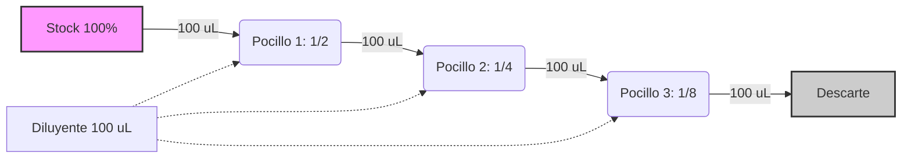

# P-1/P-2: Laboratorio - Soluciones y Diluciones

> *"La inmunología cuantitativa depende de la precisión estequiométrica. Un error en la dilución o el pH puede desnaturalizar anticuerpos o lisar células, invalidando cualquier ensayo."*

---

## 1. Fundamentos Fisicoquímicos de las Soluciones Biológicas

### Osmolaridad y Tonicidad
Las células animales carecen de pared celular, haciéndolas vulnerables a cambios osmóticos.
-   **Solución Isotónica**: Misma presión osmótica que el citosol (~290-300 mOsm/L).
    -   *Ejemplo*: NaCl 0.9% (0.154 M).
    -   *Cálculo*: $0.9\ g/100\ mL \to 9\ g/L$. PM NaCl = 58.44 g/mol.
    -   Molaridad = $9 / 58.44 \approx 0.154\ M$.
    -   Osmolaridad = $0.154 \times 2$ (Na+ y Cl-) $\approx 0.308\ Osm/L$ (ligeramente hipertónica teórica, pero isotónica funcional).
-   **Efecto de la Hipotonicidad**: Entrada neta de agua $\to$ Edema celular $\to$ Lisis osmótica (Hemólisis en eritrocitos).
-   **Efecto de la Hipertonicidad**: Salida neta de agua $\to$ Crenación (arrugamiento).

### Sistemas Amortiguadores (Buffers)
Los anticuerpos son proteínas cuya estructura terciaria depende de interacciones iónicas sensibles al pH.
-   **PBS (Phosphate Buffered Saline)**: El estándar de oro.
    -   Utiliza el par conjugado $H_2PO_4^- \leftrightarrow HPO_4^{2-} + H^+$.
    -   $pK_a \approx 7.2$, ideal para mantener el pH fisiológico (7.4).
-   **Ecuación de Henderson-Hasselbalch**:
    $$pH = pK_a + \log \left( \frac{[A^-]}{[HA]} \right)$$
    Permite calcular la proporción exacta de sal ácida y básica necesaria para un pH objetivo.

---

## 2. Diluciones: Matemática de Laboratorio

### Diluciones Simples y Factor de Dilución
El **Factor de Dilución (FD)** es un número adimensional que indica cuántas veces se ha diluido la muestra.
$$FD = \frac{V_{final}}{V_{inicial}} = \frac{C_{inicial}}{C_{final}}$$

**Ejemplo Práctico**: Se requieren 50 mL de una solución de anticuerpo a 5 µg/mL a partir de un stock de 1 mg/mL.
1.  Unificar unidades: $1\ mg/mL = 1000\ \mu g/mL$.
2.  Aplicar $C_1 V_1 = C_2 V_2$:
    $$(1000) \cdot V_1 = (5) \cdot (50)$$
    $$V_1 = \frac{250}{1000} = 0.25\ mL = 250\ \mu L$$
3.  Procedimiento: Tomar 250 µL de stock y añadir 49.75 mL de diluyente.

### Diluciones Seriadas y Titulación
Usadas para determinar el **título** de un anticuerpo (la inversa de la mayor dilución que aún da positivo).
-   **Serie Logarítmica (Base 2)**: 1/2, 1/4, 1/8, 1/16... ($2^{-n}$).
-   **Serie Semilogarítmica (Base 10)**: 1/10, 1/100, 1/1000... ($10^{-n}$).

**Protocolo de Dilución Seriada (Base 2) en Microplaca**:
1.  Añadir 50 µL de diluyente en los pocillos 2 al 12.
2.  Añadir 100 µL de muestra en el pocillo 1.
3.  Transferir 50 µL del pocillo 1 al 2. Mezclar pipeteando (vortex interno).
4.  Transferir 50 µL del 2 al 3. Repetir hasta el final.
5.  Descartar 50 µL del último pocillo para igualar volúmenes.

**Cálculo de Concentración en el Pocillo $n$**:
$$C_n = C_{inicial} \times \left( \frac{V_{transferencia}}{V_{transferencia} + V_{diluyente}} \right)^{n-1}$$

---

---

## 3. Colorantes de Viabilidad: Fundamento Molecular

### Azul de Tripán (Trypan Blue)
-   **Peso Molecular**: ~960 Da. Es una molécula cargada negativamente (aniónica).
-   **Mecanismo de Exclusión**: Las células vivas tienen bombas de membrana activas y una membrana selectiva que repele moléculas aniónicas grandes.
-   **Mecanismo de Tinción**: Cuando la membrana pierde integridad (muerte celular/necrosis), el colorante difunde pasivamente al citoplasma y se une a proteínas intracelulares.
-   **Limitación**: No distingue entre apoptosis temprana (membrana intacta) y células vivas. Para eso se usa Anexina V.

### Cámara de Neubauer (Hemocitómetro)
Instrumento de precisión para el conteo celular.
-   **Volumen de conteo**: El área central tiene $1\ mm^2$ y la profundidad es $0.1\ mm$. Volumen = $0.1\ mm^3 = 0.1\ \mu L = 10^{-4}\ mL$.
-   **Fórmula de Conteo**:
    $$Células/mL = \frac{N_{células} \times FD}{N_{cuadrantes} \times V_{cuadrante}}$$
    Simplificado para 4 cuadrantes grandes:
    $$Células/mL = \frac{N_{total}}{4} \times 10,000 \times FD$$

---

## 4. Aplicación Clínica
-   **Titulación de Anticuerpos**: Diagnóstico de infecciones (ej. Título de ASO > 200 UI/mL indica infección estreptocócica reciente).
-   **Viabilidad Celular**: Crítico en trasplante de médula ósea y terapia celular (CAR-T). Se requiere >90% de viabilidad para infusión.

---

### Referencias
-   **Cold Spring Harbor Protocols**. (2021). *Dilutions and Buffers*.
-   **Current Protocols in Immunology**. Wiley.
