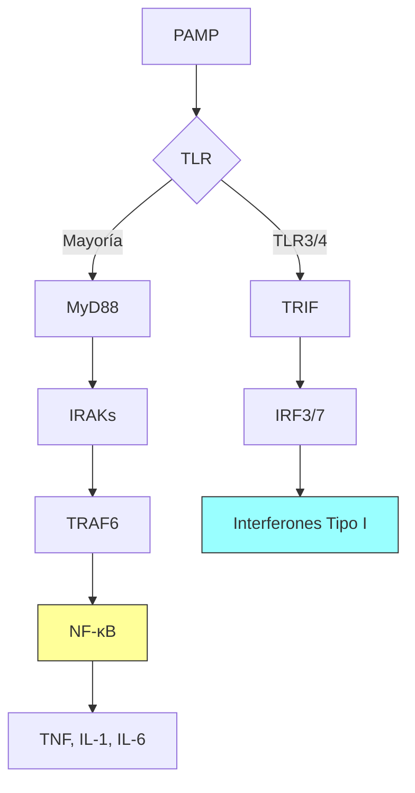

# T-2: Inmunidad Innata: Mecanismos Moleculares

> *"La inmunidad innata no es inespecífica; es 'específica de patrón'. Utiliza un código genético ancestral para detectar firmas moleculares esenciales para la vida microbiana."*

---

## 1. Reconocimiento Molecular: PRRs y sus Ligandos

El sistema innato utiliza **Receptores de Reconocimiento de Patrones (PRRs)** para detectar **PAMPs** (asociados a patógenos) y **DAMPs** (asociados a daño/peligro).

### Familias de PRRs
1.  **Toll-Like Receptors (TLRs)**: Glucoproteínas transmembrana con dominios ricos en leucina (LRR) para reconocimiento y dominio TIR intracelular para señalización.
    -   **Superficie Celular**:
        -   *TLR2*: Peptidoglicano (Gram+), Lipoproteínas. Forma heterodímeros (TLR1/2, TLR2/6).
        -   *TLR4*: Lipopolisacárido (LPS) de Gram-negativas. Requiere correceptores MD2 y CD14.
        -   *TLR5*: Flagelina bacteriana.
    -   **Endosomales** (Detectan ácidos nucleicos, típicos de virus):
        -   *TLR3*: dsRNA (ARN doble cadena).
        -   *TLR7/8*: ssRNA (ARN cadena simple).
        -   *TLR9*: DNA con motivos CpG no metilados (bacteriano/viral).

2.  **NOD-Like Receptors (NLRs)**: Receptores citosólicos.
    -   *NOD1/NOD2*: Detectan peptidoglicano intracelular.
    -   *NLRP3*: Forma el **Inflamasoma**, un complejo multiproteico que activa la Caspasa-1 para procesar IL-1β e IL-18 (citocinas pirogénicas).

3.  **RIG-I-Like Receptors (RLRs)**: Sensores citosólicos de ARN viral (RIG-I, MDA5). Inducen fuertemente Interferones tipo I.

### Vías de Señalización Intracelular
La unión Ligando-Receptor activa cascadas de fosforilación:
1.  **Vía MyD88-dependiente** (usada por todos los TLRs excepto TLR3):
    -   Reclutamiento de MyD88 $\to$ IRAK $\to$ TRAF6 $\to$ Activación de **NF-κB** y **AP-1**.
    -   **Resultado**: Transcripción de citocinas proinflamatorias (TNF, IL-6, IL-1).
2.  **Vía TRIF-dependiente** (usada por TLR3 y TLR4):
    -   Reclutamiento de TRIF $\to$ Activación de **IRF3/IRF7**.
    -   **Resultado**: Transcripción de **Interferones Tipo I (IFN-α/β)** $\to$ Estado antiviral.

---

---

## 2. Sistema del Complemento: La Cascada Proteolítica

Sistema de >30 proteínas plasmáticas (zimógenos) que se activan en cascada.

### Vías de Activación
1.  **Vía Clásica**: Iniciada por complejos Antígeno-Anticuerpo (IgM o IgG) unidos a C1q.
2.  **Vía de las Lectinas**: Iniciada por la unión de MBL (Lectina de Unión a Manosa) a carbohidratos microbianos.
3.  **Vía Alterna**: Activación espontánea ("tickover") de C3 sobre superficies microbianas que carecen de reguladores del complemento.

### Convergencia y Efectos
Todas las vías convergen en la formación de la **C3 Convertasa**, que cliva C3 en C3a y C3b.
-   **C3a / C5a (Anafilotoxinas)**: Inducen inflamación, quimiotaxis de neutrófilos y degranulación de mastocitos.
-   **C3b (Opsonina)**: "Marca" al patógeno para ser fagocitado por macrófagos (que tienen receptores CR1).
-   **Complejo de Ataque a Membrana (MAC - C5b-9)**: Forma un poro en la membrana del patógeno causando lisis osmótica (crítico para *Neisseria*).

---

## 3. Respuesta Celular Innata

### Neutrófilos (PMN)
-   Vida media corta (horas).
-   **Mecanismos**:
    -   *Estallido Respiratorio*: NADPH oxidasa genera Superóxido ($O_2^-$) $\to$ Peróxido de Hidrógeno ($H_2O_2$) $\to$ Hipoclorito ($HOCl$, lejía) mediante Mieloperoxidasa (MPO).
    -   *NETosis*: Expulsión de trampas extracelulares de ADN y cromatina (NETs) para inmovilizar microbios.

### Macrófagos
-   Fenotipos plásticos:
    -   **M1 (Clásico)**: Proinflamatorio, microbicida (ROS, NO). Inducido por IFN-γ y LPS.
    -   **M2 (Alternativo)**: Antiinflamatorio, reparación tisular. Inducido por IL-4, IL-13.

### Células Natural Killer (NK)
-   Linfocitos de la inmunidad innata (sin TCR).
    > [!NOTE] Hipótesis del "Missing Self"
    > Las NK tienen receptores inhibidores (KIR) que reconocen MHC-I propio.
    > - **Célula sana** (MHC-I alto) $\to$ Señal negativa $\to$ NK no mata.
    > - **Célula infectada/tumoral** (baja MHC-I para evadir T CD8) $\to$ Pierde señal negativa $\to$ **NK mata**.
-   **Mecanismo Lítico**: Perforina (poros) y Granzimas (activan caspasas apoptóticas).

---

## 4. Correlación Clínica
-   **Enfermedad Granulomatosa Crónica (CGD)**: Defecto en la NADPH oxidasa. Los fagocitos no pueden matar bacterias catalasa-positivas (*S. aureus*, *Aspergillus*). Formación de granulomas.
-   **Deficiencia de C3**: Susceptibilidad severa a infecciones bacterianas piógenas encapsuladas.
-   **Sepsis**: Activación sistémica y descontrolada de TLRs por LPS, llevando a tormenta de citocinas (TNF, IL-1), hipotensión y fallo multiorgánico.

---

### Referencias
1.  **Abbas, A. K.** (2021). *Cellular and Molecular Immunology*. Capítulo 2 y 13.
2.  **Akira, S., Uematsu, S., & Takeuchi, O.** (2006). Pathogen recognition and innate immunity. *Cell*, 124(4), 783-801.
3.  **Murphy, K., & Weaver, C.** (2016). *Janeway's Immunobiology*. Garland Science.
