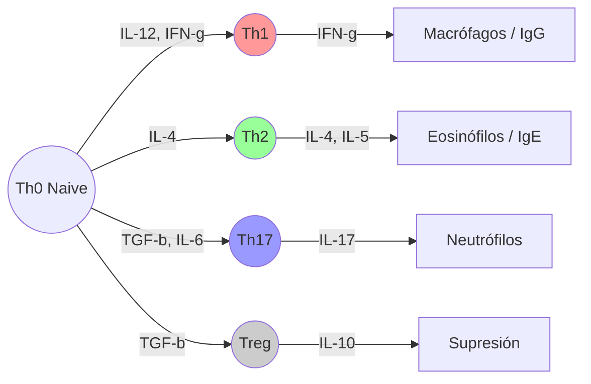

# T-3: Células del Sistema Inmunitario Adaptativo

> *"La diversidad del repertorio inmune adaptativo ($>10^{11}$ especificidades) supera el número de genes en el genoma humano, una hazaña lograda mediante recombinación somática."*

---

## 1. Biología Molecular del Receptor de Antígeno

La característica definitoria de los linfocitos es la expresión de receptores clonales (BCR y TCR).

### Recombinación V(D)J
¿Cómo generamos millones de receptores con solo ~20,000 genes?
-   **Locus Génico**: Los genes de las inmunoglobulinas y TCR no están contiguos en la línea germinal. Están fragmentados en segmentos:
    -   **V** (Variable)
    -   **D** (Diversidad - solo en cadenas pesadas/beta)
    -   **J** (Unión/Joining)
    -   **C** (Constante)
-   **Enzimas RAG1/RAG2**: Recombinasas que cortan y empalman aleatoriamente un segmento V, uno D y uno J.
-   **Diversidad de la Unión**: La enzima TdT (Desoxinucleotidil Transferasa Terminal) añade nucleótidos al azar (N-nucleótidos) en las uniones, aumentando exponencialmente la variabilidad.
-   **Resultado**: Cada linfocito sale de la médula/timo con una combinación única de ADN.

### Selección Clonal
Teoría propuesta por Burnet.
1.  Cada linfocito expresa un solo tipo de receptor.
2.  La unión del antígeno a ese receptor induce la proliferación (clonación) de esa célula específica.
3.  Los clones resultantes tienen la misma especificidad que la célula original.

---

## 2. Linfocitos T: Subpoblaciones y Funciones Efectoras

### Marcadores de Superficie
-   **CD3**: Complejo de señalización asociado al TCR (transduce la señal al núcleo). Presente en TODOS los T.
-   **CD4**: Correceptor que se une a MHC-II.
-   **CD8**: Correceptor que se une a MHC-I.

### Linfocitos T Helper (CD4+): Los Orquestadores
Tras activarse, se diferencian en subpoblaciones según las citocinas del entorno (polarización):

| Subpoblación | Citocinas Inductoras | Factor Transcripcional | Citocinas Secretadas | Función Principal | Patógenos Diana |
| :--- | :--- | :--- | :--- | :--- | :--- |
| **Th1** | IL-12, IFN-γ | T-bet | IFN-γ, IL-2 | Activa macrófagos, IgG | Intracelulares (Virus, Micobacterias) |
| **Th2** | IL-4 | GATA-3 | IL-4, IL-5, IL-13 | Activa eosinófilos, IgE, moco | Helmintos (Parásitos), Alérgenos |
| **Th17** | TGF-β, IL-6 | RORγt | IL-17, IL-22 | Recruta neutrófilos, defensinas | Bacterias extracelulares, Hongos |
| **Treg** | TGF-β | FoxP3 | TGF-β, IL-10 | Suprime respuesta inmune | Tolerancia, previene autoinmunidad |
| **Tfh** | IL-6, IL-21 | Bcl-6 | IL-21 | Ayuda a células B en centro germinal | Producción de anticuerpos alta afinidad |

### Linfocitos T Citotóxicos (CD8+): Los Ejecutores
-   **Activación**: Requieren presentación cruzada (Cross-presentation) por células dendríticas y ayuda de Th1 (IL-2).
-   **Sinapsis Inmunológica**: Forman un contacto estrecho con la célula diana.
-   **Mecanismos de Muerte**:
    1.  **Perforina/Granzima**: La perforina crea poros; las granzimas entran y clivan caspasas (muerte apoptótica).
    2.  **Fas/FasL**: El ligando Fas (CD178) en el T se une a Fas (CD95) en la diana, activando la vía extrínseca de apoptosis.

---

## 3. Linfocitos B: Inmunidad Humoral

-   **BCR (B Cell Receptor)**: Es una inmunoglobulina de membrana (IgM e IgD) asociada a cadenas de señalización Igα/Igβ.
-   **Activación T-dependiente**:
    1.  B reconoce antígeno nativo $\to$ Endocitosis $\to$ Procesamiento.
    2.  Presenta péptido en MHC-II al Linfocito Tfh.
    3.  Tfh provee señal CD40L y citocinas.
    4.  **Resultado**: Cambio de isotipo (Class Switching), Hipermutación Somática (maduración de afinidad) y memoria de larga vida.
-   **Activación T-independiente**: Antígenos poliméricos (LPS, polisacáridos) entrecruzan múltiples BCRs. Respuesta rápida (IgM) pero sin memoria robusta.

---

## 4. Correlación Clínica
-   **Síndrome de DiGeorge**: Aplasia tímica (sin Timo). No hay maduración de células T. Inmunodeficiencia severa, infecciones virales/fúngicas recurrentes.
-   **Síndrome de Hiper-IgM**: Defecto en CD40L (en células T). Los B no pueden cambiar de isotipo. El paciente tiene mucha IgM pero nada de IgG/IgA/IgE. Infecciones piógenas.
-   **Leucemia Linfoblástica Aguda (LLA)**: Cáncer de precursores linfoides inmaduros en médula ósea.

---

### Referencias
1.  **Abbas, A. K.** (2021). *Cellular and Molecular Immunology*. Capítulos 4, 5, 9 y 10.
2.  **Tonegawa, S.** (1983). Somatic generation of antibody diversity. *Nature*, 302(5909), 575-581. (Premio Nobel).
