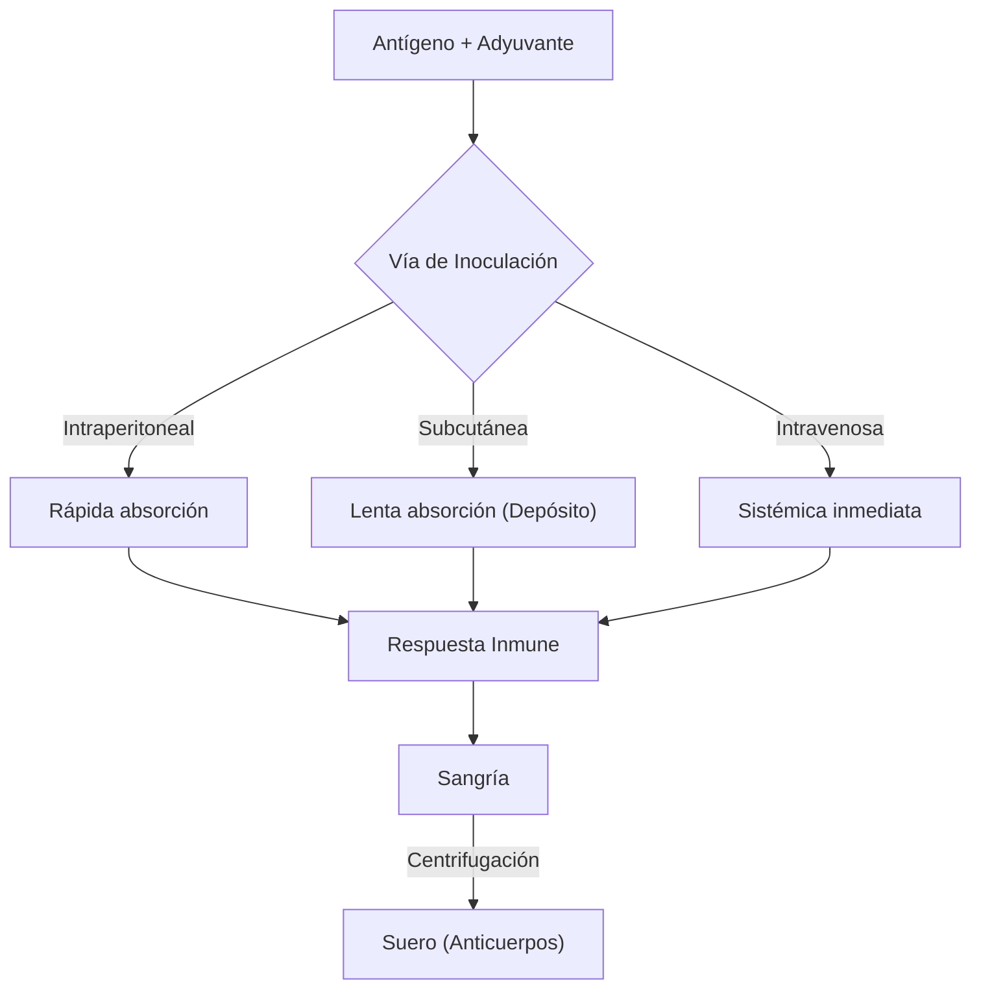

# P-3/P-4: Laboratorio - Inmunización y Células

> *"La inmunología experimental comienza con la capacidad de generar una respuesta inmune (inmunización) y obtener los efectores (sangría y aislamiento celular)."*

---

## 1. P-3: Preparación de Agentes Inmunizantes e Inoculación

### Conceptos Básicos
-   **Inmunización**: Proceso de inducir inmunidad artificialmente.
-   **Adyuvante**: Sustancia que se mezcla con el antígeno para potenciar la respuesta inmune (ej. Adyuvante Completo de Freund - FCA).
    -   *Mecanismo*: Libera el antígeno lentamente (efecto depósito) y activa la inmunidad innata (contiene micobacterias muertas).

### Vías de Inoculación (Ratón)
La vía determina el tipo y magnitud de la respuesta.
1.  **Intraperitoneal (i.p.)**: Común para obtener grandes volúmenes de anticuerpos o células. Rápida absorción.
    -   *Técnica*: Sujetar al ratón, inclinar cabeza abajo (para que las vísceras bajen), inyectar en cuadrante inferior derecho/izquierdo.
2.  **Subcutánea (s.c.)**: Lenta absorción, buena para sólidos/adyuvantes. En el lomo.
3.  **Intravenosa (i.v.)**: En la vena lateral de la cola. Efecto inmediato. Difícil técnica.
4.  **Intramuscular (i.m.)**: En el muslo posterior.

### Sangría (Obtención de Sangre)
-   **Punción Cardíaca**: Terminal (el animal muere). Para máximo volumen.
-   **Seno Retro-orbital**: Con capilar. No terminal.
-   **Vena de la cola**: Pequeños volúmenes.

---

---

## 2. P-4: Células del Sistema Inmunitario (Frotis Sanguíneo)

Para observar las células inmunes circulantes, realizamos un **Frotis Sanguíneo** teñido con **Wright** o **Giemsa**.

### Identificación Morfológica

| Célula | Morfología del Núcleo | Citoplasma | Función Principal |
| :--- | :--- | :--- | :--- |
| **Neutrófilo** | Multilobulado (3-5 lóbulos) | Gránulos finos, rosa pálido | Fagocitosis bacteriana (1ra línea) |
| **Eosinófilo** | Bilobulado (gafas de sol) | Gránulos grandes **rojo/naranja** | Parásitos y alergias |
| **Basófilo** | Lobulado (difícil de ver) | Gránulos grandes **azul oscuro** | Inflamación, histamina |
| **Linfocito** | Redondo, grande, ocupa casi todo | Escaso, azul cielo | Inmunidad adaptativa (T, B, NK) |
| **Monocito** | Arriñonado (forma de frijol) | Grisáceo, con vacuolas | Precursor de macrófago |

### Procedimiento de Coloración Wright
1.  Realizar el extendido (frotis) fino. Secar al aire.
2.  Cubrir con colorante Wright (fijador + colorante) por 1-3 min.
3.  Añadir buffer fosfato (o agua destilada) sobre el colorante sin botarlo. Soplar suavemente hasta que aparezca brillo metálico. Dejar 5-10 min.
4.  Lavar con agua corriente. Secar.
5.  Observar a 100x con aceite de inmersión.

---

## 3. Conexiones
-   Las células que observamos aquí son las estudiadas en teoría en [[03_Inmunidad_Innata]] (granulocitos) y [[04_Celulas_Sistema_Adaptativo]] (linfocitos).
-   Los anticuerpos obtenidos por sangría se titularán usando las técnicas de [[02_Laboratorio_Soluciones_Diluciones]].

---

### Referencias
-   Guía de Prácticas de Inmunología.
-   Atlas de Hematología.
