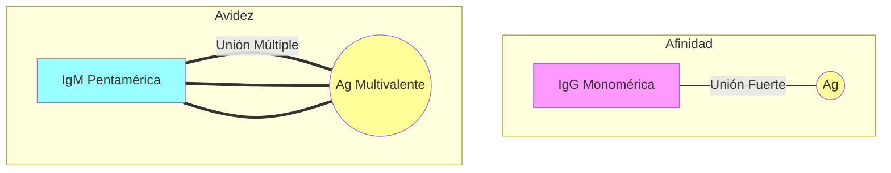

# T-4: Inmunógenos y Antígenos: Bases Fisicoquímicas

> *"La interacción antígeno-anticuerpo es el evento molecular central de la inmunología, gobernado por fuerzas termodinámicas no covalentes que determinan la afinidad y la especificidad."*

---

## 1. Naturaleza del Antígeno y el Epítopo

### Definiciones Avanzadas
-   **Inmunogenicidad**: Capacidad intrínseca de inducir una respuesta inmune (humoral o celular).
-   **Antigenicidad**: Capacidad de combinarse específicamente con los productos finales de la respuesta (anticuerpos o TCR).
-   **Hapteno**: Molécula de bajo peso molecular (<1 kDa) que es antigénica pero no inmunogénica.
    -   *Mecanismo de Landsteiner*: Karl Landsteiner demostró que los haptenos (ej. dinitrofenol) conjugados a un *carrier* (proteína portadora) generan anticuerpos anti-hapteno, anti-carrier y anti-conjugado. Esto es la base de las **alergias a fármacos** (ej. penicilina actuando como hapteno unido a albúmina sérica).

### Tipos de Epítopos (Determinantes Antigénicos)
1.  **Lineales (Secuenciales)**: Secuencia continua de aminoácidos (6-10 residuos).
    -   Reconocidos por: Células T (siempre) y Anticuerpos (a veces, si la proteína está desnaturalizada).
2.  **Conformacionales (Discontinuos)**: Aminoácidos distantes en la secuencia primaria pero cercanos en el plegamiento tridimensional.
    -   Reconocidos por: Células B / Anticuerpos.
    -   *Importancia*: Si desnaturalizas la proteína (calor), se pierde el epítopo conformacional y el anticuerpo deja de unirlo.

---

## 2. Factores que Determinan la Inmunogenicidad

Para que una molécula sea un buen inmunógeno, debe cumplir la regla de las **4 C**:
1.  **Cuerpo extraño (Foreignness)**: Distancia filogenética. El sistema inmune es tolerante a lo propio.
2.  **Composición Química**: Proteínas > Polisacáridos > Ácidos Nucleicos > Lípidos.
    -   La complejidad estructural (aromaticidad) aumenta la inmunogenicidad (ej. tirosina aumenta respuesta).
3.  **Configuración Molecular (Peso)**: Generalmente >100 kDa. Moléculas <5-10 kDa son pobres inmunógenos.
4.  **Capacidad de Procesamiento**: Debe ser degradable por fagocitos. Polímeros D-aminoácidos (no naturales) no son degradables y inducen tolerancia.

**Factores del Huésped**:
-   **Genotipo MHC**: Solo se responde a un antígeno si el individuo tiene un alelo MHC capaz de presentar péptidos de ese antígeno (*Determinante de la respuesta inmune*).
-   **Dosis y Vía**: Dosis muy bajas o muy altas pueden inducir tolerancia (anergia). Vía subcutánea > Intravenosa > Oral (tolerogénica).

---

## 3. Interacción Antígeno-Anticuerpo: Termodinámica

La unión Ag-Ac es **reversible** y **no covalente**. Se rige por la Ley de Acción de Masas.

$$[Ag] + [Ac] \leftrightarrow [Ag-Ac]$$

### Fuerzas Intermoleculares Implicadas
1.  **Fuerzas Electrostáticas (Iónicas)**: Atracción entre cargas opuestas ($NH_3^+$ y $COO^-$). Dependen del pH y fuerza iónica.
2.  **Puentes de Hidrógeno**: Entre átomos electronegativos (O, N) e hidrógeno. Requieren alta complementariedad estructural.
3.  **Fuerzas de Van der Waals**: Interacciones débiles dipolo-dipolo a distancias muy cortas. Dependen críticamente del ajuste estérico ("llave-cerradura").
4.  **Fuerzas Hidrofóbicas**: Exclusión de agua entre superficies apolares. Aportan gran parte de la energía de unión.

### Afinidad vs. Avidez
-   **Afinidad ($K_a$)**: Fuerza de unión entre **un solo** sitio del anticuerpo (parátopo) y un solo epítopo.
    $$K_a = \frac{[Ag-Ac]}{[Ag][Ac]}$$
-   **Avidez**: Fuerza total de unión de un anticuerpo multivalente con un antígeno multivalente.
    -   *Ejemplo*: La IgM tiene baja afinidad intrínseca (cada brazo une débil), pero al tener 10 brazos (pentámero), su **avidez** es altísima (efecto velcro).

---

## 4. Adyuvantes: Potenciadores de la Respuesta

Sustancias que, mezcladas con el antígeno, aumentan su inmunogenicidad.
1.  **Sales de Aluminio (Alumbre)**: Único aprobado extensamente en humanos. Precipita el antígeno (efecto depósito) y facilita fagocitosis.
2.  **Adyuvante Completo de Freund (FCA)**: Aceite mineral + Micobacterias muertas. Activa fuertemente TLRs (innata) induciendo respuesta Th1 potente. (Solo uso animal).
3.  **MF59/AS03**: Emulsiones de escualeno. Usados en vacunas de gripe/COVID.

---

## 5. Correlación Clínica
-   **Reacción Cruzada**: Cuando un anticuerpo une un antígeno similar pero no idéntico.
    -   *Ejemplo*: Fiebre Reumática. Anticuerpos contra *Streptococcus pyogenes* reaccionan cruzadamente con proteínas del corazón (mimetismo molecular).
-   **Vacunas Conjugadas**: Vacuna contra *Haemophilus influenzae* tipo b. El polisacárido capsular (hapteno/T-independiente) se conjuga a toxina tetánica (carrier) para reclutar ayuda T y generar memoria en niños.

---

### Referencias
1.  **Kuby Immunology**. (8th ed). Capítulos 3 y 4.
2.  **Van Oss, C. J.** (1995). Hydrophobic, hydrophilic and other interactions in epitope-paratope binding. *Molecular Immunology*.
