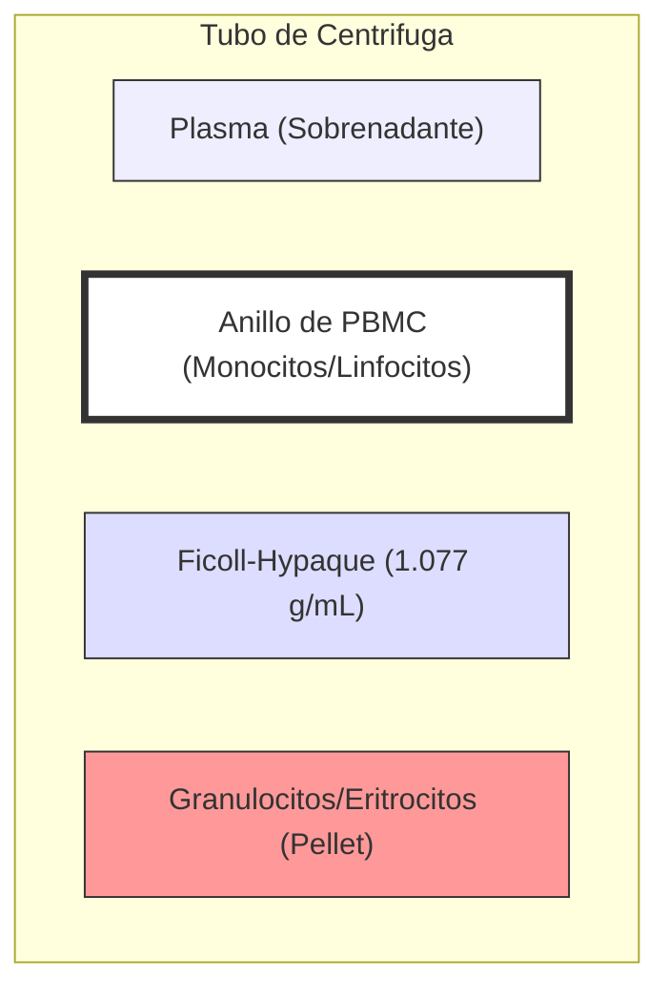

# P-6/P-7: Laboratorio - Fagocitosis y Células Mononucleares

> *"El aislamiento de células viables y funcionales es el paso limitante de la inmunología celular. La pureza y el rendimiento determinan el éxito de los ensayos posteriores."*

---

## 1. P-7: Aislamiento de PBMC (Peripheral Blood Mononuclear Cells)

### Principio Físico: Sedimentación Diferencial
La separación se basa en diferencias de **densidad** ($\rho$).
-   **Ficoll-Hypaque**: Polímero de sacarosa de alto peso molecular (Ficoll) mezclado con diatrizoato de sodio (Hypaque) para ajustar densidad a **1.077 g/mL**.

### Distribución de Densidades Celulares
1.  **Plasma**: ~1.025 g/mL (Sobrenadante).
2.  **Monocitos/Linfocitos (PBMC)**: ~1.060 - 1.070 g/mL. (Menos densos que Ficoll $\to$ Flotan).
3.  **Ficoll-Hypaque**: 1.077 g/mL.
4.  **Granulocitos (Neutrófilos)**: ~1.080 - 1.090 g/mL. (Más densos $\to$ Se hunden).
5.  **Eritrocitos**: ~1.090 - 1.110 g/mL. (Se hunden y aglutinan por el Ficoll).

### Protocolo Crítico
-   **Proporción**: Generalmente 1 volumen de Ficoll por 2 volúmenes de sangre diluida.
-   **Frenado**: La centrífuga debe detenerse **SIN FRENO** (inercia). Un frenado brusco mezcla las fases y destruye el anillo de células.
-   **Viabilidad**: Se verifica con Azul de Tripán (debe ser >95%).
-   **Contaminación**: Es común tener plaquetas en el anillo. Se eliminan con lavados a baja velocidad (200g).

---

---

## 2. P-6: Ensayo Funcional de Fagocitosis

### Fases de la Fagocitosis (Visualizables)
1.  **Quimiotaxis**: Acercamiento del fagocito.
2.  **Adherencia (Opsonización)**: Paso crítico.
    -   Sin opsoninas (IgG, C3b), la fagocitosis es ineficiente (superficies bacterianas negativas repelen al fagocito negativo).
    -   *Experimento*: Comparar fagocitosis de levaduras en suero fresco (con complemento) vs. suero inactivado por calor (sin complemento).
3.  **Ingestión**: Formación de pseudópodos y cierre del fagosoma.
4.  **Digestión (Killing)**: Fusión fagosoma-lisosoma (fagolisosoma).

### Cálculo de Índices Fagocíticos
Se cuentan 100-200 células fagocíticas (Neutrófilos/Macrófagos).

1.  **Porcentaje de Fagocitosis (%F)**: Eficiencia de la población.
    $$%F = \frac{\text{Nº Fagocitos con levaduras}}{\text{Nº Total de Fagocitos contados}} \times 100$$

2.  **Índice Fagocítico (IF)**: Capacidad individual (voracidad).
    $$IF = \frac{\text{Nº Total de levaduras ingeridas}}{\text{Nº de Fagocitos positivos (que comieron)}}$$

### Ensayo de Reducción de NBT (Nitroblue Tetrazolium)
Evalúa el **Estallido Respiratorio** (Metabolismo Oxidativo).
-   **Principio**: El NBT es amarillo y soluble. El anión superóxido ($O_2^-$) generado por la NADPH oxidasa reduce el NBT a **Formazán** (azul oscuro/negro insoluble).
-   **Resultado**:
    -   *Fagocitos Activados*: Tienen gránulos azul oscuro en el citoplasma.
    -   *Fagocitos en CGD (Enfermedad Granulomatosa Crónica)*: No reducen NBT (permanecen incoloros). Prueba diagnóstica clásica.

---

## 3. Aplicaciones en Investigación
-   **Cultivo de Macrófagos**: Los monocitos aislados de PBMC se pueden diferenciar a macrófagos en placa con M-CSF (Macrophage Colony-Stimulating Factor) para estudios de infección *in vitro*.
-   **Ensayos de Proliferación**: Los linfocitos de PBMC se usan para medir respuesta a mitógenos (PHA, ConA) o antígenos específicos.

---

### Referencias
1.  **Bøyum, A.** (1968). Isolation of mononuclear cells and granulocytes from human blood. *Scandinavian Journal of Clinical and Laboratory Investigation*.
2.  **Current Protocols in Immunology**. Chapter 7: Immunologic Studies in Humans.
