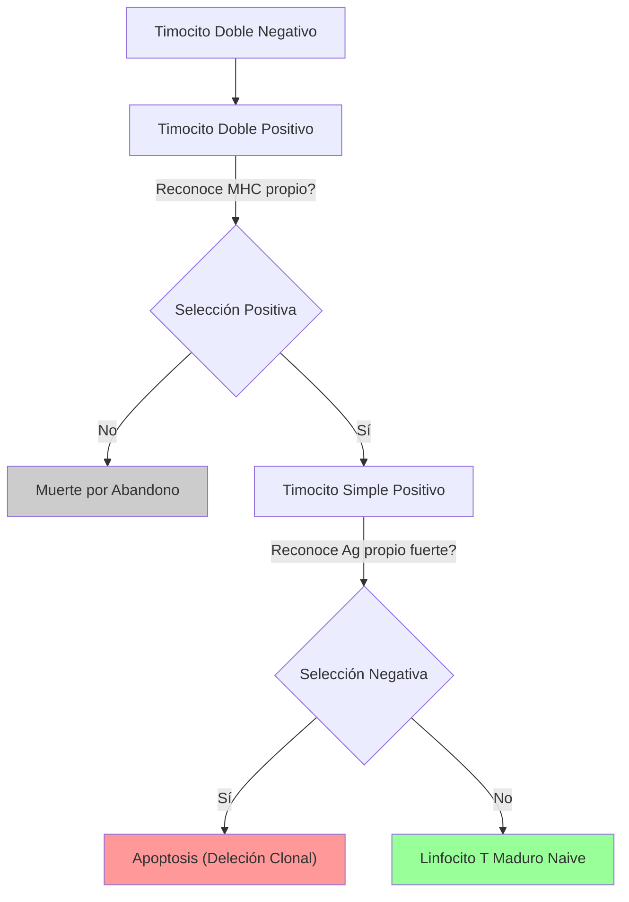

# T-5: Órganos del Sistema Inmune: Microanatomía Funcional

> *"La arquitectura de los órganos linfoides no es aleatoria; está optimizada para maximizar la probabilidad de encuentro entre un linfocito (que es 1 en 100,000) y su antígeno específico."*

---

## 1. Órganos Linfoides Primarios: La Escuela de la Tolerancia

### Timo: Selección Tímica
Órgano linfoepitelial bilobulado. Histológicamente tiene Corteza (externa, densa) y Médula (interna, pálida).
1.  **Corteza**:
    -   Llegan los progenitores desde médula ósea (Timocitos Doble Negativos: CD4-CD8-).
    -   Proliferan y expresan ambos correceptores (Doble Positivos: CD4+CD8+).
    -   **Selección Positiva**: Las Células Epiteliales Corticales (cTEC) presentan MHC propio. Si el timocito reconoce MHC con afinidad moderada $\to$ Sobrevive (Restricción por MHC). Si no $\to$ Apoptosis (Muerte por abandono).
2.  **Médula**:
    -   Los timocitos viajan aquí (ya son Simple Positivos: CD4+ o CD8+).
    -   **Selección Negativa**: Las Células Epiteliales Medulares (mTEC) expresan el factor de transcripción **AIRE** (Autoimmune Regulator), que les permite mostrar proteínas de *otros* tejidos (insulina, tiroglobulina).
    -   Si el timocito reconoce estos antígenos propios con *alta* afinidad $\to$ Apoptosis (Deleción Clonal) para evitar autoinmunidad.

### Médula Ósea
-   Nicho hematopoyético. Contiene células madre (HSC) y células estromales (CXCL12) que sostienen el desarrollo B.
-   **Checkpoint de Células B**: Si el BCR de un B inmaduro reconoce antígeno propio en la médula $\to$ Edición del Receptor (cambia su cadena ligera) o Apoptosis.

---

## 2. Órganos Linfoides Secundarios: El Campo de Batalla

### Ganglio Linfático (Filtro de Tejidos)
Estructura encapsulada que filtra la linfa.
1.  **Corteza (Zona de Células B)**: Organizada en **Folículos**.
    -   *Folículo Primario*: B vírgenes en reposo.
    -   *Folículo Secundario*: Tiene un **Centro Germinal** activo donde ocurre la proliferación B, hipermutación somática y cambio de isotipo tras la activación.
2.  **Paracorteza (Zona de Células T)**: Rica en Células Dendríticas y vénulas de endotelio alto (HEV) por donde entran los linfocitos T desde la sangre (homing vía CCR7).
3.  **Médula**: Cordones medulares con células plasmáticas secretando anticuerpos hacia la linfa eferente.

### Bazo (Filtro Sanguíneo)
No tiene conexión linfática aferente. Filtra antígenos de la sangre.
1.  **Pulpa Roja**: Destrucción de eritrocitos viejos (hemocateresis) por macrófagos.
2.  **Pulpa Blanca**: Tejido linfoide periarteriolar.
    -   *PALS (Vaina Linfoide Periarteriolar)*: Zona de Células T alrededor de la arteriola central.
    -   *Folículos*: Zona de Células B adyacente a la PALS.
    -   *Zona Marginal*: Frontera rica en macrófagos y células B de zona marginal (respuesta rápida a polisacáridos bacterianos encapsulados).

### MALT (Mucosa-Associated Lymphoid Tissue)
-   No encapsulado.
-   **Placas de Peyer** (Intestino): Tienen **Células M** (Microfold) especializadas en translocar antígenos desde la luz intestinal hacia las células dendríticas subyacentes (transcitosis). Producción masiva de IgA secretora.

---

## 3. Recirculación y Homing ("Código Postal")
Los linfocitos saben a dónde ir gracias a moléculas de adhesión y receptores de quimiocinas.
-   **Linfocito T Virgen**: Expresa **CCR7** y **L-Selectina** $\to$ Va a Ganglios Linfáticos (que tienen CCL19/21).
-   **Linfocito T Efector**: Pierde CCR7, gana integrinas (VLA-4) $\to$ Va a tejidos inflamados.
-   **Linfocito de Mucosa**: Expresa integrina $\alpha4\beta7$ $\to$ Va al intestino (MAdCAM-1).

---

## 4. Correlación Clínica
-   **Esplenectomía**: Pacientes sin bazo tienen alto riesgo de sepsis por bacterias encapsuladas (*Pneumococcus*, *Meningococcus*, *Haemophilus*) porque pierden la Zona Marginal y los macrófagos esplénicos. Requieren vacunación obligatoria.
-   **Síndrome APECED**: Mutación en el gen **AIRE**. Falla la selección negativa en el timo $\to$ Autoinmunidad poliglandular (atacan paratiroides, adrenales, etc.).

---

### Referencias
1.  **Abbas, A. K.** (2021). *Cellular and Molecular Immunology*. Capítulo 2.
2.  **Mebius, R. E., & Kraal, G.** (2005). Structure and function of the spleen. *Nature Reviews Immunology*.
