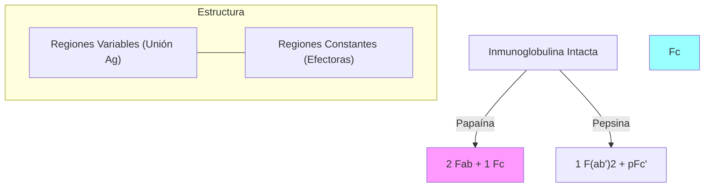

# T-6: Inmunoglobulinas: Estructura y Función Efectora

> *"La molécula de anticuerpo es una maravilla de la ingeniería proteica: combina una variabilidad infinita en un extremo para el reconocimiento, con una constancia biológica en el otro para la función."*

---

## 1. Estructura Molecular Detallada

### El Pliegue de Inmunoglobulina (Ig Fold)
La unidad estructural básica es el **Dominio Ig**: ~110 aminoácidos plegados en dos láminas $\beta$ antiparalelas estabilizadas por un puente disulfuro intracanario. Es un motivo estructural tan estable que se usa en muchas otras proteínas (Superfamilia de las Inmunoglobulinas: TCR, MHC, CD4, CD8, ICAM).

### Regiones Hipervariables (CDR)
Dentro de los dominios variables ($V_H$ y $V_L$), la variabilidad no se distribuye uniformemente. Se concentra en 3 bucles expuestos llamados **Regiones Determinantes de Complementariedad (CDR1, CDR2, CDR3)**.
-   Estos 6 bucles (3 de la pesada + 3 de la ligera) forman la superficie de unión al antígeno (**Parátopo**).
-   El CDR3 de la cadena pesada es el más variable de todos (codificado por la unión V-D-J).

### Fragmentos Proteolíticos (Experimentos de Porter y Edelman)
El tratamiento con enzimas reveló la estructura:
-   **Papaína**: Corta por encima de la bisagra $\to$ 2 fragmentos **Fab** (unen antígeno) + 1 fragmento **Fc** (cristalizable, función efectora).
-   **Pepsina**: Corta por debajo de la bisagra $\to$ 1 fragmento **F(ab')2** (bivalente, une antígeno y precipita) + fragmentos pFc' degradados.

---

## 2. Funciones Efectoras Mediadas por Fc

La región Fc interactúa con receptores Fc (FcR) en células o con C1q.

1.  **Neutralización**: Bloqueo estérico. Impide que virus/toxinas se unan a sus receptores celulares. (IgG, IgA). Única función que no requiere Fc (Fab es suficiente).
2.  **Opsonización**: Recubrimiento del patógeno. Los fagocitos tienen receptores **Fc$\gamma$R** que reconocen la cola de IgG, facilitando la fagocitosis de microbios encapsulados.
3.  **Citotoxicidad Celular Dependiente de Anticuerpos (ADCC)**: Las células NK tienen receptor **Fc$\gamma$RIII (CD16)**. Si reconocen una célula cubierta de IgG, la matan (importante en cáncer y virus).
4.  **Activación del Complemento**: IgM (muy potente) e IgG (subclases 1 y 3) unen C1q e inician la vía clásica.
5.  **Desgranulación**: IgE se une a **Fc$\epsilon$RI** (alta afinidad) en mastocitos/basófilos. Al contactar antígeno, induce liberación de histamina (alergia/parásitos).

---

## 3. Variantes de Inmunoglobulinas

-   **Isotipos**: Diferencias en la cadena pesada ($\gamma, \alpha, \mu, \delta, \epsilon$). Presentes en todos los individuos de la especie.
-   **Alotipos**: Variaciones alélicas (polimorfismos) entre individuos (ej. mi IgG1 es levemente distinta a la tuya).
-   **Idiotipos**: Variaciones en la región variable (CDR). Específicas de cada clon.

---

## 4. Dinámica de la Respuesta Humoral

### Respuesta Primaria vs. Secundaria
1.  **Primaria** (Primer contacto):
    -   Latencia: 5-10 días.
    -   Predominio: **IgM** > IgG.
    -   Afinidad: Baja.
2.  **Secundaria** (Re-exposición / Memoria):
    -   Latencia: 1-3 días.
    -   Predominio: **IgG** (o IgA/IgE) masiva.
    -   Afinidad: Alta (**Maduración de la Afinidad** en centros germinales).

---

## 5. Correlación Clínica
-   **Enfermedad Hemolítica del Recién Nacido (Eritroblastosis Fetal)**: Madre Rh- con feto Rh+. En el segundo embarazo, las IgG anti-Rh de la madre atraviesan la placenta (vía receptor FcRn) y destruyen los glóbulos rojos del feto. Profilaxis: Anti-D (RhoGAM).
-   **Mieloma Múltiple**: Cáncer de células plasmáticas. Produce una "Proteína M" monoclonal (pico gamma en electroforesis) y a veces cadenas ligeras libres en orina (Proteínas de Bence-Jones).

---

### Referencias
1.  **Abbas, A. K.** (2021). *Cellular and Molecular Immunology*. Capítulo 5.
2.  **Schroeder, H. W., & Cavacini, L.** (2010). Structure and function of immunoglobulins. *Journal of Allergy and Clinical Immunology*.
