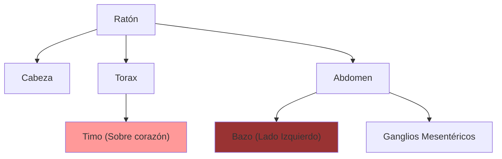

# P-8/P-9: Laboratorio - Órganos Linfoides

> *"La anatomía inmunológica no se ve a simple vista en un humano vivo, pero en el modelo murino podemos mapear las rutas de la defensa."*

---

## 1. P-9: Localización y Aislamiento de Órganos en el Ratón

### Objetivo
Identificar y extraer los órganos linfoides primarios y secundarios para obtener células inmunocompetentes.

### Anatomía Murina Relevante
1.  **Timo**:
    -   *Ubicación*: Cavidad torácica, sobre el corazón, detrás del esternón.
    -   *Aspecto*: Dos lóbulos blanco-amarillentos. En ratones jóvenes es grande; en viejos es difícil de ver.
2.  **Bazo**:
    -   *Ubicación*: Hipocondrio izquierdo (lado izquierdo del abdomen), adherido al estómago.
    -   *Aspecto*: Rojo oscuro, forma de lengua alargada.
3.  **Ganglios Linfáticos**:
    -   Son difíciles de ver si no están inflamados.
    -   *Axilares/Inguinales*: En las axilas y la ingle.
    -   *Mesentéricos*: En la cadena que sostiene los intestinos.

### Procedimiento de Disección
1.  **Eutanasia**: Dislocación cervical o sobredosis de anestésico (ética animal).
2.  **Desinfección**: Rociar el animal con alcohol 70%.
3.  **Incisión**: Cortar la piel del abdomen y tirar hacia extremos opuestos (como quitando un abrigo) para exponer el peritoneo y tórax sin cortar músculos aún.
4.  **Extracción**:
    -   Abrir peritoneo $\to$ Localizar Bazo $\to$ Cortar pedículo.
    -   Abrir caja torácica (cortar costillas) $\to$ Localizar Timo $\to$ Extraer con cuidado de no romper vasos grandes.

---

## 2. P-8: Obtención de Antígenos Microbianos

Para estudiar la respuesta inmune, a veces necesitamos fabricar nuestros propios antígenos a partir de bacterias.

### Antígenos Somáticos (O) vs. Flagelares (H)
-   **Antígeno O (Soma)**: Se obtiene hirviendo la bacteria. El calor destruye las proteínas (flagelos) pero deja los lipopolisacáridos (LPS) de la pared celular.
-   **Antígeno H (Flagelo)**: Se obtiene tratando la bacteria con formol. El formol fija las proteínas flagelares sin destruirlas.

---

## 3. Conexiones
-   Los órganos extraídos aquí se estudiaron en teoría en [[08_Organos_Sistema_Inmune]].
-   Las células obtenidas del bazo (esplenocitos) son una mezcla rica de B y T, útiles para ensayos de [[05_Laboratorio_Inmunizacion_Celulas]].

---

### Referencias
-   Guía de Prácticas de Inmunología.
-   Atlas de Anatomía del Ratón de Laboratorio.
