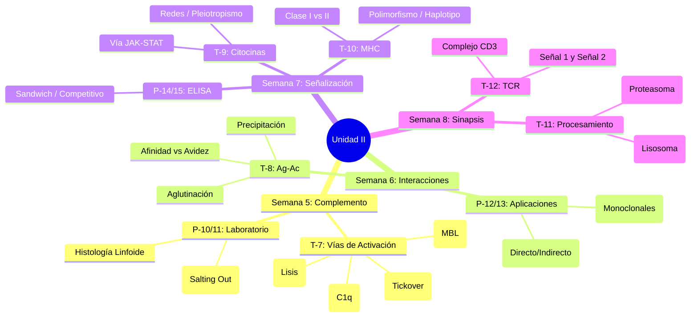

# Unidad II: Reconocimiento de Antígenos

> **Objetivo de la Unidad**: Al finalizar la unidad, el estudiante identifica y relaciona las moléculas que intervienen en el reconocimiento antigénico (Complemento, Anticuerpos, MHC, TCR) y las vías de procesamiento de antígenos, comprendiendo los mecanismos moleculares de la especificidad inmunológica.

---

## 🗺️ Mapa de Navegación

### Semana 5: El Sistema del Complemento
- [[11_Sistema_Complemento|T-7: El Sistema del Complemento]]
    - *Conceptos Clave*: Vía Clásica (C1q), Lectinas (MBL), Alterna (Tickover), MAC, Anafilotoxinas.
- [[12_Laboratorio_Histologia_Purificacion|P-10/P-11: Laboratorio - Histología y Purificación de Igs]]
    - *Práctica*: Microanatomía linfoide y precipitación de proteínas (Salting Out).

### Semana 6: Interacciones Antígeno-Anticuerpo
- [[13_Interacciones_Ag_Ac|T-8: Interacciones Antígeno-Anticuerpo]]
    - *Conceptos Clave*: Afinidad vs Avidez, Fuerzas de Van der Waals, Fenómeno de Zona.
- [[14_Laboratorio_Aglutinacion_Monoclonales|P-12/P-13: Laboratorio - Aglutinación y Monoclonales]]
    - *Práctica*: Coombs, Hibridomas.

### Semana 7: Comunicación y Restricción (Citocinas y MHC)
- [[15_Citocinas|T-9: Citocinas]]
    - *Conceptos Clave*: JAK-STAT, Pleiotropismo, Familias de receptores.
- [[16_MHC_Complejo_Mayor_Histocompatibilidad|T-10: Complejo Principal de Histocompatibilidad]]
    - *Conceptos Clave*: Polimorfismo, Haplotipo, Restricción MHC.
- [[17_Laboratorio_ELISA|P-14/P-15: Laboratorio - ELISA]]
    - *Práctica*: Ensayos inmunoenzimáticos.

### Semana 8: La Sinapsis Inmunológica
- [[18_Procesamiento_Antigenico|T-11: Procesamiento y Presentación de Antígenos]]
    - *Conceptos Clave*: Vía Citosólica (Proteasoma/TAP), Vía Endocítica (Li/CLIP).
- [[19_Reconocimiento_TCR|T-12: Reconocimiento de Patógenos por TCR]]
    - *Conceptos Clave*: Complejo CD3, ITAMs, Sinapsis Inmunológica (SMAC).

---

## 🧠 Conceptos Transversales (Hubs)
- [[Reconocimiento_Molecular]]
- [[Transduccion_de_Senales]]
- [[Especificidad_Inmunologica]]

---

## 📚 Recursos Adicionales
- **Lectura 3**: Evaluación de la respuesta inmune celular.
