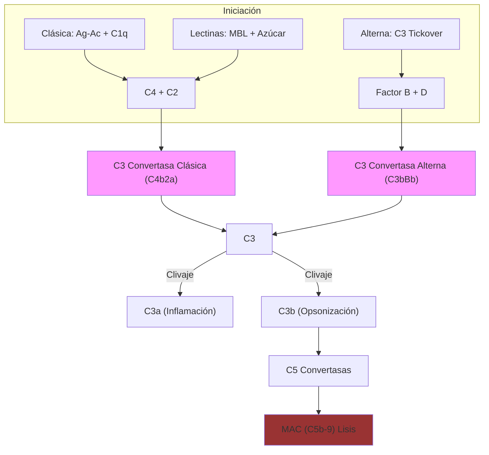

# T-7: El Sistema del Complemento: Bioquímica y Regulación Fina

> *"El complemento es una cascada proteolítica ancestral, estrictamente regulada, que actúa como interfaz crítica entre la inmunidad innata y adaptativa, capaz de lisar patógenos y modular la respuesta B."*

---

## 1. Introducción y Nomenclatura
El sistema del complemento comprende >30 proteínas séricas y de membrana.

> [!TIP] 🧠 Analista de Primeros Principios: Deconstrucción
> **Tesis Central:** El complemento es un sistema de **amplificación enzimática en cascada** que convierte un evento de reconocimiento pequeño (unión Ag-Ac) en una respuesta efectora masiva (lisis/inflamación).
> **Principio Base:** *Zimógenos*. Proteínas inactivas que, al ser cortadas, adquieren actividad proteasa para cortar a la siguiente.
> **Límite:** Debe ser inhibido en células propias (CD55/CD59) para evitar autolisis.

> [!EXAMPLE] 🧸 Maestro Feynman: La Analogía de las Trampas de Ratón
> Imagina una habitación llena de trampas de ratón cargadas con pelotas de ping-pong (Zimógenos).
> 1.  **Iniciación:** Tiras una sola pelota (C1q detecta anticuerpo).
> 2.  **Amplificación:** Esa pelota golpea una trampa, que lanza otra pelota, que golpea dos trampas más...
> 3.  **Resultado:** En segundos, toda la habitación es un caos de pelotas volando (Inflamación/Lisis).
> 4.  **Regulación:** Tus propios muebles tienen "escudos" (Reguladores) para que las pelotas reboten sin activar trampas sobre ellos.

-   **Zimógenos**: La mayoría circulan como proenzimas inactivas (ej. C3, C4).
-   **Nomenclatura**:
    -   Vía Clásica/Lectinas: Números (C1, C2, C4). Fragmento pequeño 'a' (anafilotoxina), grande 'b' (unión). *Excepción histórica*: En C2, 'a' es el grande (enzimático) y 'b' el pequeño.
    -   Vía Alterna: Letras (Factor B, D, H, I).

---

## 2. Mecanismos Moleculares Detallados

### A. Vía Clásica: El Complejo C1
-   **Estructura C1**: $C1q \cdot (C1r_2 \cdot C1s_2)$.
    -   *C1q*: Hexámero con "cabezas globulares" (unen Fc) y "colas de colágeno".
    -   *Activación*: Requiere unión a **2 cabezas globulares**.
        -   **IgM**: Pentamérica ("grapa"). Una sola molécula basta si está en conformación "grapa" sobre el antígeno.
        -   **IgG**: Monomérica. Se requieren al menos 2 moléculas de IgG cercanas (IgG3 > IgG1 > IgG2). IgG4 no activa.
-   **Cascada Enzimática**:
    1.  C1q se une $\to$ Cambio conformacional $\to$ Autoactivación de C1r.
    2.  C1r cliva y activa a C1s (Serina proteasa).
    3.  C1s cliva **C4** $\to$ C4b (expone enlace tioéster reactivo, se une covalentemente a superficie).
    4.  C1s cliva **C2** (unido a C4b) $\to$ C2a (catalítico).
    5.  **C3 Convertasa Clásica**: **C4b2a**.

### B. Vía de las Lectinas: Reconocimiento de Patrones
-   **MBL (Mannose-Binding Lectin)**: Colectina estructuralmente similar a C1q. Reconoce residuos terminales de Manosa/Fucosa (patrón bacteriano).
-   **Ficolinas**: Reconocen N-acetilglucosamina.
-   **MASPs (MBL-Associated Serine Proteases)**:
    -   *MASP-2*: Funcionalmente análoga a C1s (cliva C4 y C2).
    -   *MASP-1*: Auxiliar, puede clivar C2.

### C. Vía Alterna: Vigilancia Constitutiva ("Tickover")
-   **Hidrólisis Espontánea**: El enlace tioéster interno de C3 es inestable. En plasma, se hidroliza lentamente $\to$ $C3(H_2O)$ (iC3).
-   **Convertasa de Fase Fluida**: iC3 une Factor B $\to$ Factor D cliva B $\to$ **$iC3Bb$**. Esta enzima cliva C3 nativo a C3b.
-   **Amplificación**: Si C3b se deposita en superficie microbiana (sin ácido siálico/reguladores):
    -   Une Factor B $\to$ Factor D cliva B $\to$ **C3bBb** (C3 Convertasa Alterna).
    -   **Properdina (Factor P)**: Único regulador positivo. Estabiliza C3bBb, aumentando su vida media de 4 a 40 min.

### D. Fase Terminal: El MAC
1.  **C5 Convertasas**:
    -   Clásica: **C4b2a3b**.
    -   Alterna: **C3bBb3b**.
2.  **Formación del Poro**:
    -   C5b (lábil) une C6 y C7 $\to$ Inserta en membrana lipídica.
    -   Une C8 (inicia poro pequeño).
    -   Polimerización de 10-16 moléculas de **C9** $\to$ Poro de 100 Å.
    -   **Lisis**: Entrada masiva de $Ca^{2+}$ y $Na^+$, salida de $K^+$, hinchamiento osmótico.

---

## 3. Regulación Estricta (Self vs Non-Self)

El complemento es destructivo; las células propias deben protegerse activamente.

| Regulador | Mecanismo | Localización | Patología por Déficit |
| :--- | :--- | :--- | :--- |
| **C1-INH** | Disocia C1r/C1s de C1q. Inhibe MASPs y Calicreína. | Plasma | Angioedema Hereditario |
| **Factor I** | Proteasa que degrada C3b $\to$ iC3b $\to$ C3dg. | Plasma | Infecciones piógenas (consumo de C3) |
| **Factor H** | Cofactor para Factor I. Desplaza Bb de C3b (Decay). Se une a polianiones (Sialic acid) en células propias. | Plasma | SHU Atípico, Glomerulopatía C3 |
| **DAF (CD55)** | Acelera disociación de C3 convertasas (C4b2a / C3bBb). | Membrana (GPI) | Hemoglobinuria Paroxística Nocturna |
| **CD59** | Bloquea unión de C9 (impide MAC). | Membrana (GPI) | Hemoglobinuria Paroxística Nocturna |

---

## 4. Receptores de Complemento y Funciones Biológicas

1.  **CR1 (CD35)**:
    -   *Eritrocitos*: Capturan inmunocomplejos (C3b/C4b) y los llevan al hígado/bazo ("Clearance").
    -   *Fagocitos*: Opsonización.
2.  **CR2 (CD21)**:
    -   *Células B*: Parte del complejo correceptor (CD19/CD81/CD21). Une C3d (producto final de C3b). **Baja el umbral de activación del BCR** de 10,000 a 100 veces. Esencial para respuesta T-dependiente.
    -   *Virus Epstein-Barr*: Usa CD21 como puerta de entrada al linfocito B.
3.  **CR3 (Mac-1, CD11b/CD18)**: Integrina. Adhesión leucocitaria y fagocitosis de iC3b.

---

## 5. Correlación Clínica Avanzada

### Angioedema Hereditario (HAE)
-   **Fisiopatología**: Déficit de C1-INH $\to$ Activación descontrolada de Calicreína $\to$ Producción excesiva de **Bradicinina** (vasodilatador potente).
-   **Clínica**: Edema no pruriginoso, dolor abdominal (edema intestinal), edema laríngeo (mortal). No responde a antihistamínicos/corticoides.
-   **Tratamiento**: Concentrado de C1-INH, Icatibant (antagonista receptor B2 de bradicinina).

### Hemoglobinuria Paroxística Nocturna (HPN)
-   **Genética**: Mutación somática adquirida en gen *PIG-A* en célula madre hematopoyética.
-   **Defecto**: Ausencia de ancla GPI $\to$ Pérdida de **CD55** y **CD59**.
-   **Clínica**: Hemólisis intravascular crónica mediada por complemento (orina oscura en la mañana), trombosis venosa (activación plaquetaria), pancitopenia.
-   **Tratamiento**: Eculizumab (Anti-C5 monoclonal). Bloquea la formación del MAC.

### Lupus Eritematoso Sistémico (LES)
-   Paradoja: El déficit de C1q, C2 o C4 predispone fuertemente a LES (>90% en déficit de C1q).
-   **Mecanismo**: El complemento es necesario para solubilizar y eliminar inmunocomplejos y cuerpos apoptóticos. Si fallan, se acumulan autoantígenos nucleares $\to$ Ruptura de tolerancia.

---

## 6. Referencias Clave
1.  **Walport, M. J.** (2001). Complement. *NEJM*. (La "biblia" clínica del complemento).
2.  **Ricklin, D., & Lambris, J. D.** (2013). Complement in immune and inflammatory disorders: pathophysiological mechanisms. *Journal of Immunology*.
3.  **Abbas, A. K.** (2021). *Cellular and Molecular Immunology*. Capítulo 13.
