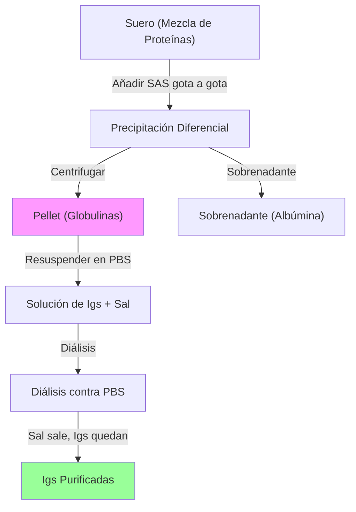

# P-10/P-11: Laboratorio - Histología Linfoide y Purificación de Inmunoglobulinas

> *"La arquitectura estromal de los órganos linfoides dirige el tráfico celular mediante quimiocinas específicas, optimizando el encuentro Ag-Linfocito. La purificación de Igs explota las propiedades de solubilidad diferencial de las proteínas globulares."*

---

## 1. P-10: Histología Funcional de Órganos Linfoides

### A. Timo: La Escuela T
Órgano linfoepitelial. El estroma no es conectivo (reticulina), sino epitelial (células TEC).
-   **Barrera Hemato-Tímica**: En la corteza. Endotelio capilar continuo + Membrana basal gruesa + Pericitos + Procesos de cTEC. Impide que antígenos extraños entren a la corteza y perturben la selección positiva.
-   **Corteza**:
    -   *cTEC (Células Epiteliales Corticales)*: Expresan MHC-I y MHC-II. Nodriza de timocitos ("Nurse cells").
    -   *Selección Positiva*: Ocurre aquí.
-   **Médula**:
    -   *mTEC (Células Epiteliales Medulares)*: Expresan **AIRE**.
    -   *Corpúsculos de Hassall*: Restos de mTEC degeneradas, queratina, IL-7, TSLP. Inducen diferenciación de **Tregs**.

### B. Ganglio Linfático: El Filtro Regional
-   **Sistema de Conductos**:
    -   *Seno Subcapsular*: Recibe linfa aferente. Piso de macrófagos (CD169+) que capturan virus/antígenos y los pasan a la corteza.
    -   *Conductos Fibroblásticos Reticulares (FRC)*: "Autopistas" de colágeno envueltas en células reticulares. Conducen quimiocinas (CCL19/CCL21) y antígenos solubles (<70 kDa) directo a la zona T.
-   **Vénulas de Endotelio Alto (HEV)**:
    -   En paracorteza. Células endoteliales cúbicas.
    -   Expresan "Addressinas" (PNAd) que unen L-selectina (CD62L) de linfocitos T vírgenes $\to$ Homing.

### C. Bazo: El Filtro Sistémico
-   **Zona Marginal**:
    -   Interfase entre Pulpa Roja y Blanca.
    -   *Macrófagos de Zona Marginal*: Receptores MARCO (Scavenger). Capturan bacterias encapsuladas.
    -   *Células B de Zona Marginal*: Respuesta T-independiente rápida (IgM) contra polisacáridos.

---

## 2. P-11: Purificación de Inmunoglobulinas (Salting Out)

### Fundamento Biofísico: Serie de Hofmeister
La capacidad de los iones para precipitar proteínas sigue la serie liotrópica de Hofmeister.
-   **Aniones Kosmotrópicos** (Estabilizadores de estructura del agua): $SO_4^{2-} > HPO_4^{2-} > Cl^-$. El sulfato es muy efectivo "robando" agua.
-   **Mecanismo**:
    1.  Las proteínas tienen parches hidrofóbicos internos y superficie hidrofílica hidratada.
    2.  Al añadir alta concentración de sal ($(NH_4)_2SO_4$), los iones de sal solvatan masivamente el agua.
    3.  La capa de hidratación de la proteína se reduce.
    4.  Las interacciones hidrofóbicas proteína-proteína predominan $\to$ Agregación $\to$ Precipitación.

### Curva de Solubilidad
La solubilidad ($S$) decrece logarítmicamente con la fuerza iónica ($I$):
$$\log S = \beta - K_s \cdot I$$
-   Las $\gamma$-globulinas (Igs) tienen un $K_s$ alto (precipitan rápido, al 33-50% sat).
-   La Albúmina tiene un $K_s$ bajo (precipita lento, al >50-100% sat).

### Protocolo Detallado y Puntos Críticos
1.  **Preparación de SAS (Saturated Ammonium Sulfate)**: Debe estar saturada a temperatura ambiente (aprox 4.1 M). Ajustar pH a 7.0 (si es ácido, desnaturaliza).
2.  **Precipitación**:
    -   Goteo lento de SAS sobre el suero (1:1 v/v) en hielo y agitación.
    -   *Punto Crítico*: Si se añade muy rápido, hay zonas locales de hipersaturación y coprecipitan albúminas (impureza).
3.  **Diálisis**:
    -   Membrana de diálisis con "Cut-off" de 12-14 kDa.
    -   Las sales (MW ~132 Da) salen. Las Igs (MW ~150 kDa) se quedan.
    -   Prueba de Nessler o Cloruro de Bario en el dializado para confirmar eliminación de sulfato/amonio.

### Rendimiento y Pureza
-   El "Salting Out" es un método de **enriquecimiento**, no de purificación total.
-   Para pureza >95% se requiere **Cromatografía de Afinidad** (Proteína A/G).

---

### Referencias
1.  **Current Protocols in Protein Science**. Precipitation of proteins.
2.  **Willard-Mack, C. L.** (2006). Normal structure, function, and histology of the lymph node. *Toxicologic Pathology*.
