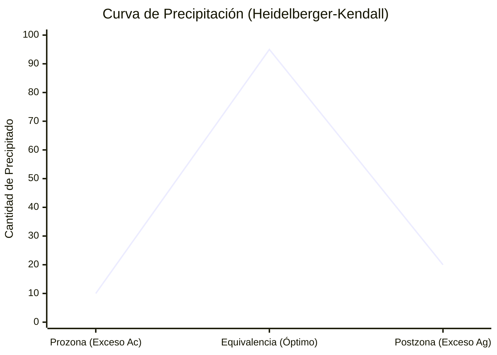

# T-8: Interacciones Antígeno-Anticuerpo: Termodinámica y Cinética

> *"La interacción Ag-Ac es el paradigma del reconocimiento molecular específico. No es un enlace covalente rígido, sino un equilibrio dinámico gobernado por la complementariedad estructural y fuerzas débiles."*

---

## 1. Biofísica de la Unión

### Fuerzas No Covalentes
La energía libre de Gibbs ($\Delta G$) de la unión debe ser negativa para que sea espontánea.
$$\Delta G = \Delta H - T\Delta S$$
1.  **Fuerzas de Van der Waals**: Dipolos inducidos fluctuantes. Operan a distancias muy cortas ($3-6 Å$). Requieren un **ajuste estérico perfecto** ("llave-cerradura"). Si hay un solo aminoácido diferente que cause impedimento estérico, la fuerza cae drásticamente $\to$ Base de la especificidad.
2.  **Efecto Hidrofóbico**: Es la fuerza impulsora principal. Al unirse el epítopo (hidrofóbico) al parátopo (hidrofóbico), se liberan moléculas de agua ordenadas (clatratos) al medio. Esto aumenta la entropía ($\Delta S > 0$) del sistema (agua), favoreciendo la unión.
3.  **Puentes de Hidrógeno y Fuerzas Electrostáticas**: Aportan direccionalidad y estabilidad inicial (fuerzas de largo alcance).

### Cinética: Afinidad ($K_a$)
$$[Ag] + [Ac] \underset{k_{off}}{\overset{k_{on}}{\rightleftharpoons}} [Ag-Ac]$$
-   **Constante de Asociación ($K_a$)**:
    $$K_a = \frac{[Ag-Ac]}{[Ag][Ac]} \quad (Unidades: M^{-1} o\ L/mol)$$
    Valores típicos: $10^7 - 10^{11} M^{-1}$.
-   **Constante de Disociación ($K_d$)**:
    $$K_d = \frac{1}{K_a} \quad (Unidades: M)$$
    Es la concentración de Ag necesaria para ocupar el 50% de los anticuerpos. Menor $K_d$ = Mayor Afinidad.
    -   *Afinidad baja*: $10^{-6} M$.
    -   *Afinidad alta*: $10^{-9} - 10^{-12} M$.

### Avidez: El Efecto Multivalente
La avidez ($K_{avidez}$) es la fuerza de unión funcional de un anticuerpo multivalente.
$$K_{avidez} > \sum K_{afinidad}$$
-   **Bonus de Avidez**: Si un brazo se suelta ($k_{off}$), el otro mantiene al anticuerpo cerca, permitiendo que el primero se vuelva a unir rápidamente (aumenta $k_{on}$ aparente).
-   **Importancia Biológica**: Permite que IgM (afinidad intrínseca baja) sea un activador de complemento y aglutinante extremadamente potente.

---

## 2. Reacciones de Precipitación en Medio Líquido

### Teoría de la Red (Lattice Theory) - Marrack (1934)
Para que precipite, el complejo debe crecer indefinidamente formando una red tridimensional.
**Requisitos**:
1.  **Antígeno Multivalente**: Debe tener al menos 2 epítopos (iguales o diferentes).
2.  **Anticuerpo Bivalente**: (IgG, IgA, IgM). Fab monovalentes NO precipitan (inhiben).

### Curva de Precipitación Cuantitativa (Heidelberger-Kendall)
Al titular Ag sobre suero fijo:
1.  **Zona de Prozona (Exceso de Ac)**:
    -   Complejos pequeños ($Ac_2Ag_1$, $Ac_3Ag_1$). No hay puentes suficientes.
    -   Sobrenadante contiene Ac libres.
    -   *Clínica*: Falsos negativos en VDRL/Brucelosis si no se diluye el suero.
2.  **Zona de Equivalencia**:
    -   Máxima formación de red. Todo el Ag y todo el Ac están en el precipitado.
    -   Sobrenadante estéril (sin Ag ni Ac libres).
3.  **Zona de Postzona (Exceso de Ag)**:
    -   Complejos pequeños ($Ag_2Ac_1$). El exceso de Ag satura los sitios de unión impidiendo enlaces cruzados.
    -   Sobrenadante contiene Ag libres.
    -   *Patología*: **Enfermedad del Suero**. Los complejos pequeños formados en exceso de antígeno son solubles, no son depurados por fagocitos (CR1) y se depositan en glomérulos/sinovia $\to$ Inflamación (Tipo III).

*(Nota: La gráfica muestra cómo el precipitado es máximo en equivalencia y disminuye en los extremos)*
---

## 3. Reacciones de Aglutinación (Antígenos Particulados)

Más sensible que la precipitación.
-   **Potencial Zeta ($\zeta$)**: Nube iónica negativa alrededor de eritrocitos/bacterias que genera repulsión electrostática.
    -   En solución salina, la distancia de repulsión es mayor que el alcance de los brazos de una IgG (~14 nm). Por eso IgG es un "anticuerpo incompleto" (une pero no aglutina).
    -   IgM (~30 nm) supera el potencial zeta y aglutina ("anticuerpo completo").
-   **Efecto de la Albúmina/Coombs**: Reducen el potencial zeta o puentean las IgG, permitiendo la aglutinación.

---

## 4. Referencias
1.  **Van Oss, C. J.** (1995). *Hydrophobic interactions in immune recognition*.
2.  **Berzofsky, J. A., & Berkower, I. J.** (1993). Antigen-antibody interaction. *Fundamental Immunology*.
