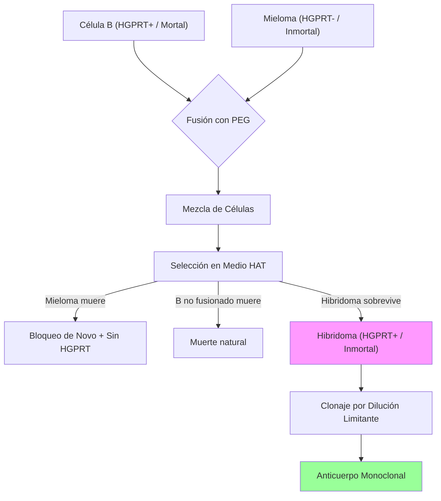

# P-12/P-13: Laboratorio - Aglutinación y Anticuerpos Monoclonales

> *"La prueba de Coombs salvó millones de vidas al diagnosticar la incompatibilidad Rh. La tecnología de hibridomas nos dio herramientas de 'bala mágica' para el cáncer y la autoinmunidad."*

---

## 1. P-12: Reacciones de Aglutinación y Prueba de Coombs

### Prueba de Antiglobulina (Coombs)
El reactivo de Coombs es un suero de conejo (u otro animal) hiperinmune contra **IgG humana** y **C3d humano**. Actúa como un "segundo anticuerpo" puente.

#### A. Coombs Directo (DAT - Direct Antiglobulin Test)
-   **Pregunta**: ¿Tienen los glóbulos rojos del paciente anticuerpos (o complemento) pegados *in vivo*?
-   **Indicaciones**:
    1.  **Enfermedad Hemolítica del Recién Nacido (EHRN)**: Detectar IgG materna en GR fetales.
    2.  **Anemia Hemolítica Autoinmune (AHAI)**: Detectar autoanticuerpos.
    3.  **Reacción Transfusional**: Detectar aloanticuerpos en GR transfundidos.
-   **Procedimiento**: Lavar GR del paciente (eliminar proteínas plasmáticas que neutralizarían el reactivo) + Añadir Coombs. Aglutinación = Positivo.

#### B. Coombs Indirecto (IAT - Indirect Antiglobulin Test)
-   **Pregunta**: ¿Tiene el *suero* del paciente anticuerpos libres contra ciertos GR?
-   **Indicaciones**:
    1.  **Screening de Anticuerpos (RAI)**: En banco de sangre, antes de transfusión.
    2.  **Pruebas Cruzadas (Cross-match)**: Suero receptor + GR donante.
-   **Procedimiento**: Suero paciente + GR Test (O) $\to$ Incubar 37°C (fase de sensibilización) $\to$ Lavar $\to$ Añadir Coombs.

### Fenómeno de Zona en Aglutinación
Un exceso de anticuerpo puede cubrir todos los sitios antigénicos sin formar puentes (Efecto Prozona).
-   **Solución**: Si se sospecha prozona (clínica fuerte, test negativo), diluir el suero y repetir.

---

## 2. P-13: Tecnología de Hibridomas (Milstein & Köhler, 1975)

### Bases Celulares y Moleculares
El objetivo es crear una célula inmortal que secrete un solo isotipo de anticuerpo con una sola especificidad (monoclonal).

1.  **Fusión (Hibridación)**:
    -   **Célula B (Esplenocito)**: Fuente de HGPRT ($HGPRT^+$) y especificidad. Mortal.
    -   **Célula de Mieloma (Sp2/0)**: Inmortal. Deficiente en HGPRT ($HGPRT^-$) y no secretora de Igs propias (para no contaminar).
    -   **Agente Fusógeno**: Polietilenglicol (PEG) o Electrofusión. Fusiona membranas.

2.  **Selección Metabólica (Medio HAT)**:
    -   **Aminopterina**: Bloquea la Dihidrofolato Reductasa (DHFR), inhibiendo la **Vía de Novo** de síntesis de purinas/pirimidinas. Las células deben usar la **Vía de Rescate**.
    -   **Hipoxantina/Timidina**: Sustratos para la vía de rescate.
    -   *Mielomas no fusionados*: Mueren (Son $HGPRT^-$, no pueden usar vía de rescate).
    -   *Células B no fusionadas*: Mueren naturalmente en días.
    -   *Hibridomas*: Sobreviven (Usan HGPRT del B para la vía de rescate + Inmortalidad del mieloma).

3.  **Clonaje por Dilución Limitante**:
    -   Se diluye la suspensión hasta tener estadísticamente 0.5 células/pozo. Asegura monoclonidad.

### Monoclonales Quiméricos y Humanizados
Los monoclonales de ratón (sufijo *-omab*) generan respuesta inmune en humanos (HAMA - Human Anti-Mouse Antibodies).
-   **Quiméricos (*-ximab*)**: Región Variable (V) de ratón + Región Constante (C) humana. (Ej. Rituximab). ~65% humano.
-   **Humanizados (*-zumab*)**: Solo los CDRs son de ratón; el resto es humano. (Ej. Trastuzumab). ~95% humano.
-   **Humanos (*-umab*)**: 100% humanos (Ratones transgénicos o Phage Display). (Ej. Adalimumab).

---

### Referencias
1.  **Goding, J. W.** (1996). *Monoclonal Antibodies: Principles and Practice*. Academic Press.
2.  **Petz, L. D., & Garratty, G.** (2004). *Immune Hemolytic Anemias*. (Referencia definitiva para Coombs).
