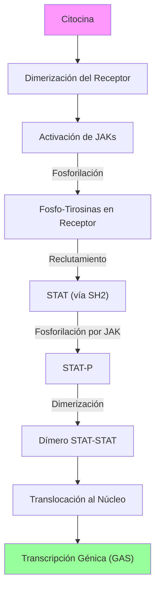

# T-9: Citocinas: Redes de Señalización e Inmunomodulación

> *"Las citocinas operan en redes complejas no lineales. Una sola citocina rara vez actúa sola; el contexto (el 'milieu' de citocinas) determina si la célula vive, muere, se activa o se tolera."*

---

## 1. Biología Celular de las Citocinas
-   **Secreción**: Generalmente no se almacenan (excepto TGF-$\beta$ en plaquetas o TNF en mastocitos). Se sintetizan *de novo* tras la activación transcripcional (mRNA inestable AU-rich).
-   **Radio de Acción**:
    -   *Autocrina*: IL-2 (expansión clonal T).
    -   *Paracrina*: IL-12 (Macrófago $\to$ NK). La más común.
    -   *Endocrina*: IL-1, IL-6, TNF (Hígado $\to$ Reactantes Fase Aguda; Hipotálamo $\to$ Fiebre).

---

## 2. Familias Estructurales y Vías de Señalización

### A. Receptores Tipo I (Hematopoyetina)
Estructura conservada (motivo WSXWS). Usan la vía **JAK-STAT**.
-   **Subfamilia Cadena $\gamma$ Común ($\gamma_c$ / CD132)**:
    -   IL-2, IL-4, IL-7, IL-9, IL-15, IL-21.
    -   *Mecanismo*: La citocina une la cadena $\alpha$ (específica) $\to$ Recluta $\gamma_c$ (señalizadora) $\to$ Activa JAK1/JAK3.
    -   *Patología*: Mutación en $\gamma_c$ $\to$ **X-SCID**. Sin T ni NK.
-   **Subfamilia Cadena $\beta$ Común ($\beta_c$ / CD131)**:
    -   IL-3, IL-5, GM-CSF. (Hematopoyesis mieloide/eosinófilos).
-   **Subfamilia gp130**:
    -   IL-6, IL-11, IL-27. (Inflamación).

### B. Vía JAK-STAT: Mecanismo Molecular
1.  **Ligando**: Dimeriza el receptor.
2.  **Transfosforilación**: Las JAKs asociadas (Tirosina Kinasas) se acercan y se fosforilan mutuamente.
3.  **Sitios de Anclaje**: JAKs fosforilan Tirosinas distales del receptor.
4.  **Reclutamiento**: Proteínas **STAT** (Signal Transducers and Activators of Transcription) se unen vía dominios **SH2** a las fosfotirosinas.
5.  **Activación**: JAK fosforila a STAT.
6.  **Dimerización**: STAT-P se suelta y forma homodímeros o heterodímeros.
7.  **Translocación**: Entran al núcleo y unen secuencias GAS (Gamma Activated Sites).

**Especificidad de Señal**:
| Citocina | JAKs | STAT Principal | Efecto Biológico |
| :--- | :--- | :--- | :--- |
| **IFN-$\gamma$** | JAK1, JAK2 | **STAT1** | Activación macrófago, MHC-I/II, Th1 |
| **IL-4** | JAK1, JAK3 | **STAT6** | Cambio a IgE, Th2 |
| **IL-12** | JAK2, Tyk2 | **STAT4** | Diferenciación Th1 |
| **IL-6/IL-10** | JAK1, Tyk2 | **STAT3** | Inflamación (IL-6) / Anti-inflamatorio (IL-10) |

### C. Familia IL-1 / Toll-Like
Comparten el dominio TIR (Toll/IL-1 Receptor) citosólico.
-   **Vía**: MyD88 $\to$ IRAK $\to$ TRAF6 $\to$ **NF-$\kappa$B**.
-   **Inflamasoma**: IL-1$\beta$ e IL-18 se sintetizan como precursores inactivos (pro-IL-1$\beta$). Requieren clivaje por **Caspasa-1**, activada por el inflamasoma NLRP3 (sensor de daño citosólico).

### D. Familia TNF
-   **Receptores de Muerte (Fas, TNFR1)**: Tienen "Death Domain" (DD). Reclutan FADD $\to$ Caspasa-8 $\to$ Apoptosis.
-   **Receptores de Supervivencia (CD40, TNFR2)**: Reclutan TRAFs $\to$ NF-$\kappa$B $\to$ Supervivencia/Activación.

---

## 3. Regulación Negativa (Feedback)
Para evitar toxicidad/autoinmunidad.
1.  **SOCS (Suppressors of Cytokine Signaling)**: Genes inducidos por STATs. Las proteínas SOCS se unen a JAKs y las inhiben (Feedback negativo clásico).
2.  **PIAS**: Inhibidores de STAT activados.
3.  **Fosfatasas (SHP-1)**: Desfosforilan JAKs/Receptores.

---

## 4. Correlación Clínica y Terapéutica

### Biológicos (Anticuerpos Monoclonales / Proteínas de Fusión)
-   **Anti-TNF**: Infliximab, Adalimumab, Etanercept. Revolución en Artritis Reumatoide y Crohn. Riesgo: Reactivación de Tuberculosis latente (el granuloma depende de TNF).
-   **Anti-IL-6R**: Tocilizumab. Artritis Reumatoide, Tormenta de Citocinas (COVID-19, CAR-T).
-   **Anti-IL-17**: Secukinumab. Psoriasis.
-   **Anti-IL-4R$\alpha$**: Dupilumab. Dermatitis Atópica, Asma severa.
-   **Inhibidores de JAK (Small Molecules)**: Tofacitinib (JAK1/3), Baricitinib (JAK1/2). Orales. Bloquean la señalización intracelular.

---

## 5. Referencias
1.  **Leonard, W. J., & O'Shea, J. J.** (1998). Jaks and STATs: biological implications. *Annual Review of Immunology*.
2.  **Dinarello, C. A.** (2009). Immunological and inflammatory functions of the interleukin-1 family. *Annual Review of Immunology*.
