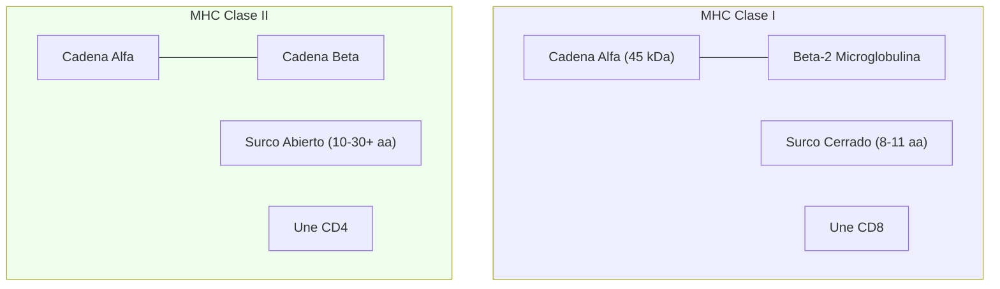

# T-10: Complejo Principal de Histocompatibilidad (MHC): Genética y Estructura

> *"El MHC es el 'documento de identidad' molecular. Su extremo polimorfismo asegura que, como especie, no seamos exterminados por un solo patógeno que logre evadir un haplotipo común."*

---

> [!TIP] 🧠 Analista de Primeros Principios: Deconstrucción
> **Tesis Central:** El MHC es una **ventana molecular** que muestra al sistema inmune lo que está ocurriendo *dentro* de la célula.
> **Principio Base:** *Presentación de Antígenos*. Los linfocitos T son "ciegos" a los patógenos libres; solo pueden ver fragmentos de proteínas (péptidos) si están "servidos" en una molécula MHC.
> **Paradoja:** Para proteger a la población, el MHC debe ser extremadamente diverso (polimórfico), pero esto hace imposible los trasplantes entre individuos no idénticos.

> [!EXAMPLE] 🧸 Maestro Feynman: El Marco de Fotos y el Hot Dog
> 1.  **El Hot Dog (MHC-I):** Imagina que el MHC Clase I es un pan de hot dog. El péptido es la salchicha.
>     -   El pan es cerrado en los extremos (surco cerrado).
>     -   La salchicha debe tener el tamaño exacto (8-11 aminoácidos) para caber. Si es muy larga, hay que cortarla antes.
> 2.  **El Taco (MHC-II):** El MHC Clase II es como un taco o una tortilla.
>     -   Es abierto en los extremos (surco abierto).
>     -   Puedes poner un relleno mucho más largo (10-30+ aminoácidos) y que cuelgue por los lados.
> 3.  **La Ventana:** Si caminas por la calle (torrente sanguíneo), no sabes qué pasa dentro de las casas (células). Pero si cada casa pone en la ventana (MHC) una muestra de lo que están cocinando (péptidos), la policía (Linfocitos T) puede saber si alguien está cocinando metanfetamina (virus) y entrar a detenerlo.

---

## 1. Organización Genómica (Complejo HLA)
Ubicado en el brazo corto del cromosoma 6 (6p21.3). Es la región más densa en genes del genoma humano.
-   **Clase I**: Genes *HLA-A, HLA-B, HLA-C*. (Teloméricos).
-   **Clase II**: Genes *HLA-DP, HLA-DQ, HLA-DR*. (Centroméricos).
-   **Clase III**: Región intermedia. Contiene genes de complemento (C4, C2, Factor B) y citocinas (TNF, Linfotoxina). No presentan antígenos.

### Herencia y Polimorfismo
-   **Haplotipo**: El conjunto de alelos en un cromosoma. Se hereda en bloque (baja recombinación).
-   **Codominancia**: Se expresan los alelos maternos y paternos.
    -   MHC-I: Hasta 6 moléculas distintas (A, B, C de mamá + A, B, C de papá).
    -   MHC-II: Más complejo por emparejamiento de cadenas $\alpha$ y $\beta$. (>6 moléculas).
-   **Polimorfismo**: >20,000 alelos descritos. La variabilidad se concentra en los exones que codifican el **surco de unión al péptido** (residuos de anclaje).

---

## 2. Estructura Molecular Detallada

### MHC Clase I
-   **Cadena $\alpha$**: 45 kDa. Dominios $\alpha1, \alpha2$ (forman el surco), $\alpha3$ (transmembrana, sitio de unión de **CD8**).
-   **$\beta_2$-microglobulina**: 12 kDa. No polimórfica. Esencial para el plegamiento y expresión en superficie.
-   **Surco**: Cerrado. Aloja péptidos de **8-11 aa**.
    -   *Residuos de Anclaje*: El péptido se ancla por sus extremos (N-terminal y C-terminal) a bolsillos conservados del MHC. El centro del péptido se abomba hacia afuera para ser reconocido por el TCR.

### MHC Clase II
-   **Cadena $\alpha$ y $\beta$**: Ambas polimórficas (especialmente $\beta$). Dominios $\alpha1, \beta1$ forman el surco. Dominio $\beta2$ une **CD4**.
-   **Surco**: Abierto. Aloja péptidos de **10-30 aa** (o más).
    -   *Residuos de Anclaje*: Distribuidos a lo largo del surco. El péptido yace plano y extendido.

---

## 3. Restricción por MHC y Educación Tímica
-   **Restricción**: Un TCR específico para el *Péptido X* presentado por *HLA-A2* **NO** reconocerá el *Péptido X* presentado por *HLA-A3*. El TCR reconoce la **combinación** MHC + Péptido.
    > [!NOTE] La Paradoja de la Aloreactividad
    > ¿Por qué rechazamos trasplantes si nunca vimos ese MHC extraño?
    > - **Mimetismo Molecular**: Un MHC extraño + péptido extraño se parece estructuralmente a un MHC propio + péptido extraño (Cross-reactivity).
    > - **Densidad**: La alta densidad de MHC extraño en el injerto activa clones T con baja afinidad pero alta avidez.

---

## 4. Correlación Clínica

### Tipificación HLA y Trasplantes
-   **Trasplante de Órganos Sólidos (Riñón)**: Se busca compatibilidad en HLA-A, HLA-B y HLA-DR (6 antígenos). A mayor "Mismatch", menor supervivencia del injerto.
-   **Trasplante de Células Hematopoyéticas (Médula Ósea)**: Requiere compatibilidad casi perfecta (10/10: A, B, C, DR, DQ) para evitar **Enfermedad Injerto contra Huésped (GVHD)** letal.

### Asociación con Enfermedades Autoinmunes
El Riesgo Relativo (RR) indica cuánto aumenta la probabilidad de enfermar si se tiene el alelo.
1.  **Espondilitis Anquilosante (HLA-B27)**: RR > 90. Teoría del "Péptido Artritogénico" (B27 presenta un péptido de *Klebsiella* que se parece a colágeno propio).
2.  **Artritis Reumatoide (HLA-DR4)**: Epítopo compartido en la cadena $\beta$ de DR4.
3.  **Diabetes Tipo 1 (HLA-DR3/DR4)**: Heterocigotos DR3/DR4 tienen riesgo máximo (RR ~20).
4.  **Narcolepsia (HLA-DQB1*06:02)**: Asociación casi del 100%. Posible autoinmunidad contra neuronas de hipocretina.

### Hipersensibilidad a Fármacos
-   **Abacavir (HIV)**: Pacientes con **HLA-B*57:01** tienen reacción de hipersensibilidad fatal. El fármaco se une al surco del MHC y altera la especificidad de los péptidos presentados ("Self" parece "Non-self"). **Screening obligatorio**.
-   **Carbamazepina**: HLA-B*15:02 (Síndrome de Stevens-Johnson en asiáticos).

---

## 5. Referencias
1.  **Neefjes, J., et al.** (2011). Towards a systems understanding of MHC class I and MHC class II antigen presentation. *Nature Reviews Immunology*.
2.  **Trowsdale, J., & Knight, J. C.** (2013). Major histocompatibility complex genomics and human disease. *Annual Review of Genomics and Human Genetics*.
