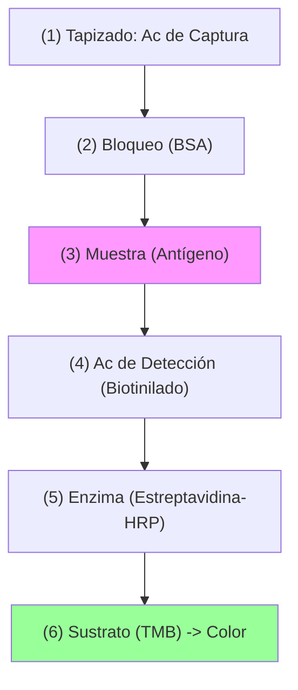

# P-14/P-15: Laboratorio - ELISA: Cuantificación y Validación

> *"El ELISA no es solo 'ver color'. Es una técnica analítica cuantitativa que requiere control estricto de variables (temperatura, tiempo, lavado) para garantizar reproducibilidad y exactitud."*

---

## 1. Fundamento Bioquímico
-   **Adsorción**: Las proteínas se unen al poliestireno por interacciones hidrofóbicas. El pH del buffer de tapizado (Carbonato/Bicarbonato pH 9.6) es crucial para exponer regiones hidrofóbicas sin desnaturalizar epítopos.
-   **Bloqueo**: Paso crítico. Se usa BSA (Albúmina Bovina), Caseína (Leche descremada) o Tween-20 para saturar los sitios libres de la placa. Si falla $\to$ Alto ruido de fondo (falsos positivos).
-   **Enzimas Reporteras**:
    -   *HRP (Peroxidasa)*: Sustrato TMB (azul $\to$ amarillo con ácido). Rápida, alta sensibilidad. Sensible a inhibidores (azida).
    -   *AP (Fosfatasa Alcalina)*: Sustrato pNPP (amarillo). Cinética lineal más larga.

---

## 2. Variantes Metodológicas Avanzadas

### A. ELISA Sandwich (Captura)
El estándar de oro para cuantificar antígenos solubles (Citocinas, Hormonas).
-   **Efecto Gancho (Hook Effect)**: En muestras con *extremadamente* alta concentración de antígeno, el exceso de Ag satura tanto el Ac de captura como el de detección por separado, impidiendo la formación del sandwich. La señal cae paradójicamente.
    -   *Solución*: Realizar diluciones seriadas de la muestra.

<!-- -->

### B. ELISA Competitivo
Para moléculas pequeñas (haptenos, cortisol, T3/T4) que no pueden unir dos anticuerpos a la vez (estéricamente imposible hacer sandwich).
-   **Cinética**: La señal es **inversamente proporcional** a la concentración.
    -   Alta señal = Muestra vacía.
    -   Baja señal = Muestra llena (inhibió la unión del trazador).

### C. ELISPOT (Enzyme-Linked ImmunoSpot)
Variante para contar **células** secretoras de citocinas.
-   Se cultivan células sobre una placa tapizada con Anti-IFN-$\gamma$.
-   La citocina secretada es capturada inmediatamente alrededor de la célula ("huella").
-   Se revela y se cuentan los "spots". Cada spot = 1 célula secretora.
-   *Uso*: Medir frecuencia de células T específicas de antígeno (ej. respuesta a vacunas).

---

## 3. Análisis de Datos y Validación

### Curva Estándar
Se usan estándares de concentración conocida para trazar una curva de calibración.
-   **Ajuste de Curva**: Generalmente no es lineal. Se usa regresión logística de 4 parámetros (4PL) para el rango dinámico completo.

### Parámetros de Validación
1.  **Sensibilidad (Límite de Detección)**: La menor cantidad de analito distinguible del cero (Media del blanco + 3 SD).
2.  **Especificidad**: Capacidad de no reaccionar con sustancias estructuralmente relacionadas (reacción cruzada).
3.  **Precisión (CV%)**: Coeficiente de variación intra-ensayo (repetibilidad) e inter-ensayo (reproducibilidad). Debe ser <10-15%.
4.  **Exactitud (Recuperación)**: Capacidad de medir el valor verdadero (Spike-and-recovery).

---

## 4. Aplicaciones Diagnósticas Críticas
-   **HIV (4ta Generación)**: Combo Ag/Ac. Detecta Antígeno p24 (ventana temprana) + Anticuerpos anti-gp120/gp41. Reduce el periodo ventana a ~14 días.
-   **Hepatitis B**: HBsAg (Antígeno de superficie) es el primer marcador de infección.
-   **Troponina I/T**: ELISA de alta sensibilidad para Infarto de Miocardio.

---

### Referencias
1.  **Crowther, J. R.** (2009). *The ELISA Guidebook*. Methods in Molecular Biology.
2.  **Wild, D.** (2013). *The Immunoassay Handbook*. Elsevier.
