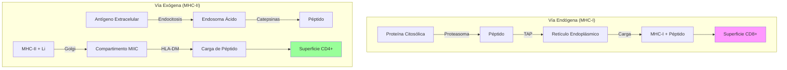

# T-11: Procesamiento y Presentación de Antígenos: Biología Celular del Tráfico

> *"La célula es una máquina de vigilancia que muestrea constantemente su proteoma interno y externo para reportar anomalías a los linfocitos T. Este reporte depende de una logística intracelular precisa."*

---

## 1. Vía MHC Clase I (Citosólica / Endógena)
Vigilancia de lo que ocurre **dentro** de la célula (virus, mutaciones).

### A. Generación de Péptidos: El Inmunoproteasoma
-   **Proteasoma Constitutivo (20S)**: Degrada proteínas ubiquitinadas.
-   **Inmunoproteasoma**: Inducido por **IFN-$\gamma$**. Reemplaza las subunidades catalíticas $\beta1, \beta2, \beta5$ por $\beta1i (LMP2), \beta2i (MECL-1), \beta5i (LMP7)$.
    -   *Efecto*: Aumenta la actividad quimotripsina-like (corte tras residuos hidrofóbicos) y tripsina-like (tras básicos). Genera péptidos con extremos C-terminales hidrofóbicos/básicos, que son los preferidos para anclarse al MHC-I.

### B. Transporte al RE: TAP
-   **TAP1/TAP2**: Transportador ABC (ATP-binding cassette). Bombea péptidos de 8-16 aa desde el citosol al lumen del RE.
-   *Selectividad*: Prefiere péptidos de 8-12 aa con C-terminal hidrofóbico (coincide con el producto del inmunoproteasoma).

### C. Ensamblaje del Complejo de Carga (Peptide Loading Complex - PLC)
El MHC-I es inestable sin péptido.
1.  **Calnexina**: Estabiliza la cadena $\alpha$ naciente.
2.  **$\beta_2$-microglobulina**: Se une a $\alpha$, desplaza Calnexina.
3.  **PLC**: Se reclutan **Calreticulina** (chaperona), **Erp57** (tiol-oxidoreductasa) y **Tapasina**.
    -   *Tapasina*: Es el puente físico entre MHC-I y TAP. Mantiene el MHC-I en una conformación "abierta" y receptiva.
4.  **Optimización**: Si entra un péptido de baja afinidad, se suelta rápido. Si entra uno de alta afinidad, "traba" el MHC-I ("Peptide Editing"). El complejo se disocia y viaja a superficie.

---

## 2. Vía MHC Clase II (Endocítica / Exógena)
Vigilancia del entorno extracelular.

### A. Acidificación Endosomal
El pH baja progresivamente (Endosoma temprano 6.0 $\to$ Tardío 5.5 $\to$ Lisosoma 4.5).
-   Esto activa las **Catepsinas** (S, L, B, D), proteasas ácidas que degradan el antígeno proteico en péptidos.

### B. La Cadena Invariante (Li / CD74)
-   Se sintetiza en exceso junto con MHC-II en el RE.
-   **Funciones**:
    1.  Bloquea el surco del MHC-II (impide unión de péptidos endógenos en el RE).
    2.  Señal de direccionamiento (Targeting motif) en su cola citoplasmática que lleva el complejo MHC-II hacia los endosomas tardíos (MIIC).

### C. Intercambio CLIP/Péptido: HLA-DM
En el compartimento MIIC:
1.  Catepsinas degradan Li, dejando solo el fragmento **CLIP** en el surco.
2.  **HLA-DM**: Molécula tipo MHC-II no polimórfica.
    -   Actúa como enzima catalítica ("Peptide Editor").
    -   Se une al MHC-II-CLIP e induce un cambio conformacional que expulsa a CLIP.
    -   Estabiliza el MHC-II vacío hasta que llega un péptido de alta afinidad.
    -   **HLA-DO**: Regulador negativo de HLA-DM (freno).

---

## 3. Presentación Cruzada (Cross-Presentation)
Exclusiva de **Células Dendríticas (cDC1)**.
-   **Problema**: Si un virus no infecta a la DC (ej. Hepatitis C infecta hepatocitos), ¿cómo se activa un CD8+ virgen? El CD8 solo ve MHC-I, pero el virus exógeno iría a MHC-II.
-   **Solución**: La DC fagocita la célula infectada. El antígeno escapa del fagosoma al citosol (mecanismo incierto, posible retrotranslocación Sec61), es degradado por proteasoma y entra al RE (o vuelve al fagosoma) para cargarse en **MHC-I**.
-   **Resultado**: Priming de T CD8+ contra virus que no infectan DCs y contra tumores.

---

## 4. Evasión Inmune Viral
Los virus han evolucionado para bloquear cada paso:
-   **Bloqueo de TAP**: ICP47 (Herpes Simplex), US6 (CMV). El MHC-I se queda vacío en el RE y se degrada.
-   **Retención en RE**: E19 (Adenovirus).
-   **Dislocación (ERAD)**: US2/US11 (CMV) tiran el MHC-I de vuelta al citosol para ser comido por el proteasoma.
-   **Downregulation de MHC-I**: Nef (HIV).

---

## 5. Referencias
1.  **Yewdell, J. W.** (2011). DRiPs solidify: progress in understanding endogenous antigen processing. *Trends in Immunology*.
2.  **Roche, P. A., & Furuta, K.** (2015). The ins and outs of MHC class II-mediated antigen processing and presentation. *Nature Reviews Immunology*.
