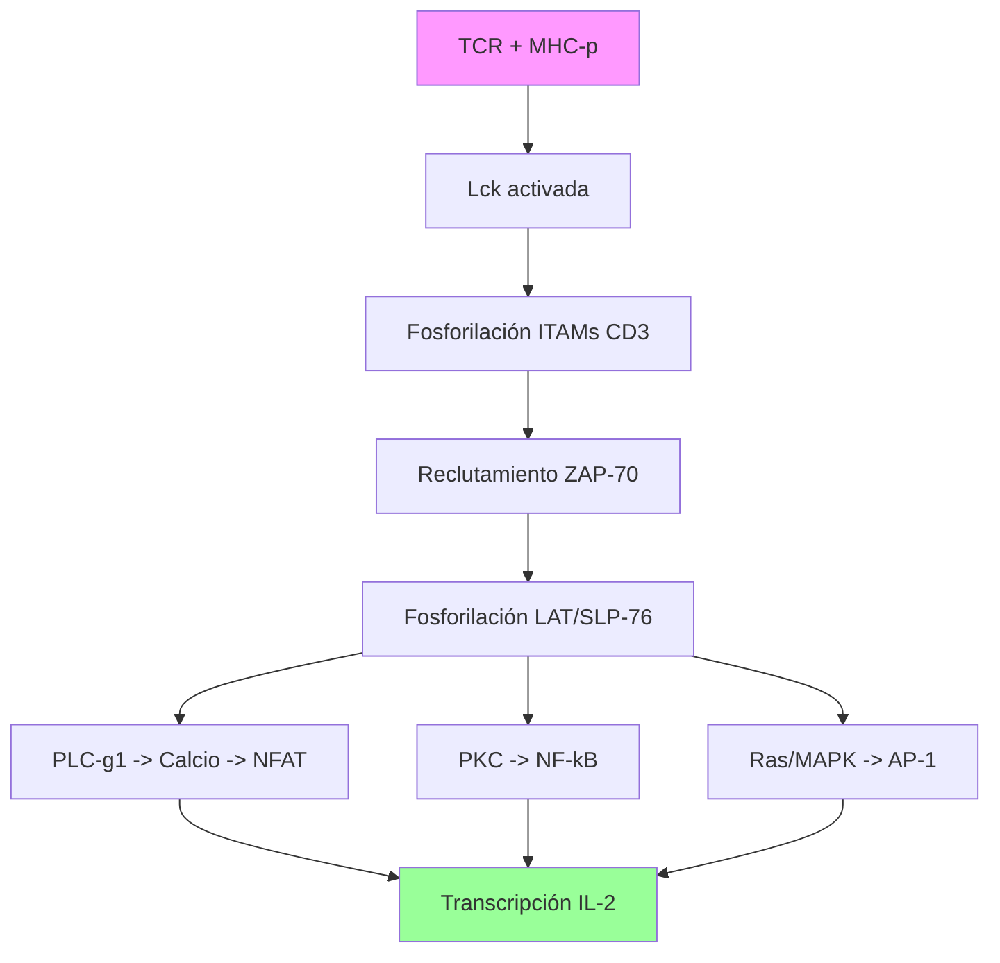

# T-12: Reconocimiento de Patógenos por TCR: Transducción de Señales

> *"El linfocito T toma decisiones de vida o muerte basándose en diferencias sutiles en la afinidad del TCR por el complejo MHC-péptido. Esta decisión se computa mediante una red de señalización digital y analógica."*

---

> [!TIP] 🧠 Analista de Primeros Principios: Deconstrucción
> **Tesis Central:** El TCR convierte una interacción física débil y transitoria (unión a MHC-péptido) en una decisión biológica permanente (activación/anergia/apoptosis).
> **Mecanismo:** *Transducción de Señales*. El TCR no tiene actividad enzimática propia; actúa como un "interruptor" que recluta maquinaria de fosforilación (Lck, ZAP-70).
> **Principio de Coestimulación:** Se requieren dos llaves para activar la bomba nuclear. Llave 1 (TCR) + Llave 2 (CD28). Solo Llave 1 = Apagado de seguridad (Anergia).

> [!EXAMPLE] 🧸 Maestro Feynman: La Llave de Seguridad Nuclear
> Activar un Linfocito T es peligroso (puede matarte si se equivoca). Por eso el sistema usa un mecanismo de "doble llave", como en los submarinos nucleares.
> 1.  **Llave 1 (TCR):** Confirma el objetivo. "¿Es este el enemigo?". (Reconoce al antígeno).
> 2.  **Llave 2 (CD28):** Confirma la autorización. "¿Tenemos permiso de atacar?". (Reconoce que la célula presentadora está alarmada/inflamada).
> 
> -   Si giras las dos llaves $\to$ **¡LANZAMIENTO!** (Activación, IL-2, expansión clonal).
> -   Si giras solo la Llave 1 (ves al enemigo pero no hay alarma) $\to$ El sistema asume que es un error y se bloquea para siempre (**Anergia**).

---

## 1. El Complejo TCR-CD3: La Maquinaria de Detección

El TCR ($\alpha\beta$) tiene colas citoplasmáticas cortas (3 aa) sin actividad enzimática. Depende obligatoriamente del complejo **CD3** para señalizar.

### Estructura del Complejo (Octámero)
-   **TCR Heterodímero**: $\alpha$ y $\beta$. (Reconocimiento).
-   **CD3 Heterodímeros**: $\epsilon\delta$ y $\epsilon\gamma$. (Transducción).
-   **Cadena $\zeta$ (Zeta)**: Homodímero $\zeta\zeta$. (Amplificación).
-   **ITAMs (Immunoreceptor Tyrosine-based Activation Motifs)**: Secuencia consenso `YxxL/I`.
    -   Cada CD3 ($\epsilon, \delta, \gamma$) tiene 1 ITAM.
    -   Cada $\zeta$ tiene 3 ITAMs.
    -   **Total**: 10 ITAMs por complejo TCR.

---

## 2. Cascada de Señalización (Señal 1)

### Fase de Iniciación (Segundos)
1.  **Lck (Lymphocyte-specific protein tyrosine kinase)**: Kinasa de la familia Src, asociada constitutivamente a las colas de **CD4** o **CD8**.
2.  **Reconocimiento**: Cuando TCR une MHC-p y el correceptor (CD4/8) une el MHC, Lck es traída a la proximidad de los ITAMs.
3.  **Fosforilación**: Lck fosforila las Tirosinas de los ITAMs en CD3 y $\zeta$.
4.  **ZAP-70 (Zeta-chain-associated protein kinase 70)**: Kinasa de la familia Syk. Tiene dos dominios **SH2** que se unen a los ITAMs fosforilados de $\zeta$.
5.  **Activación de ZAP-70**: Lck fosforila y activa a ZAP-70.

### Fase de Amplificación y Adaptadores
ZAP-70 fosforila proteínas adaptadoras clave:
-   **LAT (Linker for Activation of T cells)**: Proteína transmembrana que sirve de "hub".
-   **SLP-76**: Se une a LAT.

### Fase de Divergencia (Los 3 Módulos de Transcripción)
El complejo LAT-SLP-76 recluta enzimas efectoras:

1.  **Vía del Calcio (NFAT)**:
    -   **PLC$\gamma$1** es reclutada y activada $\to$ Hidroliza PIP2 en **IP3** + **DAG**.
    -   **IP3** abre canales de $Ca^{2+}$ en el RE.
    -   La entrada de calcio activa la **Calmodulina** $\to$ Activa **Calcineurina** (fosfatasa).
    -   Calcineurina desfosforila a **NFAT** (Nuclear Factor of Activated T cells) $\to$ Transloca al núcleo.
    -   *Efecto*: Transcripción de IL-2.

2.  **Vía PKC (NF-$\kappa$B)**:
    -   **DAG** activa a **PKC$\theta$**.
    -   PKC$\theta$ activa el complejo CARMA1-BCL10-MALT1 $\to$ Degrada I$\kappa$B.
    -   **NF-$\kappa$B** se libera y entra al núcleo.
    -   *Efecto*: Supervivencia, inflamación.

3.  **Vía RAS-MAPK (AP-1)**:
    -   Adaptador Grb2/Sos se une a LAT.
    -   Sos activa a **Ras** (GTPasa).
    -   Ras $\to$ Raf $\to$ MEK $\to$ ERK.
    -   ERK activa a **Fos**. (Jun es activado por JNK).
    -   Fos + Jun = **AP-1**.
    -   *Efecto*: Proliferación, diferenciación.

---

## 3. La Sinapsis Inmunológica (SMAC)
Estructura supramolecular en "ojo de buey" (Bullseye).

-   **c-SMAC (Central)**: TCR, CD3, CD4/8, CD28, PKC$\theta$.
    -   *Función*: Señalización sostenida y endocitosis (degradación) del TCR para terminar la señal.
-   **p-SMAC (Periférico)**: LFA-1 (Integrina) unida a ICAM-1.
    -   *Función*: Adhesión mecánica estable.
-   **d-SMAC (Distal)**: CD45, CD43 (moléculas grandes y cargadas).
    -   *Función*: Exclusión física. CD45 es una fosfatasa; si entra al c-SMAC, apaga la señal.

---

## 4. Coestimulación (Señal 2) y Checkpoints
El TCR solo (Señal 1) induce **Anergia** (tolerancia periférica). Se requiere Señal 2.

-   **CD28**: Receptor constitutivo en T. Une **CD80/CD86 (B7)** en APC activada.
    -   Activa PI3K $\to$ PIP3 $\to$ Akt/mTOR. Potencia la producción de IL-2 y Bcl-xL (supervivencia).
-   **CTLA-4 (CD152)**: Receptor inducido tras activación (24-48h).
    -   Une B7 con *mayor afinidad* que CD28.
    -   Secuestra B7 y envía señales inhibitorias (recruta fosfatasas SHP-2).
    -   *Función*: Freno fisiológico para evitar autoinmunidad/linfoproliferación.

---

## 5. Correlación Clínica
-   **Inhibidores de Calcineurina**: Ciclosporina A y Tacrolimus (FK506). Bloquean la actividad fosfatasa de la calcineurina $\to$ NFAT no entra al núcleo $\to$ No hay IL-2 $\to$ No hay rechazo de trasplante.
-   **Inmunoterapia del Cáncer (Checkpoint Blockade)**:
    -   *Ipilimumab*: Anti-CTLA-4. Quita el freno en la fase de priming (ganglio).
    -   *Pembrolizumab/Nivolumab*: Anti-PD-1. Quita el freno en la fase efectora (tejido).

---

## 6. Referencias
1.  **Smith-Garvin, J. E., et al.** (2009). T cell activation. *Annual Review of Immunology*.
2.  **Courtney, A. H., et al.** (2018). TCR signaling: mechanisms of initiation and propagation. *Trends in Biochemical Sciences*.
