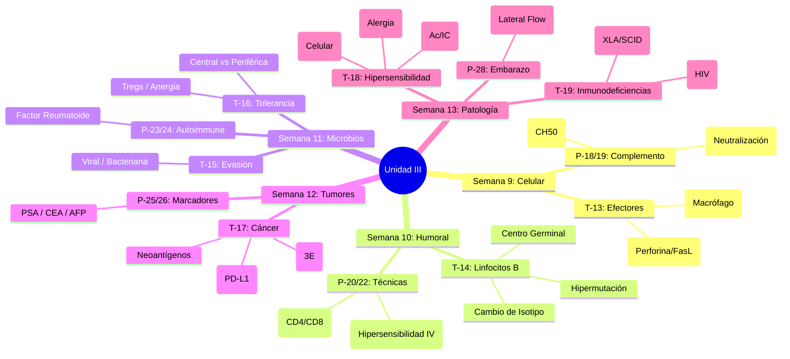

# Unidad III: Mecanismos Efectores de la Respuesta Inmune frente a las Infecciones y en la Enfermedad

> **Objetivo de la Unidad**: Integrar los conocimientos moleculares para comprender cómo el sistema inmune elimina patógenos (Respuesta Celular y Humoral) y cómo su desregulación causa enfermedad (Hipersensibilidad, Autoinmunidad, Inmunodeficiencia, Cáncer).

---

## 🗺️ Mapa de Navegación

### Semana 9: Respuesta Inmune Celular
- [[20_Respuesta_Celular|T-13: Respuesta Inmune Celular]]
    - *Conceptos Clave*: Sinapsis efectora, Perforina/Granzima, FasL, Activación de Macrófagos (Th1).
- [[21_Laboratorio_Lisis_Complemento|P-18/P-19: Laboratorio - Lisis y ASO]]
    - *Práctica*: Hemólisis por complemento y titulación de Antiestreptolisina O.

### Semana 10: Respuesta Inmune Humoral
- [[22_Respuesta_Humoral|T-14: Respuesta Inmune Humoral]]
    - *Conceptos Clave*: Centro Germinal, Hipermutación Somática, Cambio de Isotipo, Neutralización, ADCC.
- [[23_Laboratorio_Citometria_PPD|P-20/P-21/P-22: Laboratorio - Citometría, PPD, PCR]]
    - *Práctica*: Fenotipificación celular, Hipersensibilidad Tipo IV (Mantoux), Reactantes de Fase Aguda.

### Semana 11: Microbios y Tolerancia
- [[24_Inmunidad_Microorganismos|T-15: Inmunidad frente a Microorganismos]]
    - *Conceptos Clave*: Mecanismos de evasión viral, bacteriana y parasitaria.
- [[25_Tolerancia_Autoinmunidad|T-16: Tolerancia Inmunitaria y Autoinmunidad]]
    - *Conceptos Clave*: Selección negativa, Tregs, Anergia, Mimetismo Molecular, Epitope Spreading.
- [[26_Laboratorio_Factor_Reumatoide|P-23/P-24: Laboratorio - Factor Reumatoide]]
    - *Práctica*: Diagnóstico de Artritis Reumatoide.

### Semana 12: Inmunología Tumoral
- [[27_Inmunidad_Tumoral|T-17: Inmunidad frente a Tumores]]
    - *Conceptos Clave*: Neoantígenos, Inmunoedición (3E), Evasión (PD-L1), CAR-T Cells.
- [[28_Laboratorio_Marcadores_Tumorales|P-25/P-26: Laboratorio - Marcadores Tumorales]]
    - *Práctica*: PSA, CEA, AFP.

### Semana 13: Patología Inmunitaria
- [[29_Hipersensibilidad|T-18: Hipersensibilidad (I-IV)]]
    - *Conceptos Clave*: Alergia (IgE), Citotoxicidad (IgG), Inmunocomplejos, Retardada (T).
- [[30_Inmunodeficiencias|T-19: Inmunodeficiencias]]
    - *Conceptos Clave*: Primarias (XLA, SCID, CGD) vs Secundarias (HIV/SIDA).
- [[31_Laboratorio_Embarazo|P-28: Laboratorio - Diagnóstico de Embarazo]]
    - *Práctica*: Detección de hCG.

---

## 🧠 Conceptos Transversales (Hubs)
- [[Patologia_Inmunologica]]
- [[Inmunoterapia]]
- [[Diagnostico_Inmunologico]]

---

## 📚 Recursos Adicionales
- **Lectura 4**: Antígenos en cáncer y autoinmunidad.
