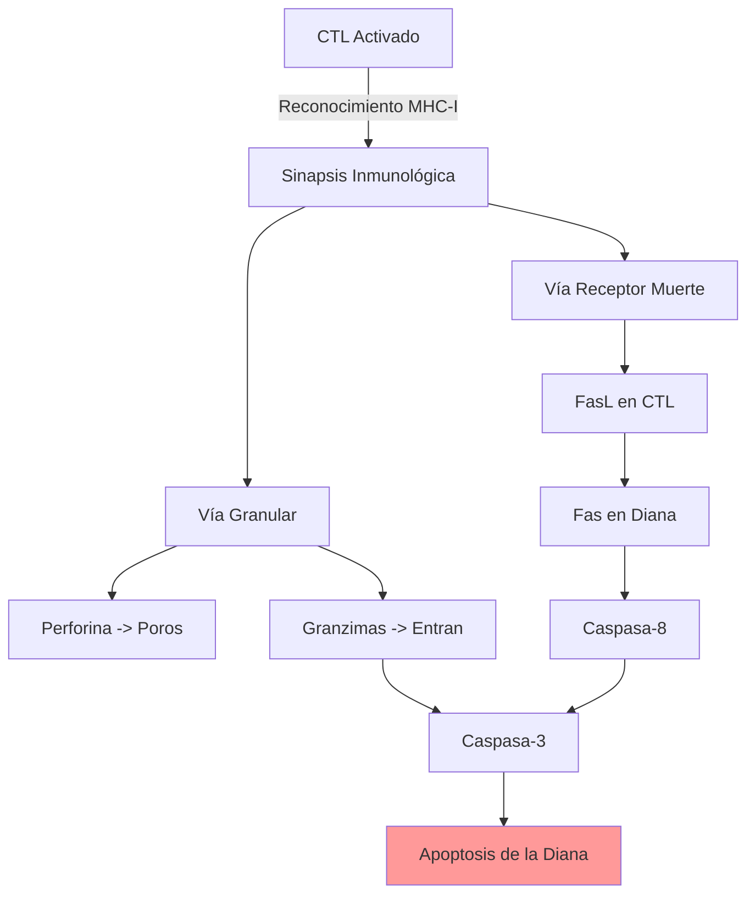

# T-13: Respuesta Inmune Celular: El Brazo Ejecutor

> *"Los anticuerpos no pueden entrar a las células. Para eliminar patógenos intracelulares (virus, micobacterias) o células aberrantes (cáncer), el sistema inmune despliega asesinos de precisión: los Linfocitos T Citotóxicos."*

---

> [!TIP] 🧠 Analista de Primeros Principios: Deconstrucción
> **Tesis Central:** La respuesta celular es un mecanismo de **sacrificio controlado**: el sistema mata a sus propias células infectadas para detener la replicación del patógeno.
> **Dilema:** ¿Cómo matar a la célula infectada sin dañar el tejido sano circundante?
> **Solución:** *Sinapsis Inmunológica*. Un beso de la muerte sellado herméticamente donde se inyectan venenos (perforinas/granzimas) solo a la célula objetivo.

> [!EXAMPLE] 🧸 Maestro Feynman: Policía vs SWAT
> 1.  **Anticuerpos (Policía de Tránsito):** Patrullan las calles (sangre/fluidos). Si ven a un ladrón corriendo (bacteria libre), lo esposan (neutralización) o llaman a la grúa (fagocito). Pero no pueden entrar a las casas.
> 2.  **Linfocitos T (SWAT):**
>     -   El virus se esconde *dentro* de la casa (célula).
>     -   El Linfocito T revisa la ventana (MHC). Si ve algo sospechoso, no entra a negociar.
>     -   **Solución:** Vuela la casa entera (Apoptosis) para que el virus no pueda usarla como fábrica de más virus. Es drástico, pero efectivo.

---

## 1. Fases de la Respuesta Celular
1.  **Inducción (Priming)**: Ocurre en órganos linfoides secundarios. DC presenta Ag a T naive $\to$ Expansión clonal $\to$ Diferenciación a efectores (CTL o Th).
2.  **Migración**: Los efectores pierden CCR7/L-selectina y ganan receptores de quimiocinas inflamatorias (CXCR3) e integrinas (VLA-4) para ir al tejido infectado.
3.  **Función Efectora**:
    -   **CD4+ Th1**: Activan macrófagos para matar microbios intravesiculares.
    -   **CD8+ CTL**: Matan células infectadas en el citosol.

---

## 2. Mecanismos de Citotoxicidad (CD8+ y NK)

Los CTLs son "asesinos seriales". Matan una célula, se desenganchan y buscan la siguiente.

### A. Vía de la Exocitosis de Gránulos (Perforina/Granzima)
Es la vía principal y más rápida.
1.  **Sinapsis**: El CTL reconoce MHC-I-péptido y forma una unión estrecha (anillo de actina) para no dañar células vecinas.
2.  **Polarización**: El MTOC (Centro Organizador de Microtúbulos) y el aparato de Golgi se reorientan hacia la sinapsis.
3.  **Degranulación**:
    -   **Perforina**: Monómeros que polimerizan en la membrana de la diana formando un poro (similar a C9 del complemento).
    -   **Granzimas (A y B)**: Serina proteasas que entran por el poro (o por endocitosis mediada por receptor de manosa-6-fosfato).
4.  **Muerte**:
    -   *Granzima B*: Cliva y activa **Caspasa-3** (Ejecutora) $\to$ Apoptosis. También cliva **BID** $\to$ Daño mitocondrial.

### B. Vía del Receptor de Muerte (Fas/FasL)
1.  El CTL activado expresa **FasL (CD178)** en su membrana.
2.  Se une a **Fas (CD95)** en la célula diana.
3.  Trimerización de Fas $\to$ Reclutamiento de FADD $\to$ Activación de **Caspasa-8** $\to$ Caspasa-3 $\to$ Apoptosis.
*Importancia*: Vital para la homeostasis (eliminar linfocitos autoreactivos o sobrantes tras la infección). Mutación en Fas $\to$ **ALPS (Síndrome Linfoproliferativo Autoinmune)**.

---

## 3. Activación de Macrófagos (Cooperación Th1-Macrófago)
Microbios como *Mycobacterium tuberculosis* o *Leishmania* viven felices dentro del fagosoma del macrófago. El macrófago necesita "superpoderes" para matarlos.

1.  **Señal 1**: El Macrófago presenta péptido en MHC-II al Th1.
2.  **Señal 2**: El Th1 expresa **CD40L** que une CD40 en el macrófago.
3.  **Señal 3**: El Th1 secreta **IFN-$\gamma$**.
4.  **Resultado (Activación Clásica M1)**:
    -   Aumento masivo de **ROS** (Estallido respiratorio) y **NO** (Óxido Nítrico sintasa inducible - iNOS).
    -   Mayor expresión de MHC y B7 (Feedback positivo).
    -   Secreción de TNF e IL-12.

---

## 4. Correlación Clínica
-   **Linfohistiocitosis Hemofagocítica (HLH)**: Defecto genético en Perforina o maquinaria de exocitosis (Rab27a). Los CTLs no pueden matar, pero siguen secretando IFN-$\gamma$ descontroladamente $\to$ Activación masiva de macrófagos que fagocitan glóbulos rojos propios. Mortal si no se trata.
-   **Tuberculosis**: El granuloma es el intento del cuerpo de contener una infección que los macrófagos no pueden erradicar completamente (incluso con ayuda Th1).

---

## 5. Referencias
1.  **Barry, M., & Bleackley, R. C.** (2002). Cytotoxic T lymphocytes: all roads lead to death. *Nature Reviews Immunology*.
2.  **Kägi, D., et al.** (1994). Cytotoxicity mediated by T cells and natural killer cells is greatly impaired in perforin-deficient mice. *Nature*.
