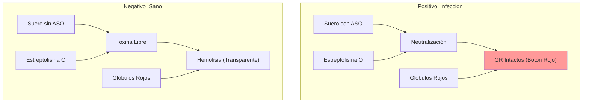

# P-18/P-19: Laboratorio - Actividad Lítica y Antiestreptolisina O

> *"El complemento puede medirse funcionalmente (¿mata?) o antigénicamente (¿está ahí?). La prueba de ASO es un clásico ejemplo de neutralización de toxinas."*

---

## 1. P-18: Actividad Lítica del Complemento (CH50)

### Fundamento
El ensayo **CH50** (Complemento Hemolítico 50%) mide la capacidad funcional de la **Vía Clásica** completa (C1-C9) para lisar el 50% de una suspensión estandarizada de eritrocitos de carnero sensibilizados.

### Reactivos
1.  **Sistema Hemolítico**: Eritrocitos de carnero + Hemolisina (Anticuerpos IgG de conejo anti-eritrocito de carnero).
2.  **Suero Paciente**: Fuente de complemento.

### Procedimiento
1.  Se realizan diluciones seriadas del suero del paciente.
2.  Se añade el sistema hemolítico.
3.  Incubación 37°C (30-60 min).
4.  Centrifugación. Se mide la absorbancia del sobrenadante (hemoglobina liberada) a 541 nm.

### Interpretación
-   **CH50 Bajo (Consumo)**: Indica activación sistémica (Lupus activo, Glomerulonefritis, Endocarditis) o deficiencia genética de algún componente.
-   **CH50 Cero**: Ausencia congénita de un componente (ej. C2, C4) o mala manipulación de la muestra (el complemento es termolábil, se inactiva si no se congela rápido).

---

## 2. P-19: Antiestreptolisina O (ASO)

### Fundamento: Neutralización
El *Streptococcus pyogenes* (Grupo A) produce una exotoxina hemolítica llamada **Estreptolisina O (SLO)**.
-   La SLO lisa glóbulos rojos humanos.
-   Si el paciente tuvo una infección reciente, tendrá anticuerpos **Anti-Estreptolisina O (ASO)** que neutralizan la toxina.

### Procedimiento (Inhibición de la Hemólisis)
1.  **Mezcla 1**: Suero del paciente (diluciones) + Reativo de Estreptolisina O (Toxina).
    -   Incubar. Si hay Acs, neutralizan la toxina.
2.  **Mezcla 2**: Añadir Eritrocitos Humanos (Indicador).
3.  **Resultado**:
    -   **Sin Hemólisis**: Positivo. (Los Acs neutralizaron la toxina $\to$ GR intactos).
    -   **Con Hemólisis**: Negativo. (No había Acs $\to$ Toxina libre lisó los GR).

### Significado Clínico
-   Título elevado (>200 UI/mL) indica infección estreptocócica reciente (Faringitis, Pioderma).
-   Es criterio diagnóstico mayor para **Fiebre Reumática** y **Glomerulonefritis Post-estreptocócica**.

---

### Referencias
1.  **Manual de Procedimientos Técnicos**. Pruebas serológicas para estreptococo.
2.  **Costabile, M.** (2010). Measuring the 50% haemolytic complement (CH50) activity of serum. *Journal of Visualized Experiments*.
