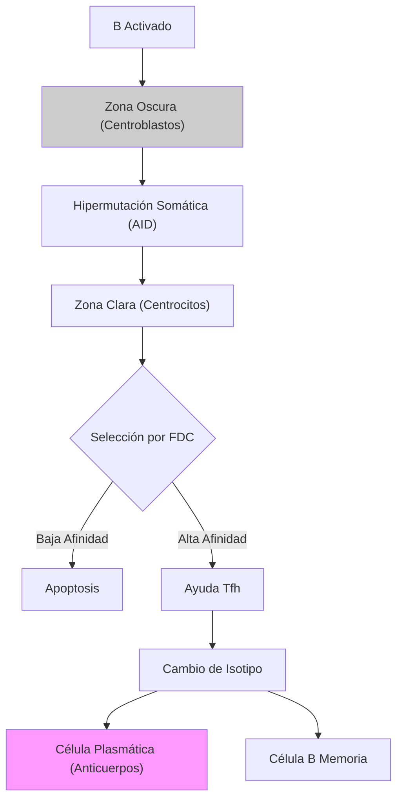

# T-14: Respuesta Inmune Humoral: La Fábrica de Anticuerpos

> *"La respuesta B es un proceso darwiniano acelerado que ocurre en tiempo real dentro de los ganglios linfáticos, seleccionando los clones con mayor afinidad para neutralizar al invasor."*

---

## 1. Activación del Linfocito B

### A. T-Independiente (TI)
-   **Antígenos**: Polisacáridos, lípidos, ácidos nucleicos (multivalentes).
-   **Mecanismo**: Entrecruzamiento masivo de BCRs.
-   **Resultado**: Solo IgM. Baja afinidad. Sin memoria. Vida media corta. (Defensa rápida contra bacterias encapsuladas).

### B. T-Dependiente (TD)
-   **Antígenos**: Proteínas.
-   **Mecanismo**:
    1.  B reconoce Ag nativo $\to$ Endocita $\to$ Presenta péptido en MHC-II.
    2.  **Tfh (T Follicular Helper)** reconoce MHC-II-péptido.
    3.  Tfh da señales: **CD40L** (une CD40 en B) y citocinas (IL-21, IL-4).
-   **Resultado**: Reacción de Centro Germinal.

---

## 2. La Reacción de Centro Germinal (GC)

Ocurre en los folículos secundarios. Es la "escuela de posgrado" de los linfocitos B.

### A. Hipermutación Somática (SHM)
-   **Enzima AID (Activation-Induced Deaminase)**: Convierte Citosinas en Uracilos en el ADN de las regiones variables (CDR) de las Igs.
-   La reparación propensa a error genera mutaciones puntuales a una tasa $10^6$ veces mayor que la normal.
-   **Objetivo**: Crear variantes del BCR con diferente afinidad.

### B. Selección de Afinidad
-   Los B mutados compiten por capturar el antígeno retenido en las **Células Dendríticas Foliculares (FDC)**.
-   Solo los B con **mayor afinidad** logran robar el antígeno, procesarlo y presentarlo al Tfh para recibir señales de supervivencia.
-   Los de baja afinidad mueren por apoptosis.
-   **Resultado**: Maduración de la Afinidad (los anticuerpos son cada vez mejores).

### C. Cambio de Isotipo (Class Switching)
-   La misma enzima **AID** corta el ADN en las regiones "Switch" (S) y recombina la región variable VDJ con una nueva región constante ($C\gamma, C\alpha, C\epsilon$).
-   Dirigido por citocinas Th:
    -   IFN-$\gamma$ $\to$ IgG (Opsonización).
    -   IL-4 $\to$ IgE (Parásitos/Alergia).
    -   TGF-$\beta$ $\to$ IgA (Mucosas).

---

## 3. Mecanismos Efectores Humorales

1.  **Neutralización**: Bloqueo de entrada viral o toxinas. (IgG, IgA). Único mecanismo que no requiere componentes accesorios.
2.  **Opsonización**: IgG recubre microbios. Fagocitos con **Fc$\gamma$R** comen mejor.
3.  **ADCC (Citotoxicidad Celular Dependiente de Ac)**: NK con **Fc$\gamma$RIII (CD16)** mata células cubiertas de IgG.
4.  **Activación de Complemento**: IgM e IgG activan C1q $\to$ Lisis y Opsonización (C3b).

---

## 4. Correlación Clínica
-   **Síndrome de Hiper-IgM**: Defecto en **CD40L** (en células T) o **AID** (en células B). No hay cambio de isotipo ni hipermutación. Paciente tiene IgM normal/alta pero cero IgG/IgA/IgE. Infecciones piógenas severas.
-   **Vacunas Conjugadas**: Los bebés (<2 años) no tienen respuesta T-independiente madura (zona marginal inmadura). Para vacunarlos contra polisacáridos (*Neumococo*), se conjuga el azúcar a una proteína (Toxoide diftérico) para convertir la respuesta en T-dependiente y generar memoria IgG.

---

## 5. Referencias
1.  **Victora, G. D., & Nussenzweig, M. C.** (2012). Germinal centers. *Annual Review of Immunology*.
2.  **Muramatsu, M., et al.** (2000). Class switch recombination and hypermutation require activation-induced cytidine deaminase (AID). *Cell*.
