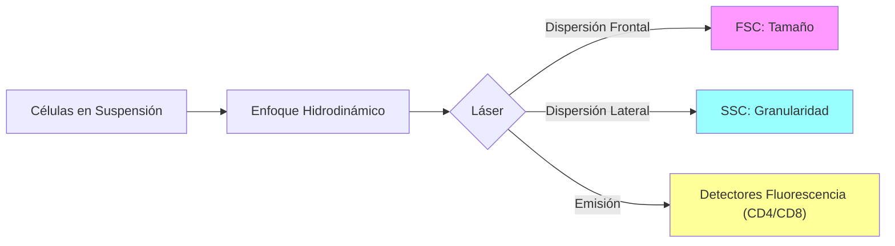

# P-20/P-21/P-22: Laboratorio - Tecnologías de Evaluación Inmune

> *"Desde la medición molecular individual (PCR) hasta el análisis célula por célula (Citometría) y la respuesta in vivo (PPD), estas pruebas cubren todo el espectro diagnóstico."*

---

## 1. P-20: Citometría de Flujo

### Fundamento
Técnica láser para contar y caracterizar células en suspensión, una por una, a alta velocidad (>10,000 células/seg).
-   **Fluidica**: Enfoque hidrodinámico alinea las células en fila india.
-   **Óptica**:
    -   **FSC (Forward Scatter)**: Dispersión frontal. Proporcional al **Tamaño**.
    -   **SSC (Side Scatter)**: Dispersión lateral (90°). Proporcional a la **Granularidad/Complejidad**.
    -   **Fluorescencia**: Anticuerpos monoclonales marcados con fluorocromos (FITC, PE, APC) detectan marcadores de superficie (CD).

### Aplicación: Inmunofenotipificación
-   **Poblaciones Linfocitarias**:
    -   T Totales: CD3+
    -   T Helper: CD3+ CD4+
    -   T Citotóxicos: CD3+ CD8+
    -   B: CD19+ o CD20+
    -   NK: CD3- CD16+ CD56+
-   **Clínica**: Conteo de CD4 en HIV/SIDA (<200/uL = SIDA). Diagnóstico de Leucemias/Linfomas.

---

## 2. P-21: Prueba de Tuberculina (PPD / Mantoux)

### Fundamento: Hipersensibilidad Tipo IV (Retardada)
Evalúa la memoria inmunológica celular (Th1) *in vivo*.
-   **Antígeno**: PPD (Derivado Proteico Purificado) de *M. tuberculosis*.
-   **Procedimiento**: Inyección intradérmica en antebrazo.
-   **Lectura**: A las **48-72 horas**. Se mide la **Induración** (dureza palpable), NO el eritema (rojez).
    -   La induración es causada por la infiltración de macrófagos y linfocitos T de memoria reclutados por citocinas Th1 (IFN-$\gamma$).

### Interpretación
-   **>5 mm**: Positivo en HIV o contacto cercano.
-   **>10 mm**: Positivo en personal de salud, inmigrantes de zonas endémicas.
-   **>15 mm**: Positivo en personas sin factores de riesgo.
-   *Falso Negativo (Anergia)*: En inmunosupresión severa (SIDA), el paciente no reacciona aunque tenga TB.

---

## 3. P-22: Proteína C Reactiva (PCR / CRP)

### Fundamento: Reactante de Fase Aguda
Proteína pentamérica (Pentraxina) sintetizada por el hígado en respuesta a **IL-6** (y IL-1/TNF).
-   **Función**: Opsonina primitiva. Se une a fosfocolina en bacterias y células muertas $\to$ Activa Complemento (Vía Clásica) y fagocitosis.

### Utilidad Clínica
-   **Marcador de Inflamación**: Sube en 4-6 horas (VSG sube en días). Muy sensible, poco específico.
-   **PCR Ultrasensible (hs-CRP)**: Detecta niveles muy bajos (inflamación subclinica). Marcador de riesgo cardiovascular.

---

### Referencias
1.  **Shapiro, H. M.** (2003). *Practical Flow Cytometry*. Wiley-Liss.
2.  **CDC Guidelines**. Targeted Tuberculin Testing.
