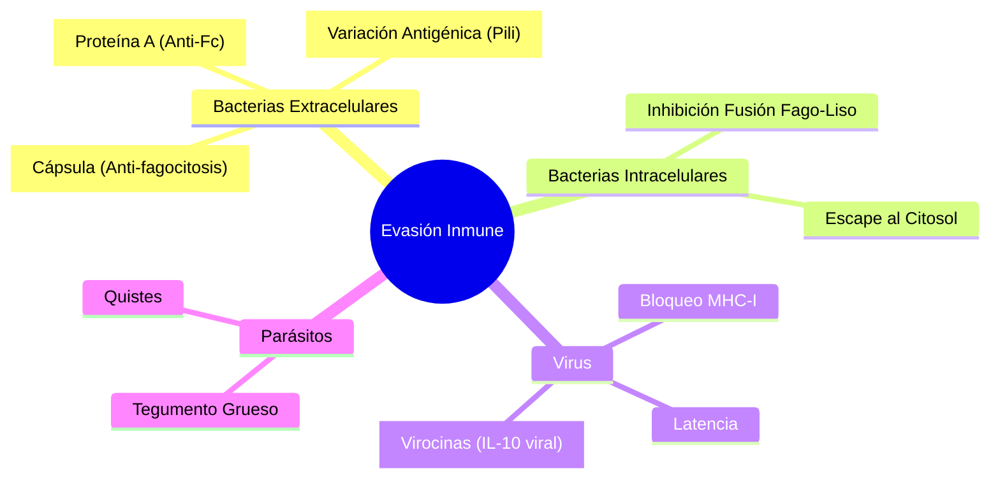

# T-15: Inmunidad frente a Microorganismos: La Carrera Armamentista

> *"La historia de la inmunología es la historia de la coevolución entre el huésped y el patógeno. Cada mecanismo inmune ha forzado la selección de un mecanismo de evasión microbiano."*

---

## 1. Bacterias Extracelulares (Ej. *Staphylococcus, Streptococcus*)
-   **Respuesta**: Humoral (Anticuerpos $\to$ Opsonización/Complemento/Neutralización) + Fagocitos (Neutrófilos). Th17 (reclutamiento).
-   **Evasión**:
    -   *Cápsula*: Inhibe fagocitosis y activación de complemento alterno.
    -   *Variación Antigénica*: Cambiar proteínas de superficie (Pili de *Neisseria*).
    -   *Proteínas Anti-Ig*: Proteína A (*S. aureus*) une Fc de IgG al revés, impidiendo opsonización.

## 2. Bacterias Intracelulares (Ej. *Mycobacterium, Listeria*)
-   **Respuesta**: Celular (Th1 $\to$ IFN-$\gamma$ $\to$ Macrófago activado). Si falla $\to$ Granuloma.
-   **Evasión**:
    -   Inhibir fusión fagosoma-lisosoma (*Mycobacterium*).
    -   Escapar al citosol (*Listeria* usa listeriolisina O).

## 3. Virus
-   **Respuesta**:
    -   *Innata*: Interferones Tipo I (Estado antiviral), NK.
    -   *Adaptativa*: Anticuerpos neutralizantes (previenen entrada) + CTL CD8+ (matan infectadas).
-   **Evasión**:
    -   Bloqueo de MHC-I (HSV, CMV).
    -   Producción de "virocinas" (homólogos de citocinas/receptores inhibitorios). Ej. EBV produce IL-10 viral.
    -   Latencia (integración en genoma o episoma silente).
    -   Deriva/Cambio Antigénico (Influenza).

## 4. Parásitos (Helmintos)
-   **Respuesta**: Th2 $\to$ IL-4/IL-5 $\to$ IgE + Eosinófilos + Mastocitos.
    -   Los eosinófilos liberan Proteína Básica Mayor (MBP) tóxica para la cutícula del gusano.
    -   "Weep and Sweep": Aumento de moco y peristaltismo intestinal.
-   **Evasión**:
    -   Tegumento grueso.
    -   Inmunosupresión (Inducción de Tregs).

---

## 5. Referencias
1.  **Salyers, A. A., & Whitt, D. D.** (2002). *Bacterial Pathogenesis*. ASM Press.
2.  **Alcami, A., & Koszinowski, U. H.** (2000). Viral mechanisms of immune evasion. *Immunology Today*.
