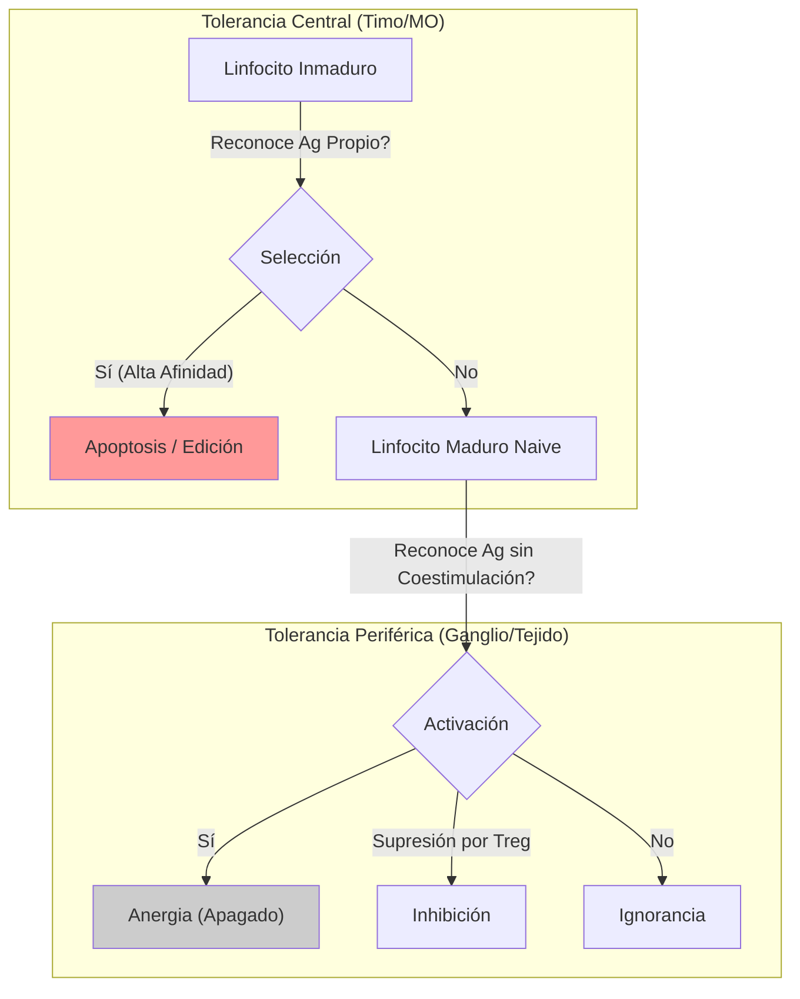

# T-16: Tolerancia Inmunitaria y Autoinmunidad: El Precio de la Complejidad

> *"El sistema inmune es un arma cargada. La tolerancia es el seguro. Cuando el seguro falla, el arma se dispara contra uno mismo."*

---

> [!TIP] 🧠 Analista de Primeros Principios: Deconstrucción
> **Tesis Central:** La tolerancia no es pasividad; es un proceso **activo** de educación y censura.
> **Paradoja Fundamental:** El sistema inmune se crea generando receptores al azar (recombinación V(D)J). Por estadística, *muchos* de estos receptores atacarán al propio cuerpo.
> **Solución:** Un sistema de "Control de Calidad" riguroso (Selección Negativa) donde se eliminan los defectos de fábrica antes de que salgan a la calle.

> [!EXAMPLE] 🧸 Maestro Feynman: La Escuela de Linfocitos (El Timo)
> Imagina que el Timo es una academia de policía muy estricta.
> 1.  **El Examen Final:** El instructor (Célula Epitelial del Timo) se disfraza de ciudadano inocente (muestra un péptido propio).
> 2.  **La Prueba:** Le dice al cadete (Linfocito T): "¿Me dispararías?".
> 3.  **El Resultado:**
>     -   Si el cadete dice "Sí" (reacciona al péptido propio) $\to$ **REPROBADO** (Ejecutado/Apoptosis).
>     -   Si el cadete dice "No" (ignora al péptido propio) $\to$ **APROBADO** (Sale a la sangre).
> 4.  **El Fallo (Autoinmunidad):** A veces, un cadete loco se escapa del examen o el instructor se olvida de mostrar un disfraz específico. Ese cadete ahora es un policía corrupto suelto en la ciudad.

---

## 1. Tolerancia Central (Educación Primaria)
Ocurre en órganos generativos (Timo, Médula Ósea).
-   **Timo (Selección Negativa)**: AIRE expresa antígenos tisulares. Si T reacciona fuerte $\to$ Apoptosis.
-   **Médula Ósea**: Si B inmaduro reacciona fuerte $\to$ Edición del Receptor (RAG reactivado) o Apoptosis.

## 2. Tolerancia Periférica (Mecanismos de Seguridad)
Para los clones autoreactivos que escaparon de la selección central.
1.  **Anergia**: Reconocimiento de Ag (Señal 1) SIN coestimulación (Señal 2). El linfocito se apaga funcionalmente.
2.  **Supresión (Tregs)**: Linfocitos T Regulatorios ($CD4+ CD25+ FoxP3+$).
    -   Secretan citocinas inhibitorias (TGF-$\beta$, IL-10).
    -   Consumen IL-2 (privación).
    -   Expresan CTLA-4 constitutivamente.
3.  **Ignorancia**: Antígenos secuestrados en sitios inmunoprivilegiados (Ojo, Testículo, Cerebro).

---

## 3. Mecanismos de Autoinmunidad
Fallo de la tolerancia + Predisposición Genética + Factor Ambiental.

1.  **Mimetismo Molecular**: Un patógeno tiene un epítopo similar a uno propio.
    -   *Ejemplo*: Fiebre Reumática (*Streptococcus* M protein vs Miosina cardíaca).
2.  **Modificación de Antígenos Propios**: Fármacos o infecciones alteran proteínas propias (Neoantígenos).
3.  **Propagación de Epítopos (Epitope Spreading)**: El daño tisular libera nuevos antígenos ocultos, ampliando la respuesta autoinmune.
4.  **Activación Policlonal**: Superantígenos activan clones inespecíficamente.

---

## 4. Clasificación de Enfermedades
-   **Órgano-Específicas**:
    -   Diabetes Tipo 1 (Islotes pancreáticos).
    -   Hashimoto (Tiroides).
    -   Miastenia Gravis (Receptor Acetilcolina).
-   **Sistémicas**:
    -   Lupus Eritematoso Sistémico (DNA, histonas).
    -   Artritis Reumatoide (IgG, Citrulina).

---

## 5. Referencias
1.  **Goodnow, C. C., et al.** (2005). Cellular and genetic mechanisms of self-tolerance and autoimmunity. *Nature*.
2.  **Sakaguchi, S.** (2004). Naturally arising CD4+ regulatory t cells for immunologic self-tolerance and negative control of immune responses. *Annual Review of Immunology*.
