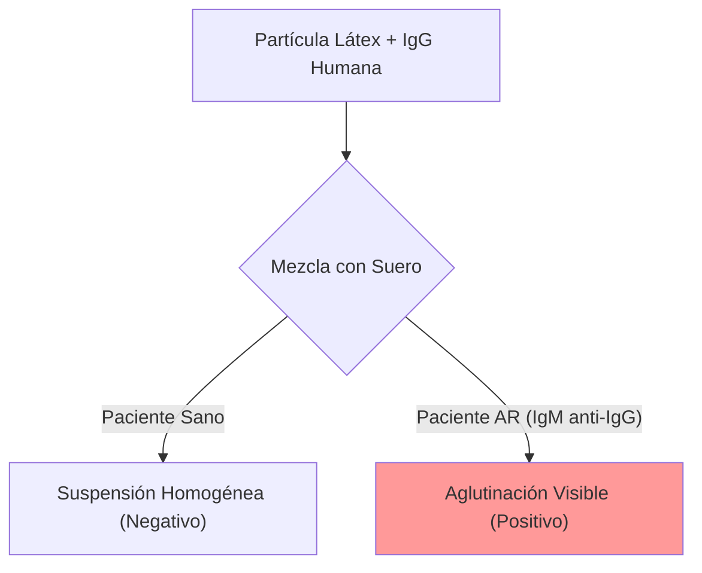

# P-23/P-24: Laboratorio - Factor Reumatoide y Autoinmunidad

> *"El Factor Reumatoide es un autoanticuerpo contra un anticuerpo. Una paradoja inmunológica que sirve de marcador diagnóstico clave."*

---

## 1. Fundamento: Factor Reumatoide (FR)
-   **Definición**: Es un autoanticuerpo (generalmente **IgM**, aunque puede ser IgG/IgA) que se une a la **región Fc de la IgG** humana.
-   **Mecanismo**: Forma inmunocomplejos (IgM-IgG) que se depositan en la membrana sinovial, activan complemento e inducen inflamación crónica (sinovitis).

## 2. Prueba de Aglutinación en Látex (Test de Singer y Plotz)
-   **Reactivo**: Partículas de látex recubiertas de **IgG humana** (antígeno).
-   **Procedimiento**: Mezclar suero del paciente con látex.
-   **Resultado**:
    -   *Aglutinación*: Presencia de FR (IgM anti-IgG).
    -   *Título*: La inversa de la última dilución positiva. >1:80 suele ser significativo.

## 3. Interpretación Clínica
-   **Sensibilidad**: ~70-80% en Artritis Reumatoide (AR).
-   **Especificidad**: Baja. Puede aparecer en Sjögren, Lupus, Endocarditis, Hepatitis C, y en ancianos sanos.
-   **Anti-CCP (Péptido Citrulinado Cíclico)**: Nuevo marcador más específico (>95%) para AR. Se pide junto con el FR.

---

### Referencias
1.  **Aletaha, D., et al.** (2010). 2010 Rheumatoid arthritis classification criteria. *Arthritis & Rheumatism*.
