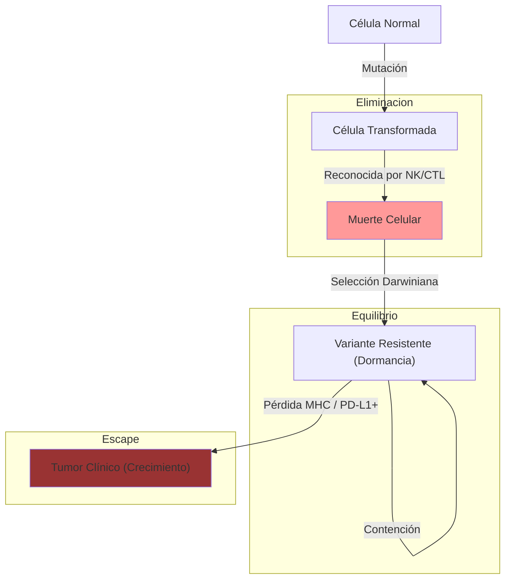

# T-17: Inmunidad frente a Tumores: Vigilancia y Escape

> *"El cáncer no es solo una enfermedad genética; es una falla inmunológica. El tumor debe evolucionar para volverse invisible o supresor antes de poder crecer clínicamente."*

---

## 1. Antígenos Tumorales
Para que el sistema inmune ataque, debe ver algo "extraño".
1.  **Neoantígenos**: Productos de genes mutados (ej. Ras mutado, p53 mutado). Específicos del tumor. Alta inmunogenicidad.
2.  **Antígenos de Cáncer-Testículo (MAGE)**: Proteínas normales que solo deberían expresarse en testículo (inmunoprivilegiado) pero se reactivan en cáncer.
3.  **Antígenos de Diferenciación**: Proteínas de tejido normal sobreexpresadas (ej. Tirosinasa en Melanoma, HER2 en Mama).

---

## 2. Teoría de la Inmunoedición (Las 3 E)
El sistema inmune esculpe el tumor.
1.  **Eliminación (Vigilancia)**: NK y CTLs detectan y destruyen células transformadas antes de que formen tumor visible.
2.  **Equilibrio**: Algunas células tumorales mutantes sobreviven (selección darwiniana) y entran en dormancia. El sistema inmune las contiene pero no las elimina.
3.  **Escape**: El tumor adquiere mecanismos para evadir el control inmune y crece exponencialmente.

---

## 3. Mecanismos de Evasión Tumoral
1.  **Pérdida de MHC-I**: El tumor deja de expresar MHC-I o TAP. Invisible a CTLs. (Pero visible a NK).
2.  **Expresión de Checkpoints Inhibitorios**: El tumor expresa **PD-L1**, que se une a PD-1 en el linfocito T y lo "apaga" (Agotamiento/Exhaustion).
3.  **Microambiente Inmunosupresor (TME)**: Reclutamiento de Tregs, Macrófagos M2 y secreción de TGF-$\beta$, IL-10, VEGF.

---

## 4. Inmunoterapia: El Cuarto Pilar del Tratamiento
1.  **Inhibidores de Checkpoint**: Anticuerpos anti-PD-1 (Pembrolizumab) o anti-CTLA-4 (Ipilimumab). "Quitan el freno".
2.  **Terapia Celular Adoptiva (CAR-T)**:
    -   Se sacan linfocitos T del paciente.
    -   Se modifican genéticamente para expresar un **Receptor de Antígeno Quimérico (CAR)** que reconoce al tumor (ej. CD19 en leucemia) sin necesidad de MHC.
    -   Se reinfunden. "Fármaco vivo".

---

## 5. Referencias
1.  **Schreiber, R. D., et al.** (2011). Cancer immunoediting: integrating immunity's roles in cancer suppression and promotion. *Science*.
2.  **Couzin-Frankel, J.** (2013). Cancer immunotherapy. *Science* (Breakthrough of the Year).
