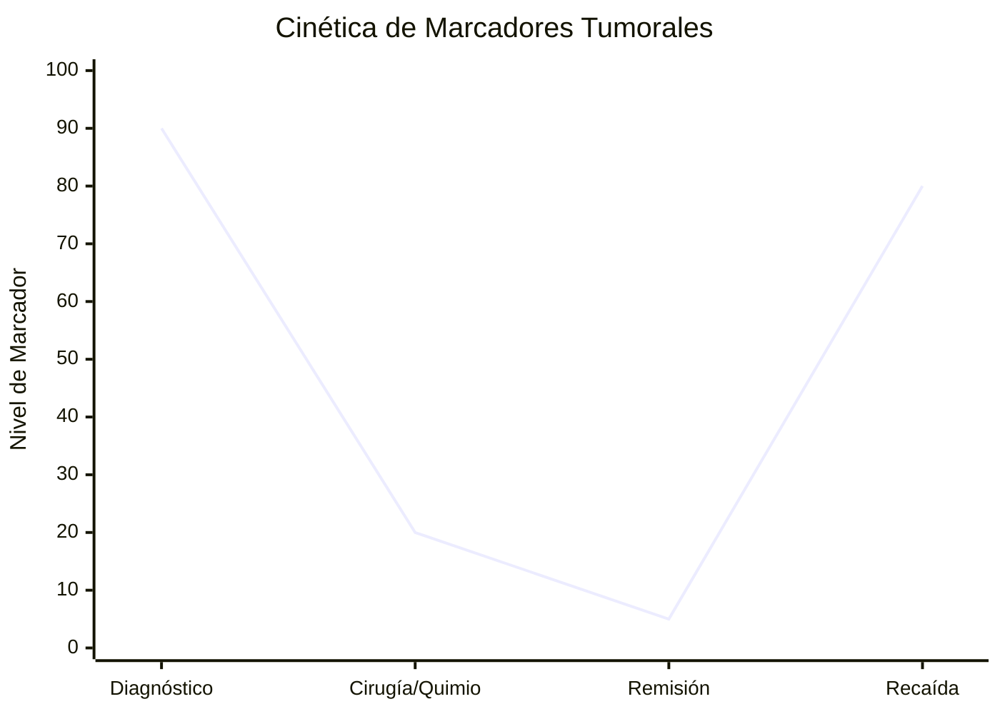

# P-25/P-26: Laboratorio - Marcadores Tumorales

> *"Los marcadores tumorales séricos son útiles para seguimiento y pronóstico, pero raramente sirven para tamizaje (screening) en población general debido a su baja especificidad."*

---

## 1. Definición y Utilidad
Sustancias producidas por el tumor o por el huésped en respuesta al tumor.
-   **Uso Principal**: Monitoreo de respuesta al tratamiento y detección de recaídas (si sube, el cáncer volvió).
-   **Falsos Positivos**: Inflamación, tabaquismo, enfermedades benignas.

*(Nota: El marcador cae tras el tratamiento exitoso y vuelve a subir antes de que la recaída sea clínicamente visible)*
## 2. Principales Marcadores
1.  **PSA (Antígeno Prostático Específico)**:
    -   Glicoproteína (serina proteasa) producida por epitelio prostático.
    -   *Específico de Órgano, NO de Cáncer*. Sube en Hiperplasia Benigna (HBP) y Prostatitis.
    -   *PSA Libre vs Total*: En cáncer, aumenta la fracción unida a proteínas (baja el % libre).
2.  **CEA (Antígeno Carcinoembrionario)**:
    -   Proteína oncofetal (normal en feto, ausente en adulto).
    -   Cáncer de Colon, Páncreas, Mama, Pulmón.
    -   Sube en fumadores.
3.  **AFP (Alfa-fetoproteína)**:
    -   Equivalente a la albúmina en el feto.
    -   Carcinoma Hepatocelular y Tumores de Células Germinales (Testículo/Ovario).
4.  **CA-125**: Cáncer de Ovario.
5.  **CA 19-9**: Cáncer de Páncreas.

## 3. Metodología
Generalmente **ELISA Sandwich** o Quimioluminiscencia (CLIA) por su alta sensibilidad.

---

### Referencias
1.  **Duffy, M. J.** (2006). Tumor markers in clinical practice: a review focusing on common solid cancers. *Medical Principles and Practice*.
