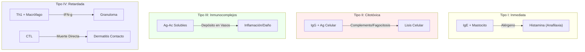

# T-18: Hipersensibilidad: Clasificación de Gell y Coombs

> *"La hipersensibilidad es una respuesta inmune adaptativa exagerada o inapropiada que causa daño tisular. Es el 'fuego amigo' de la inmunología."*

---

## Tipo I: Inmediata (Alergia / Atopia)
-   **Mediador**: **IgE**.
-   **Célula Efectora**: Mastocito / Basófilo.
-   **Mecanismo**:
    1.  *Sensibilización*: Primer contacto $\to$ Th2 $\to$ IL-4 $\to$ B switch a IgE. La IgE se une al receptor $Fc\epsilon RI$ del mastocito.
    2.  *Desencadenamiento*: Segundo contacto $\to$ Alérgeno cruza dos IgE $\to$ Desgranulación masiva.
-   **Mediadores**: Histamina (vasodilatación, broncoconstricción), Leucotrienos, Prostaglandinas.
-   **Clínica**: Anafilaxia, Asma, Rinitis, Urticaria.

## Tipo II: Citotóxica (Mediada por Anticuerpos)
-   **Mediador**: **IgG / IgM** contra antígenos en superficie celular o matriz.
-   **Mecanismo**:
    1.  *Opsonización/Fagocitosis*: Anemia Hemolítica Autoinmune.
    2.  *Complemento/Inflamación*: Síndrome de Goodpasture (Anti-MBG).
    3.  *Disfunción Celular*: Graves (Anti-TSH receptor estimulante), Miastenia Gravis (Anti-ACh receptor bloqueante).
    
    > [!NOTE] ¿Tipo V?
    > Algunos textos clasifican la **Enfermedad de Graves** como "Tipo V" (Estimulatoria), ya que el anticuerpo no destruye la célula, sino que la estimula. Sin embargo, Gell y Coombs la incluyen clásicamente en el **Tipo II**.

## Tipo III: Inmunocomplejos
-   **Mediador**: Complejos **Ag-Ac solubles** (IgG/IgM).
-   **Mecanismo**: Depósito de complejos en vasos pequeños (riñón, articulaciones) $\to$ Activación de Complemento (C5a) $\to$ Reclutamiento de Neutrófilos $\to$ Daño tisular (Vasculitis).
-   **Clínica**: Lupus (Nefritis), Enfermedad del Suero, Reacción de Arthus.

## Tipo IV: Retardada (Celular)
-   **Mediador**: **Linfocitos T** (Th1, Th17, CTL). Independiente de anticuerpos.
-   **Tiempo**: 24-72 horas.
-   **Mecanismo**:
    1.  *Th1 (Macrófagos)*: Dermatitis de Contacto (Hiedra venenosa, Níquel), PPD (Tuberculosis).
    2.  *CTL (Muerte celular)*: Rechazo de trasplante, Stevens-Johnson, Diabetes Tipo 1.

---

## Referencias
1.  **Gell, P. G. H., & Coombs, R. R. A.** (1963). *Clinical Aspects of Immunology*.
2.  **Abbas, A. K.** (2021). *Cellular and Molecular Immunology*. Capítulo 19.
