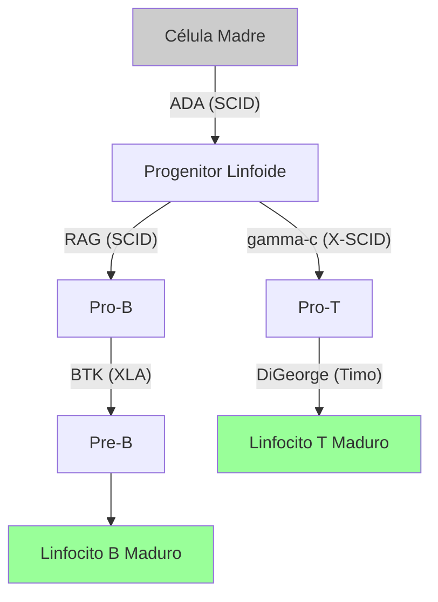

# T-19: Inmunodeficiencias: Cuando el Escudo se Rompe

> *"Las inmunodeficiencias son 'experimentos de la naturaleza' que nos enseñan la función exacta de cada gen inmunológico al mostrarnos qué pasa cuando falta."*

---

> [!TIP] 🧠 Analista de Primeros Principios: Deconstrucción
> **Tesis Central:** Una inmunodeficiencia es la **ausencia de un eslabón** en la cadena de defensa. La severidad depende de qué tan "arriba" en la jerarquía esté el eslabón perdido.
> **Principio de Jerarquía:**
> -   Fallo en Stem Cell (SCID) $\to$ Colapso total (No T, No B).
> -   Fallo en B (XLA) $\to$ Colapso parcial (Solo bacterias extracelulares).
> -   Fallo en Complemento $\to$ Fallo específico (Bacterias encapsuladas).

> [!EXAMPLE] 🧸 Maestro Feynman: El Ejército sin Balas
> -   **XLA (Bruton):** Tienes soldados (T), tienes generales, pero la fábrica de municiones (Células B) está en huelga. Puedes pelear cuerpo a cuerpo, pero no puedes disparar a distancia (Anticuerpos). Las bacterias te ganan por número.
> -   **SCID (Niño Burbuja):** No tienes ejército. Ni soldados, ni generales, ni armas. Cualquier civil con un resfriado (virus oportunista) puede invadir y conquistar tu país.
> -   **CGD (Enfermedad Granulomatosa):** Tienes soldados que comen enemigos (Fagocitos), pero se les olvidó traer sus espadas (ROS). Se comen al enemigo, pero no pueden matarlo, así que lo encierran en una cárcel hecha de sus propios cuerpos (Granuloma).

---

## 1. Inmunodeficiencias Primarias (Congénitas)
Defectos genéticos, generalmente monogénicos.

### A. Defectos de Células B (Humorales)
-   **Agammaglobulinemia Ligada al X (XLA / Bruton)**:
    -   *Defecto*: Gen **BTK** (Bruton Tyrosine Kinase). Bloquea maduración de Pro-B a Pre-B.
    -   *Clínica*: Ausencia total de células B y anticuerpos. Infecciones bacterianas recurrentes (neumonía, otitis) desde los 6 meses (cuando caen los Acs maternos).
-   **Déficit Selectivo de IgA**: La más común (1:700). Asintomática o infecciones respiratorias/digestivas leves. Riesgo de anafilaxia si reciben sangre con IgA.

### B. Defectos de Células T (Celulares/Combinadas)
-   **Síndrome de DiGeorge**:
    -   *Defecto*: Deleción 22q11.2. Aplasia tímica (sin T) + Hipoparatiroidismo (tetania) + Cardiopatía.
-   **SCID (Inmunodeficiencia Combinada Severa)**: "Niños burbuja".
    -   *X-Linked*: Mutación en cadena $\gamma$ común (**IL2RG**). Sin T ni NK. B normales en número pero no funcionan (sin ayuda T).
    -   *ADA*: Déficit de Adenosina Deaminasa. Tóxico para linfocitos.

### C. Defectos de Fagocitos
-   **Enfermedad Granulomatosa Crónica (CGD)**:
    -   *Defecto*: NADPH Oxidasa. No hay estallido respiratorio.
    -   *Clínica*: Infecciones por bacterias catalasa-positivas (*S. aureus*, *Aspergillus*). Granulomas.

---

## 2. Inmunodeficiencias Secundarias (Adquiridas)
Más comunes que las primarias. Causas: Desnutrición (la #1 mundial), Fármacos (quimio, corticoides), Infecciones.

### VIH / SIDA
-   **Virus**: Retrovirus (Lentivirus). Tropismo por **CD4** (gp120 une CD4 + CCR5/CXCR4).
-   **Fisiopatología**:
    1.  *Infección Aguda*: Viremia alta, caída transitoria de CD4. Síntomas gripales.
    2.  *Latencia Clínica*: El virus se replica en ganglios. Destrucción lenta de CD4.
    3.  *SIDA*: CD4 < 200/uL. Infecciones oportunistas (*Pneumocystis*, *Toxoplasma*, *Candida*, Sarcoma de Kaposi).
-   **Tratamiento**: TARGA (Terapia Antirretroviral de Gran Actividad). Convierte una enfermedad mortal en crónica.

---

## 3. Referencias
1.  **Notarangelo, L. D.** (2010). Primary immunodeficiencies. *Journal of Allergy and Clinical Immunology*.
2.  **Fauci, A. S.** (2003). HIV and AIDS: 20 years of science. *Nature Medicine*.
