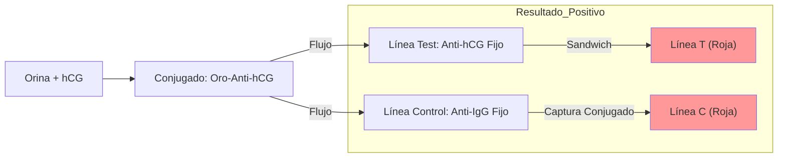

# P-28: Laboratorio - Diagnóstico Inmunológico del Embarazo

> *"La hCG es la señal química que el embrión envía para decir 'estoy aquí, no me menstrúes'. Su detección es la base de los tests rápidos caseros."*

---

## 1. Fundamento: Gonadotropina Coriónica Humana (hCG)
-   **Estructura**: Glicoproteína dímera.
    -   *Subunidad $\alpha$*: Idéntica a LH, FSH, TSH.
    -   *Subunidad $\beta$*: Específica de la hCG. Es el blanco de los anticuerpos diagnósticos.
-   **Cinética**: Producida por el sincitiotrofoblasto desde la implantación (día 6-7). Se duplica cada 48h hasta la semana 10.

## 2. Inmunocromatografía (Test Rápido / Lateral Flow)
Es el mecanismo de las tiras reactivas de orina.
1.  **Zona de Muestra**: La orina arrastra un conjugado (Ac anti-$\beta$-hCG de ratón marcado con oro coloidal/látex color).
2.  **Línea de Test (T)**: Tiene Ac anti-$\beta$-hCG fijo. Si hay hCG, se forma el sandwich: **Oro-Ac-hCG-Ac(fijo)** $\to$ Línea coloreada.
3.  **Línea de Control (C)**: Tiene Ac anti-IgG de ratón. Captura el conjugado libre. Siempre debe pintarse para validar el test.

## 3. ELISA Cuantitativo ($\beta$-hCG Sérica)
-   **Sensibilidad**: Detecta >5 mUI/mL (vs >25 mUI/mL en orina).
-   **Utilidad**:
    -   Diagnóstico precoz.
    -   Seguimiento de **Embarazo Ectópico** (niveles suben lento) o **Aborto** (niveles bajan).
    -   Marcador tumoral en **Coriocarcinoma** o tumores germinales.

---

### Referencias
1.  **Cole, L. A.** (2012). hCG, the wonder of today's science. *Reproductive Biology and Endocrinology*.
