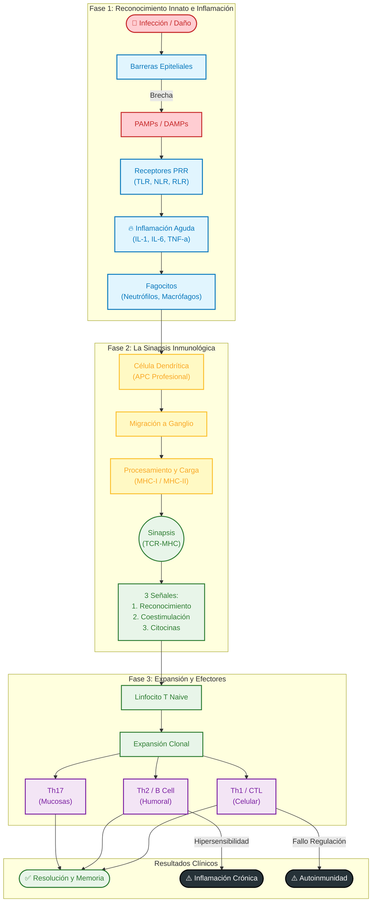
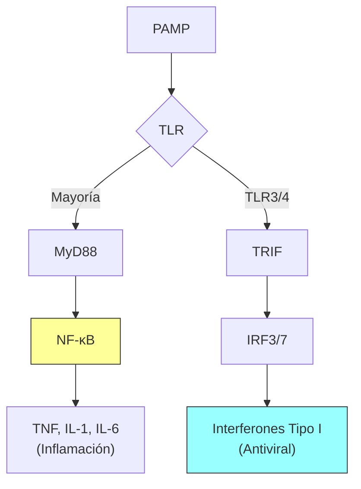
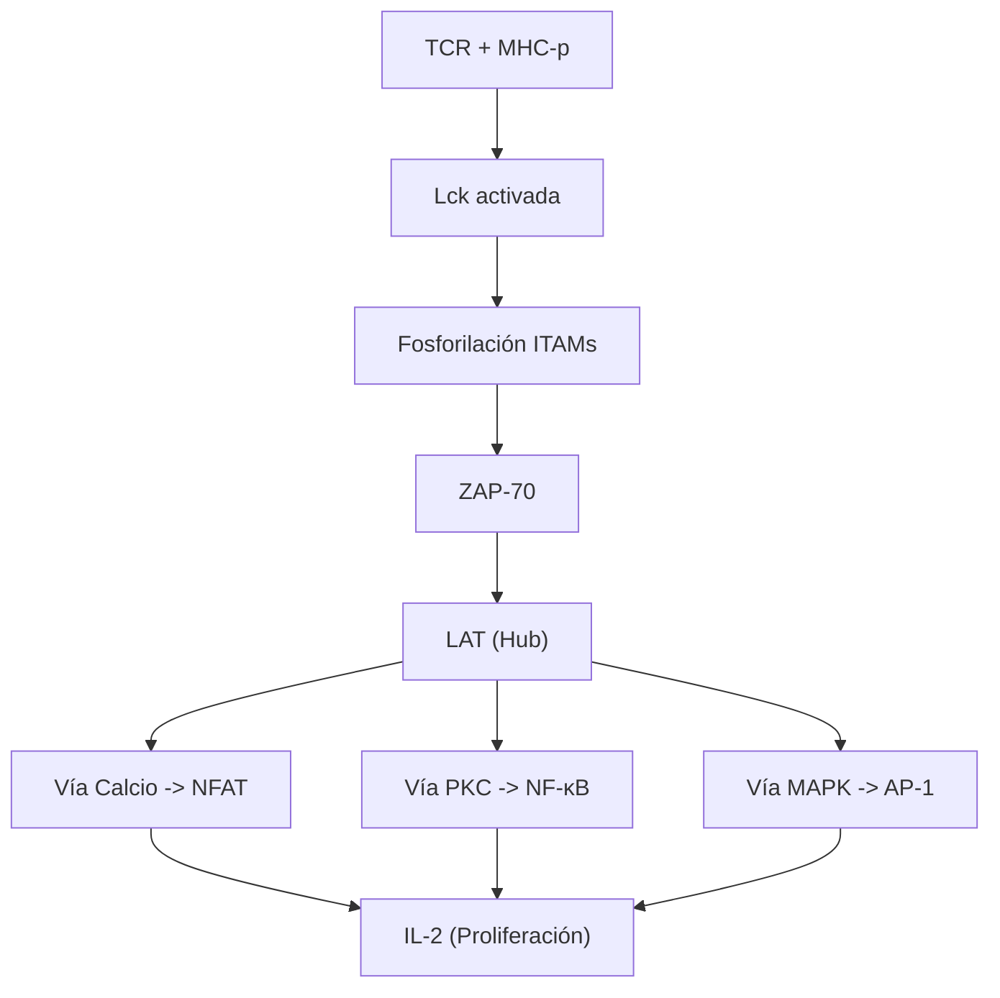
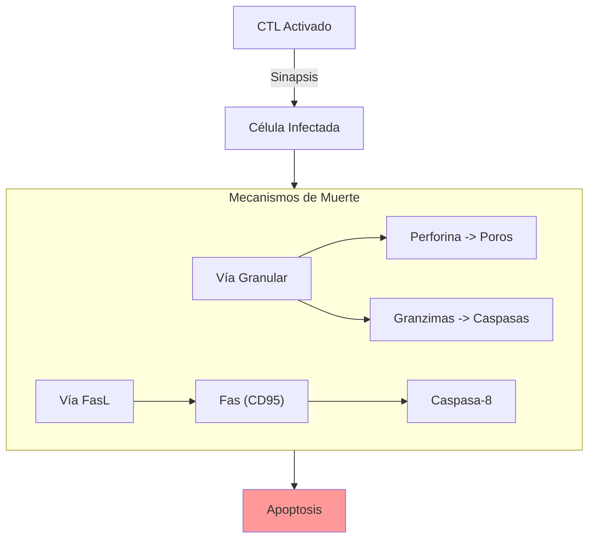

# 🧬 Mapa Global: La Lógica de la Defensa Inmunológica

> [!ABSTRACT] Abstract
> Este curso de **Inmunología Básica y Clínica** deconstruye la respuesta biológica frente a la no-mismidad (*non-self*). Desde la detección molecular de patrones conservados (PAMPs) hasta la orquestación de respuestas linfocitarias altamente específicas, analizamos cómo el sistema inmune mantiene la homeostasis.
>
> **Eje Central**: La transición crítica de la **Inmunidad Innata** (rápida, germinal) a la **Adaptativa** (lenta, somática), mediada por la presentación de antígenos, y cómo la desregulación de este proceso conduce a la patología.

---

## 🗺️ The Immunological Timeline: From Breach to Memory

Este diagrama integra las tres unidades del curso en un flujo temporal continuo.

---

## 🔬 Desglose Curricular y Mecanismos Clave

### [[Unidad I/00_Unidad_I_MOC|Unidad I: La Vigilancia Molecular]]
> **"El sistema inmune no ve patógenos, ve patrones."**

Esta unidad establece los fundamentos de la biología celular inmunológica. Nos centramos en cómo el organismo distingue lo propio de lo extraño utilizando receptores codificados en la línea germinal (**PRRs**).

#### 🔍 Zoom-In: Señalización Innata (TLRs)
*Referencia: [[03_Inmunidad_Innata#Vías de Señalización Intracelular]]*

---

### [[Unidad II/00_Unidad_II_MOC|Unidad II: La Decisión de Atacar]]
> **"Sin presentación no hay respuesta."**

Aquí diseccionamos el evento más sofisticado de la inmunología: la **Presentación de Antígenos**. Analizamos la genética del **MHC**, la restricción que impone, y la bioquímica de la **Sinapsis Inmunológica**.

#### 🔍 Zoom-In: La Cascada del TCR
*Referencia: [[19_Reconocimiento_TCR#2. Cascada de Señalización (Señal 1)]]*

---

### [[Unidad III/00_Unidad_III_MOC|Unidad III: Guerra y Paz (Patología)]]
> **"El poder de destruir conlleva el riesgo de autodestruirse."**

Integramos los mecanismos anteriores para entender la eliminación de patógenos y qué sucede cuando los mecanismos de control (**Tolerancia**) fallan.

#### 🔍 Zoom-In: Mecanismos Citotóxicos
*Referencia: [[20_Respuesta_Celular#2. Mecanismos de Citotoxicidad (CD8+ y NK)]]*

---

## 🔗 Nodos Conceptuales (Hubs Transversales)

Para navegar el curso como un experto, piense en estos conceptos no como temas aislados, sino como hilos conductores:

1.  **[[Inflamacion]]**: Es el contexto necesario para cualquier respuesta. Sin inflamación, hay tolerancia (o ignorancia).
2.  **[[Coestimulacion]]**: El sistema de seguridad de "dos llaves" para evitar la autoinmunidad.
3.  **[[Memoria_Inmunologica]]**: La base biológica de la vacunación y la diferencia fundamental entre un superviviente y un individuo naive.

---
> [!NOTE] Nota Técnica sobre Diagramas
> Los diagramas de este MOC utilizan sintaxis Mermaid.js compatible con Quartz. Se han simplificado las interacciones para asegurar la compatibilidad visual.
