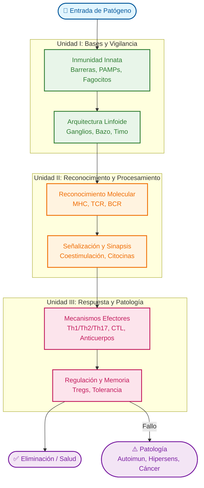

# 🧬 Mapa Global: Inmunología Básica y Clínica

> [!ABSTRACT] Visión Sinóptica
> Este curso explora la lógica defensiva del organismo, desde los mecanismos moleculares de reconocimiento hasta la orquestación de respuestas efectoras complejas y sus implicaciones patológicas.
> 
> **Estructura del Conocimiento**:
> 1.  **Vigilancia (Unidad I)**: Detección innata y preparación.
> 2.  **Decisión (Unidad II)**: Reconocimiento específico y procesamiento de información.
> 3.  **Acción (Unidad III)**: Ejecución de la respuesta y consecuencias (salud o enfermedad).

---

## 🗺️ Arquitectura del Sistema Inmune

---

## 📂 Módulos de Aprendizaje

### [[Unidad I/00_Unidad_I_MOC|Unidad I: Bases de la Inmunidad]]
**Enfoque**: Fundamentos biológicos y químicos.
- **Temas Clave**:
    - [[03_Inmunidad_Innata|Inmunidad Innata y PAMPs]]
    - [[06_Inmunogenos_Antigenos|Antígenos e Inmunogenicidad]]
    - [[08_Organos_Sistema_Inmune|Anatomía del Sistema Inmune]]
    - [[09_Inmunoglobulinas|Estructura de Inmunoglobulinas]]

### [[Unidad II/00_Unidad_II_MOC|Unidad II: Reconocimiento de Antígenos]]
**Enfoque**: Mecanismos moleculares de especificidad.
- **Temas Clave**:
    - [[11_Sistema_Complemento|Sistema del Complemento]]
    - [[16_MHC_Complejo_Mayor_Histocompatibilidad|Complejo Principal de Histocompatibilidad (MHC)]]
    - [[19_Reconocimiento_TCR|Reconocimiento por TCR y Sinapsis]]
    - [[15_Citocinas|Red de Citocinas]]

### [[Unidad III/00_Unidad_III_MOC|Unidad III: Efectores y Patología]]
**Enfoque**: Integración sistémica y consecuencias clínicas.
- **Temas Clave**:
    - [[20_Respuesta_Celular|Respuesta Celular (Th1/CTL)]]
    - [[22_Respuesta_Humoral|Respuesta Humoral (B Cells)]]
    - [[25_Tolerancia_Autoinmunidad|Tolerancia y Autoinmunidad]]
    - [[29_Hipersensibilidad|Hipersensibilidades (I-IV)]]
    - [[27_Inmunidad_Tumoral|Inmunología del Cáncer]]

---

## 🧠 Conceptos Transversales (Hubs)

Estos conceptos conectan las tres unidades y son fundamentales para una comprensión holística:

- **[[Inflamacion]]**: Desde la respuesta innata aguda (UI) hasta la crónica y patológica (UIII).
- **[[Memoria_Inmunologica]]**: El objetivo final de la vacunación y la respuesta adaptativa.
- **[[Diagnostico_Inmunologico]]**: Aplicación práctica de la teoría (ELISA, Citometría, Aglutinación) a lo largo de todo el curso.

---
> [!TIP] Consejo de Estudio
> Utilice este mapa para orientarse. Si se siente perdido en los detalles moleculares de la Unidad II, regrese aquí para ver cómo encajan en la "Gran Imagen" de la defensa del huésped.
